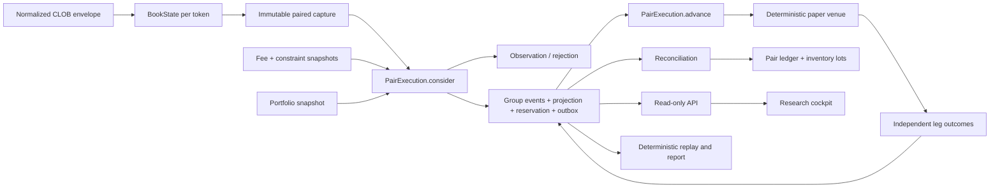

# Fable implementation brief: responsible borrowing from `MrFadiAi/Polymarket-bot`

## Implementation progress — 2026-08-04

This section records the repository state while implementation is active. A task is marked complete only when its scoped code and focused acceptance tests pass; downstream composition requirements remain listed separately and are not implied by the presence of schema tables or interfaces.

### Completed foundations

- `BPAIR-001`: baseline and deviations ledger.
- `BPAIR-002`: characterization coverage for fees, mutable books, existing paper execution/accounting, halt, and resolution behavior.
- `BPAIR-003`: permanent dependency/capability guards proving the pair subsystem cannot import authenticated venue, wallet, database, or pair-live capabilities.
- `BPAIR-010`: connection epochs, reconnect invalidation, snapshot readiness, and honest continuity states.
- `BPAIR-011`: immutable deep book snapshots and canonical local book hashes.
- `BPAIR-021`: canonical bigint decimal serialization, strict decoding, sorted canonical JSON, and deterministic object hashing. Unsafe-integer and malformed-decimal tests pass.
- `BPAIR-030`: `@b5p/pair-execution` package scaffold and research/paper-only capability boundary.
- `BPAIR-031`: branded IDs, deterministic IDs/idempotency keys, canonical hashes, and the public pair contract foundation.
- `BPAIR-032`: paired-book capture construction with identity, epoch, integrity, age, future-time, skew, depth, immutability, and observer-versus-paper continuity gates.
- `BPAIR-033`: exact direct BUY/SELL book walking with bigint economics, per-level fees, FOK/FAK, limits, cash caps, inventory proof for SELL, and fail-closed malformed/unsupported inputs.
- `BPAIR-034`: exact two-leg quote composition, mixed fee-convention observer evidence, buffers, matched net shares, payout, P&L, return, and residual-loss accounting.
- `BPAIR-035`: level-proportional candidate frontier construction and deterministic stable size objective.
- `BPAIR-036`: exact token-specific one/two-tick and depth stress requoting.
- `BPAIR-037`: pure pretrade and portfolio aggregate pair-risk gates, including randomized aggregate-cap coverage and no directional/Kelly sizing input.
- `BPAIR-038`: the complete schema-v1 pair event/state model, legal transition matrix, reducer, semantic duplicate behavior, parallel/serial/recovery/settlement/reconciliation/halt paths, and explicit illegal-transition handling.
- `BPAIR-039`: projection, quantity, FOK, cap, lifecycle, halt, reconciliation, and terminal invariants, including randomized inventory properties and record-then-manual-review handling for externally observed breaches.

### Implemented components awaiting downstream composition

- `BPAIR-012`: complete CLOB envelopes now cross the engine boundary atomically, with one mutation/version increment per affected token and exactly one post-boundary dirty mark that observes the final two-token state; reconnect barriers also cover books first created after a reconnect. The full zero-observation and replay-equivalence assertions close with `BPAIR-052`/`BPAIR-100` composition.
- `BPAIR-013`: a bounded immutable capture queue batches complete envelopes without splitting them, exposes depth/flush/overflow metrics, retains failed batches, invalidates continuity on overflow, and requires persisted same-epoch UP and DOWN snapshots for recovery. It is composed with the live public-feed callbacks and append-only store; six focused queue tests pass.
- `BPAIR-014`: the append-only event/checkpoint store now provides canonical exact serialization, atomic/idempotent envelope appends, conflicting-retry rollback, trade projection deduplication, full replay, checkpoint-plus-event reconstruction equivalence, reconnect/stale-epoch barriers, and honest nullable source timestamps. Five focused store tests pass; the DB package passes 18 tests total.
- `BPAIR-015`: an exact-string, token-aware terms provider now independently parses and persists UP/DOWN fee and constraint snapshots, reuses identical canonical rows, appends changed terms, and rejects malformed, mismatched, stale, unknown-convention, or unavailable evidence. Production discovery uses only unauthenticated public CLOB `/book` and `/fee-rate` GETs: tick/minimum strings stay exact, the raw integer fee lexeme converts from basis points exactly, token/condition identities are isolated, and an explicit versioned public USDC fee-collection authority is required. Per-token success timestamps drive honest freshness health; missing/unsupported authority fails closed. Twelve focused source tests and seven persistence tests pass.
- `BPAIR-020`: the full Section 18 schema and forward migration `0006_furry_nemesis` pass PGlite migration coverage. Verification against the deployed PostgreSQL path remains outstanding.
- `BPAIR-040`: immutable acquisition lots, group/token-isolated FIFO consumptions, deterministic exact principal/buy-fee allocation, all mandatory balanced posting templates, reservation flows, ledger replay, and ledger-derived realized P&L are implemented. Eight focused conservation/property tests pass; SQL transaction composition remains in the durable coordinator phase.
- `BPAIR-041`: pure residual alternatives and versioned policy selection are implemented with exact complement FOK, direct-bid liquidation FAK, hold-to-resolution worst case, deadline/unknown/halt/attempt gates, and deterministic minimize-worst-loss selection. Eight focused tests pass; durable coordinator integration waits on the ledger/outbox layer.
- `BPAIR-042`: authoritative hold-to-resolution and deterministic paper virtual-merge settlement are implemented with exact payout/cost journals, failure/unknown exposure retention, idempotent evidence handling, residual preservation, and merge-then-resolution double-credit protection. Ten focused settlement tests pass; durable settlement-effect/outbox composition remains.
- `BPAIR-043`: the pure reconciliation comparator now checks event continuity, event/ledger/lot/projection agreement, fill and journal causation, order/group linkage, adapter evidence, unresolved effects, terminal reservations, and ledger-derived P&L. It classifies projection-only repairs separately from retained-observation and critical manual-review cases; ten focused tests pass.
- `BPAIR-050`: the closed pair configuration schema, safe defaults, exact bigint cross-field validation, complete immutable economic policy hash, separate observer-operational hash, hard-risk source constant, and structurally no-live capability authority are implemented and tested.
- `BPAIR-051`: durable exact capture materialization, transactional episode clustering/cooloff, deterministic negative-control sampling, restart-safe observation deduplication, and one-minute funnel/rejection buckets are implemented; four focused PGlite tests pass.
- `BPAIR-052`: the observer evaluator now takes both immutable book snapshots synchronously after the complete-envelope marker, validates capture/terms, applies prefilter/frontier/direct-buy quote composition, tick/depth stress and aggregate risk, and persists the capture, episode, funnel, and observation evidence. Counterfactual eligibility is separated from actual paper permission, unexpected failures isolate the affected market, and the module has no order/reservation/venue capability. Five focused evaluator tests pass; startup registration, persist-before-evaluate `main.ts` composition, exact public terms, and the reconciled portfolio source are complete under `BPAIR-015`/`BPAIR-061`/`BPAIR-080`/`BPAIR-081`.
- `BPAIR-053`: the Section 23 health projection and dependency-free telemetry collector are implemented. Stale terms and invalid individual markets degrade paper scheduling while preserving valid-market observation; capture overflow/unbounded gaps disable observation; accounting/effect faults retain read-only observation and fail paper scheduling closed. Six focused tests pass.
- `BPAIR-060`: the durable group/event projection store implements group idempotency, one-active-group-per-market enforcement, ordered due-group reads, causal event redelivery checks, and atomic projection/event compare-and-swap. Four focused PGlite tests shared with the effect boundary pass; live PostgreSQL verification remains.
- `BPAIR-061`: the isolated pair-paper account adapter implements idempotent funding, reserve/release journals, compare-and-swap journal persistence, immutable acquisition lots, exact group-local FIFO consumption, restart reconstruction/drift detection, and directional-account isolation. The production composition now idempotently funds a versioned runtime pair account and reads an exact immutable portfolio snapshot that combines its reconciled balances/caps with active directional orders and positions. Three account-store and two portfolio-store PGlite tests plus the 19 ledger/capability tests pass. The coordinator must still make group-event and reservation writes one shared transaction.
- `BPAIR-062`: effect enqueue is atomic with committed group facts; due ordering, portable lease-claim compare-and-swap, strict canonical request decoding/binding, committed pre-call proof, durable paper-venue execution, terminal/rejected/unknown inbox linking, and expired-claim observe-first recovery are implemented. Live claims are never stolen and durable `UNKNOWN` is never blindly retried; absent-result reexecution requires injected lifecycle legality. Dispatcher plus store coverage passes 9 focused tests; evidence-to-group/ledger reduction remains coordinator work.
- `BPAIR-063`: the constrained public facade now exposes only `consider`, `advance`, `reconcile`, `halt`, `getGroup`, and `listActiveGroups` over explicit economics/observation/account/activation/store/effect/reconciliation ports. It validates and freezes capability authority, keeps business rejection as data, propagates infrastructure faults, enforces commit-before-dispatch call ordering, blocks exposure effects after halt, and preserves late-evidence/reconciliation work. Thirteen facade boundary tests pass; engine SQL adapters must still fulfill the port-level atomic transaction guarantees.
- `BPAIR-064`: startup reconciliation now replays immutable group events and compares group projection, pair ledger/lots, fills, effects, inbox evidence, and durable venue observations. It persists runs/diffs, repairs only deterministic projection drift (with exactly one `PAIR_PROJECTION_REBUILT` event for group repair), retains unknown/manual-review exposure, and gates paper scheduling while leaving observation available. Healthy and drifted zero-group accounts are also audited/gated. Seven focused tests and 14 combined store/account/reconciliation tests pass; live PostgreSQL verification remains.
- `BPAIR-070`: a dedicated pair-only paper venue now performs exact immutable-capture initial BUY FOK and recovery SELL FAK matching, deterministic scripted outcomes, stable evidence identity, collision-safe replay, and atomic durable operation evidence. The shared in-memory/PGlite contract suite and restart observation test pass (19 tests); it has no directional `PaperExecutor`, venue SDK, wallet, or network dependency.
- `BPAIR-071`: the causal activation gate selects only the latest complete capture at or before the dispatch cutoff, rejects forward evidence, always constructs a fresh activation capture, reloads/revalidates current per-token terms, caps quantity at the signal approval, and reruns exact quote/stress/risk without creating effects. Seven focused tests pass; durable as-of reader and coordinator transaction wiring remain.
- `BPAIR-072`: parallel entry planning now produces one deterministic atomic action with UP ordinal `0` and DOWN ordinal `1`, and exposes neither effect until the injected commit returns both. Independent evidence retains the sibling until terminal, classifies both-fill/zero-fill/residual/unknown exactly, survives deterministic restart/redelivery, and routes an impossible partial initial FOK result to manual review. Five focused tests pass; the durable commit/evidence-to-ledger adapter remains coordinator wiring.
- `BPAIR-073`: both serial orders are implemented symmetrically: activation commits only the selected first-leg effect and leaves an unpriced sibling, first-leg zero/reject/cancel skips the sibling, unknown blocks it, and a fill schedules the exact actual-dispatch-plus-delay cutoff. The due complement requires a new causal capture/quote and its own deterministic decision/action/effect identity, never resizes upward, and classifies paired/residual/unknown exactly. Thirteen focused tests pass; durable event/account/outbox translation remains coordinator wiring.
- `BPAIR-074`: recovery coordination persists the complete complement/liquidation/hold alternative set before deterministic policy selection. The default no-auto policy creates zero effects; optional policies pass fresh-capture, deadline, attempt, unknown, halt, book, risk, and constraint gates and create at most one ordinal-0 effect. Complement is BUY/FOK, liquidation is inventory-proven SELL/FAK, and unknown/no-fill/partial/full outcomes retain or classify exposure exactly. Six focused tests pass; atomic plan and evidence-to-FIFO/ledger persistence remain facade adapter work.
- `BPAIR-075`: settlement integration implements zero-effect hold-to-resolution and one deterministic non-exposure virtual-merge effect for exactly paired inventory. Confirmed merge applies FIFO consumptions plus balanced payout/cost/release journals once; failed/expired retains tokens for resolution; unknown retains tokens/reserve and blocks. Authoritative Chainlink resolution consumes all remaining winning/losing lots, deduplicates by resolution ID, and cannot double-credit merged inventory. Eleven focused tests pass; atomic store/account/inbox adapter wiring remains.
- `BPAIR-076`: orthogonal halt planning denies new groups/exposure effects, cancels or expires only unclaimed pending effects, preserves inventory/reservations/evidence, never starts recovery, and continues late evidence/resolution/reconciliation. The watchdog escalates initial/recovery/merge unknown outcomes at the exact timeout to deterministic manual-review facts while retaining exposure and exposing health counts. Six focused tests pass; durable halt/watchdog fact persistence remains a facade adapter hook.
- `BPAIR-080`: `createPairSubsystem` constructs the validated effective authority, stores, observer/evaluator, startup reconciler, dedicated pair venue, deny-by-default dispatcher, capability view and refreshable health. Observation remains available when safe, while paper capability requires both healthy startup reconciliation and complete explicitly supplied facade/legality ports; missing lifecycle wiring reports `PAIR_SUBSYSTEM_UNWIRED` and cannot schedule. Five subsystem tests and 47 related engine tests pass.
- `BPAIR-081`: main startup now constructs the observer-safe subsystem, installs one complete-envelope marker, persists every full envelope and boundary before evaluation, and uses the durable boundary event ID as capture sequence. WebSocket token identities map back to canonical discovered markets; active condition/token pairs register and rotate safely; maintenance advances only a healthy, effectively authorized non-null facade; shutdown clears timers/markers/maps. Exact reconciled portfolio and unauthenticated public CLOB token-term sources are wired, with current per-token health timestamps and no Gamma economic Number conversion. Pair scheduling remains fail-closed while lifecycle facade/effect legality ports are incomplete. Two persisted-boundary and two portfolio-snapshot tests pass with the full engine suite.
- `BPAIR-082`: the shared market-exposure guard store provides transactional/versioned acquire, update, directional-order-to-position handoff, terminal release, exact replay, and released-row reclaim for `DIRECTIONAL_ORDER`, `DIRECTIONAL_POSITION`, and `PAIR_GROUP`. Pair group creation now acquires `PAIR_GROUP` ownership in the same transaction and terminal close releases it; a directional guard owner blocks the group insert without leaving any pair row. A concurrent pair-versus-directional acquisition has exactly one winner, and transaction rollback removes the guard claim. Nine focused PGlite path/store tests pass; the existing directional order/position mutations still need symmetric transaction-bound composition without changing their characterized semantics.
- `BPAIR-083`: the pair status publisher composes queue/runtime/subsystem/store state into the Section 23 cockpit, health reasons, gauges, counters, and histograms with exact string bigint balances and bounded label cardinality. Only explicitly committed, deduplicated fact IDs publish best-effort summaries; raw payloads and IDs never leak through the callback. Capture-stale and engine-halt health reasons are stable. Eleven health/observability tests pass; production callers must feed durable counts and post-commit facts.
- `BPAIR-090`: the read-model repository now provides persisted health and summary projections; validated, deterministic cursor pagination for episodes, observations, groups, events, reconciliation runs, and research runs; and complete detail reads with fixed-count batched child queries. Group detail includes signal/activation decision-risk bundles, reasons/cap chains, action/order intents, pair-linked orders and fills, lots/consumptions/ledger/evidence, and reconciliation runs/diffs. Exact bigint values, including nested JSON, unsafe-range fixture values, and aggregate sums, serialize recursively as decimal strings. Batched `inArray` phases avoid action/order/reconciliation N+1 loops.
- `BPAIR-091`: all twelve Section 21 read-only pair endpoints are registered behind the existing API authorization guard. Routes preserve repository validation and exact decimal strings, return stable `400`/`404`/`500` envelopes, and expose no pair `POST`, `PUT`, `PATCH`, or `DELETE` route. Seventeen focused route tests and the full 64-test API suite pass. The default injected capability remains observer-on/paper-off until a real runtime health provider is supplied.
- `BPAIR-100`: research datasets now have canonical manifests with per-artifact SHA-256 evidence, safe root-confined paths, and rejection of traversal, absolute paths, symlink escapes, and hash mismatches. The virtual replay clock implements the fixed `pair_replay_tie_v1` priority/order and deterministic IDs. Causal market replay validates checkpoints, applies exact-bigint atomic envelopes, evaluates only after durable boundaries, fires timers prospectively, and preserves reconnect/stale-epoch/version-gap barriers. Thirteen focused manifest/clock/replay tests prove byte-identical canonical output for identical inputs.
- `BPAIR-092`: the dedicated `/pairs` overview is implemented with a permanent `RESEARCH / COUNTERFACTUAL PAPER ONLY` and no-live banner, health strip, opportunity funnel, exact exposure summary, episode/group tables, and research-results comparison. All economic strings render without floating-point conversion; tables retain headers/captions and responsive keyboard access. Populated, loading, error, and empty Playwright fixtures pass 4/4, web typecheck passes, and the production Next build succeeds.
- `BPAIR-093`: `/pairs/groups/:id` now renders the immutable group/policy identity, prospective signal versus activation quote, caps/reservation, separate responsive UP/DOWN effects and evidence, exact fills/lots/consumptions/ledger, residual/recovery/settlement/reconciliation panels, and a sequence-sorted accessible causal timeline. Research/no-live and residual/manual-review banners stay prominent, all requests are GET-only, and loading/404/error states remain read-only. Eight focused Playwright fixtures cover paired, residual, unknown, partial recovery, merge-failure-to-resolution, mismatch, missing/error, and unsafe-range bigint cases; web typecheck and production build pass. The read model is being extended to expose the remaining joined risk/fill evidence rather than fabricating it.
- `BPAIR-101`: the research scenario parser freezes and hashes a complete declared one-factor sampling design. Its 28 anchored cells always include baseline parallel, both serial orders with all required delays, fixed and measured-p95 latency variants, four depth fractions, zero/one/two-tick stress, three settlement paths, and seven deterministic fault scripts. The runner accepts only verified BPAIR-100 causal replay bytes/hashes, isolates run/account/scenario namespaces, and emits byte-identical exact-value results without runtime/live authority. Eight focused tests pass; the full research suite passes 52 tests across nine files.
- `BPAIR-102`: episode statistics validate the BPAIR-101 result hash and audit all 25 funnel counts, denominators, and fixed-six half-even rates against exact episode facts. Independent units are unique episodes with UTC days as primary clusters and markets as sensitivity clusters; raw ticks are never samples. A golden PCG32-v1 stream, SHA-256-derived seeds, 10,000 deterministic R7 percentile resamples, 36-digit fixed-point Wilson intervals, sorted inputs, exact P&L/capital/drawdown summaries, and latency/edge/duration quantiles are fully versioned. Fewer than 10 clusters suppress intervals, and fewer than 30 days or 300 activation candidates fails promotion sufficiency. Nine focused tests pass; the full research suite passes 61 tests across ten files.

### Verified current checkpoints

- Workspace recursive TypeScript typecheck passes.
- Pair package: 171 tests pass across facade, serial-dispatch and settlement-integration boundaries, exact economics, capture, codecs, inventory/ledger conservation, recovery, reconciliation, reducer, transition, invariant, property, and capability coverage.
- Engine observer/envelope/runtime/queue/health checkpoint: 27 focused tests pass (five evaluator, six envelope, six queue, four runtime scheduler, six health/telemetry).
- Token terms persistence: 7 focused database-backed tests pass.
- Public exact CLOB token-terms source: 12 focused tests pass; the full Polymarket package passes 23 tests.
- Observation store: 4 focused PGlite tests pass.
- Durable pair store/effect/dispatcher boundary: 9 focused PGlite tests pass.
- Isolated pair account store: 3 focused PGlite tests pass.
- Exact pair portfolio snapshot adapter: 2 focused PGlite tests pass.
- Startup reconciliation/gating: 7 focused PGlite tests pass.
- Dedicated paper pair venue: 19 focused in-memory/PGlite tests pass.
- Causal activation requote: 7 focused tests pass.
- Parallel two-leg planning/classification: 5 focused tests pass.
- Symmetric serial dispatch planning/classification: 13 focused tests pass.
- Recovery integration planning/classification: 6 focused tests pass.
- Settlement/resolution integration: 11 focused tests pass.
- Halt/watchdog integration: 6 focused tests pass.
- Startup subsystem composition: 5 focused PGlite tests pass.
- Persist-before-observe main wiring: 2 focused tests pass.
- Market-exposure race guard plus pair creation-path composition: 9 focused PGlite tests pass.
- Engine health/observability: 11 focused tests pass.
- Pair read-model/API detail: 26 focused tests pass with complete risk/order/fill/reconciliation lineage.
- Pair read-only API: the full API suite passes 66 tests; all pair routes remain authenticated GET-only.
- Pair dataset manifest/clock/market replay: 13 focused deterministic and filesystem-safety tests pass.
- Pair overview UI: 4 focused Playwright fixtures pass; web typecheck and production build pass.
- Pair detail UI: 8 focused Playwright fixtures pass; web typecheck and production build pass.
- Pair deterministic scenario runner: 8 focused tests pass; the full research suite passes 52 tests.
- Pair episode statistics: 9 focused tests pass; the full research suite passes 61 tests.
- Config package: 8 tests pass.

### Remaining dependency chain

Finish the deterministic statistics/report chain (`BPAIR-102`–`BPAIR-103`), close the remaining production adapter gaps explicitly listed above (atomic facade/account/outbox translations and the directional side of the symmetric exposure guard), then run final hardening and handoff (`BPAIR-110`–`BPAIR-112`). Pair paper scheduling remains deliberately fail-closed until those adapters and reconciliation gates are complete, and pair-live capability remains explicitly unavailable throughout.

## 1. Fable mission

Implement the useful engineering lessons from [`MrFadiAi/Polymarket-bot`](https://github.com/MrFadiAi/Polymarket-bot/tree/82647014e0c355a5684e09666d8a0a522234640d) as a clean-room, research-first paired-execution subsystem inside this repository.

The deliverable is not a pasted arbitrage bot and not a new live-trading path. It is a rigorously specified subsystem that can:

1. observe synchronized UP and DOWN books;
2. distinguish an optical complement dislocation from a jointly executable opportunity;
3. walk both books using exact fixed-point arithmetic;
4. include the discovered fee schedule, explicit rounding, stress, latency, and operational buffers;
5. persist the exact evidence that produced each observation;
6. prospectively simulate both non-atomic leg orderings;
7. represent one-leg fills as residual inventory rather than fictitious profit;
8. apply a pre-registered paper recovery policy without hindsight;
9. reconcile cash, token balances, fills, simulated complete-set merges, and resolution payouts;
10. survive duplicate events and process restarts deterministically;
11. expose the result in an unmistakably research-only API and dashboard; and
12. produce a reproducible report capable of rejecting the hypothesis if the opportunities disappear after costs.

Continue until the implementation through the paper/research dashboard phase is complete, migrations apply on both supported database modes, tests pass, the production build succeeds, and every acceptance criterion in this brief is demonstrably satisfied.

This brief is intentionally exhaustive. Do not replace an explicit requirement with a shorter approximation. If the current source tree differs from the file map recorded here, preserve the invariant and document the exact path chosen.

## 2. Read-before-build requirements

Before editing code, read these files completely, in this order:

1. `polymarket.fable`
2. `2026-07-31-001-initial-refinement.fable`
3. `README.md`
4. `docs/architecture.md`
5. `docs/limitations.md`
6. `docs/live-trading-checklist.md`
7. `docs/threat-model.md`
8. `docs/research/calibration-study-2026-08.md`
9. `docs/research/yash-serai-polymarket-bot-borrow-review.md`
10. this file

Then inspect the current implementation instead of assuming this brief's repository snapshot is still exact. At minimum, inspect:

- `packages/domain/src/fixed.ts`
- `packages/domain/src/fees.ts`
- `packages/domain/src/sizing.ts`
- `packages/domain/src/state.ts`
- `packages/domain/src/types.ts`
- `packages/strategy/src/book.ts`
- `packages/strategy/src/features.ts`
- `packages/strategy/src/gates.ts`
- `packages/risk/src/evaluate.ts`
- `packages/risk/src/profiles.ts`
- `packages/config/src/index.ts`
- `packages/polymarket/src/ws-base.ts`
- `packages/polymarket/src/clob-ws.ts`
- `packages/polymarket/src/execution.ts`
- `packages/polymarket/src/live.ts`
- `packages/db/src/schema.ts`
- every current migration under `packages/db/migrations/`
- `apps/engine/src/engine.ts`
- `apps/engine/src/paper.ts`
- `apps/engine/src/accounting.ts`
- `apps/engine/src/snapshot.ts`
- `apps/engine/src/main.ts`
- `apps/engine/src/live.ts`
- `apps/api/src/server.ts`
- the decisions, orders, P&L, risk, audit, and cockpit web pages
- all related tests
- `docs/live-trading.md`

Do not begin with the upstream code. Begin with the local invariants, then use the upstream repository only as an evidence source for operational failure modes.

## 3. Authority and conflict rules

This document is additive to the two parent Fable specifications. When requirements conflict, use the requirement that:

- keeps behavior in a less privileged mode;
- risks less capital;
- uses a more authoritative data source;
- uses exact rather than floating-point economics;
- assumes worse execution;
- persists more evidence;
- makes reconciliation stricter;
- makes a claimed opportunity harder to declare;
- prevents hidden route substitution;
- prevents this pair subsystem from connecting to the repository's existing directional signing/transaction path; or
- is easier to falsify through prospective evidence.

The following rules are absolute for this implementation:

1. No private-key type, field, environment variable, dependency, UI input, database column, log field, or signing code may be added to, referenced by, or made reachable from the pair subsystem.
2. No authenticated pair CLOB submission may be added. The repository's existing directional live path is out of scope and is not authority to reuse it.
3. No on-chain transaction may be built, signed, or broadcast.
4. No configuration value may contain `live` as a valid pair-execution mode.
5. Pair composition may instantiate only observer and durable paper adapters. It must not import, receive, downcast to, or route through the existing `LiveController` or `LiveClobAdapter`.
6. Existing absolute 10% risk caps remain unchanged and pair capital receives no exemption.
7. The default configuration must produce zero pair paper orders.
8. Enabling observation must not implicitly enable paper execution.
9. Enabling paper execution must still create only simulated orders and balances.
10. Any missing fee, stale leg, disconnected book, excessive leg skew, unknown market rule, persistence failure, or reconciliation mismatch must fail closed.

## 4. Executive implementation decision

### 4.1 Bottom line

The upstream repository is useful as an operational sketch, not as an economic or safety authority.

Borrow these concepts:

- a first-class aggregate for two related orders;
- explicit per-leg results;
- a lock preventing overlapping execution for one market;
- one-leg imbalance detection;
- post-action balance refresh and reconciliation;
- complete-set merge/split/redeem lifecycle seams;
- reconnect-aware subscriptions;
- user-order/trade event concepts for a possible future authenticated adapter; and
- a rebalancing vocabulary that distinguishes balanced pairs from residual inventory.

Rebuild or reject these elements:

- all floating-point arbitrage math;
- all implicit mirrored-price route selection;
- all top-of-book-only sizing;
- all fee-free opportunity tests;
- reported profit derived from a pre-trade quote rather than fills and balance deltas;
- a generic success boolean used as proof of a fill;
- smart-money copying;
- DipArb as claimed alpha;
- win-streak position-size increases;
- a dashboard switch that can instantly enable live execution;
- private-key handling; and
- production CTF calls.

### 4.2 Borrow/modify/reject matrix

| Upstream element | Evidence location | Decision | Local implementation consequence |
|---|---|---:|---|
| Parallel submission of two FOK legs | [`arbitrage-service.ts`](https://github.com/MrFadiAi/Polymarket-bot/blob/82647014e0c355a5684e09666d8a0a522234640d/src/services/arbitrage-service.ts) | Borrow as a failure model, not code | Simulate both `UP_THEN_DOWN` and `DOWN_THEN_UP`; optionally record an idealized simultaneous benchmark, never call it atomic |
| Execution mutex | same | Borrow | One nonterminal pair run per market and one coordinator advance at a time |
| One-leg imbalance repair | same | Borrow and harden | Model residual side, quantity, cost basis, recovery latency, exit book, fees, and unresolved remainder explicitly |
| Complete-set merge | same and upstream CTF client | Borrow interface only | Add a simulated settlement port; do not add a production/on-chain adapter |
| Balance refresh after execution | same | Strong borrow | Reconstruct a pair ledger after every fill/action and persist reconciliation evidence |
| Reconnect subscription registry | [`realtime-service-v2.ts`](https://github.com/MrFadiAi/Polymarket-bot/blob/82647014e0c355a5684e09666d8a0a522234640d/src/services/realtime-service-v2.ts) | Selective borrow | Keep the local validated WebSocket adapter; add disconnect invalidation and snapshot barriers rather than replacing it |
| Effective mirrored prices | [`price-utils.ts`](https://github.com/MrFadiAi/Polymarket-bot/blob/82647014e0c355a5684e09666d8a0a522234640d/src/utils/price-utils.ts) | Reject | Evaluate complete routes end to end; never take the best price independently for each conceptual leg |
| Arbitrage threshold without exact fees | upstream price/arbitrage services | Reject | Use live per-market fee snapshots, level-by-level fees, explicit collection convention, and conservative rounding |
| Top-level size with a safety factor | upstream arbitrage service | Reject | Walk both L2 books and search only jointly executable equal-share sizes |
| Estimated profit added to cumulative profit | upstream arbitrage service | Reject | Realized paper P&L comes only from ledger entries and reconciled fills/actions |
| Derived display-price pair sum | upstream realtime service | Reject for economics | Use executable asks/bids from immutable synchronized snapshots; display price may remain informational only |
| Thin `OrderResult.success` inference | [`trading-service.ts`](https://github.com/MrFadiAi/Polymarket-bot/blob/82647014e0c355a5684e09666d8a0a522234640d/src/services/trading-service.ts) | Reject | Paper legs expose requested, accepted, filled, average price, level fills, fee, remaining quantity, and evidence generation |
| Dip then later hedge | [`dip-arb-service.ts`](https://github.com/MrFadiAi/Polymarket-bot/blob/82647014e0c355a5684e09666d8a0a522234640d/src/services/dip-arb-service.ts) | Negative control only | Do not add as a strategy preset; its operational lesson is only that a delayed hedge is a directional position until the hedge fills |
| Smart-money following | [`smart-money-service.ts`](https://github.com/MrFadiAi/Polymarket-bot/blob/82647014e0c355a5684e09666d8a0a522234640d/src/services/smart-money-service.ts) | Reject | No code or configuration |
| Dynamic sizing after wins | upstream v3.1 risk documentation | Reject | Preserve Kelly-can-only-shrink and the source-level absolute cap |
| Live/simulation dashboard toggle | upstream dashboard | Reject | Research page is read-only; execution mode remains schema-controlled and cannot include live |

### 4.3 What success means

Success is not finding many opportunities. Success is producing a system that can state, with evidence:

> At timestamp `t`, these exact synchronized books, fee terms, constraints, and capital limits implied this exact route and equal-share quantity. After configured latency, these were the books actually available. Under each pre-registered leg ordering, these fills or failures occurred. Any residual was valued or recovered using this pre-registered rule. These ledger entries reconcile exactly. Here is the realized paper result and here is the stress result.

The correct empirical outcome may be that no economically meaningful opportunities survive. The existing calibration study makes that the expected result.

## 5. Source audit and provenance

### 5.1 Source snapshot

Audit against the immutable upstream revision:

```text
repository: MrFadiAi/Polymarket-bot
revision:   82647014e0c355a5684e09666d8a0a522234640d
date:       2026-01-11
license:    MIT
history:    9 commits at the audited revision
```

Record this revision in source comments only where a concept is directly derived from the upstream behavior. Do not add its source as a runtime dependency or Git submodule.

### 5.2 Upstream mechanism actually observed

The upstream arbitrage service is materially more serious than a toy script. It includes WebSocket order books, CLOB and CTF clients, two-leg execution, FOK requests, balance refresh, complete-set merge behavior, a service-level execution lock, residual imbalance handling, and a monitor-only posture when signing material is unavailable.

That sophistication does not make its economics reliable. The audited implementation:

- obtains `effectiveBuyYes` from the lower of the direct YES ask and `1 - NO bid`;
- obtains `effectiveBuyNo` from the lower of the direct NO ask and `1 - YES bid`;
- adds those independently selected values to declare long arbitrage;
- later submits direct BUY orders for both outcome tokens;
- calculates opportunity size from shallow displayed liquidity;
- does not include the current nonlinear crypto taker fee in its opportunity calculation;
- submits each leg FOK, but cannot make the pair atomic;
- attempts recovery after one leg succeeds and the other fails; and
- derives reported profit from the opportunity estimate rather than a complete fill/fee/gas/balance reconstruction.

The route mismatch is the central correctness defect. Selling NO to synthesize a YES exposure is not interchangeable with buying YES unless the trader already owns the necessary NO inventory, the route's settlement mechanics are included, and the complete sequence is executable. Selecting the cheapest conceptual price for each side independently can combine actions that cannot coexist from the same initial inventory.

### 5.3 Upstream test-quality finding

The audited arbitrage integration test primarily verifies:

- that current public APIs return data;
- that scanning returns objects of expected shapes;
- that monitoring receives some order-book data;
- that start/stop and double-start behavior work; and
- that statistics fields exist.

It does not provide the property tests, fee-aware arithmetic tests, route-precondition tests, stale-leg tests, one-leg fault injection, restart-at-every-transition tests, or ledger conservation tests required here. Therefore, upstream test presence is not evidence that its economic result is correct.

### 5.4 Clean-room policy

Although the upstream license is permissive, implement this brief cleanly against local types and invariants:

- do not copy service classes;
- do not copy floating-point formulas;
- do not copy wallet or authorization code;
- do not reuse its event/result types;
- do not inherit its defaults;
- do not add its SDK/submodule; and
- do not preserve a behavior merely for upstream compatibility.

The upstream repository is provenance for the problem statement: multi-leg execution has residual risk, reconciliation matters, and complete-set lifecycle deserves a first-class abstraction.

## 6. Local repository baseline

### 6.1 Strengths that must be preserved

The local repository already has stronger foundations than the upstream implementation:

- exact `bigint` micro-units for USDC, shares, probabilities, and rates;
- explicit rounding through `mulDiv`;
- nonlinear crypto taker-fee functions;
- both supported fee-collection conventions;
- exact break-even calculations;
- a mutable L2 `BookState` with sorted depth and taker-buy impact;
- conservative paper latency and maker queue simulation;
- immutable decision snapshots persisted before orders;
- explicit risk rejection codes;
- current fee/rule/price-to-beat gates;
- a hard 10% absolute cap;
- no martingale or averaging down;
- an engine kill switch;
- restart reconciliation for the existing paper orders;
- Chainlink-authoritative resolution; and
- a newly added, separately armed directional live path that must remain completely isolated from this pair work.

Do not weaken any of these to make paired execution easier.

### 6.2 Architectural incompatibilities that require a new aggregate

Do not route two outcome fills directly through the existing directional pipeline.

The existing `Accounting` implementation is keyed by `marketId` and represents one `outcomeSide` per open position. Feeding both UP and DOWN fills for the same market into that map would merge economically different assets into a corrupted position.

The existing `PaperExecutor` also represents one BUY order at a time. Its taker activation is effectively FAK, and it reports a single-order lifecycle. It does not own:

- a group state;
- sibling-leg dependencies;
- equal-share pairing;
- FOK-per-leg behavior;
- residual-side inventory;
- complete-set merge accounting;
- group-level capital reservation;
- per-route preconditions; or
- pair reconciliation.

The existing market FSM likewise represents one directional order lifecycle. A pair run can have one filled leg, one failed leg, an unwind, a merge, and a reconciliation simultaneously; forcing that into `MarketInstanceState` would make its meaning ambiguous.

Therefore:

> Implement paired execution as a separate aggregate with its own state machine, exact inventory ledger, events, persistence, and reconciliation. Reuse local fixed math, books, fee functions, market metadata, feed health, risk caps, logging, IDs, bus, and database infrastructure. Do not reuse the directional position representation as the pair ledger.

### 6.3 Persistence prerequisite currently missing

The schema declares `orderbook_snapshots`, `market_trade_ticks`, `constraint_snapshots`, and `fee_schedule_snapshots`, but the audited engine does not insert into those tables. The current feed callbacks update memory and drive paper fills, while durable tick persistence covers reference-price ticks only.

This discrepancy must be fixed before a deterministic pair replay is claimed.

At minimum, the pair subsystem must persist the complete book evidence used at:

- initial observation;
- opportunity-state transition;
- planned activation;
- first-leg activation;
- second-leg activation;
- recovery activation;
- merge/settlement simulation; and
- reconciliation.

It must also persist relevant trade ticks and current constraint/fee snapshots. A prospective run may use current in-memory books, but every economic conclusion must carry enough immutable evidence to replay the conclusion afterward.

### 6.4 Existing empirical prior

The existing calibration study examined 4.27 million one-second two-sided top-of-book ticks from 14,226 resolved BTC five-minute markets. It found buy-both top-of-book cost below one during approximately 24 seconds total before current-fee adjustment, approximately `0.00056%` of ticks. The mean buy-both cost was `1.0118`.

Treat this as a strong prior that the pair observer will mostly record no executable opportunity. Do not tune thresholds to manufacture activity. The purpose of the new subsystem is to test current, full-depth, fee-regime-current, prospective execution and quantify residual risk.

### 6.5 Reconciled local live-path boundary at revision `908a978`

During preparation of this brief the local repository advanced to commit `908a978b9e2f9eb2be8630d76a2a4691840b3114`, which adds an armed directional `LiveController` and `LiveClobAdapter`. Preserve that user-owned work, but do not treat it as pair infrastructure.

It is specifically unsuitable for paired execution because the audited new path:

- accepts a hot-wallet private key and authenticated CLOB dependencies that this pair package must never import;
- converts prices, shares, stakes, and external balances through JavaScript `number` at the venue boundary;
- persists non-maker live style as `taker_fak` even when the request style can be `taker_fok`;
- records an immediate matched fill at requested price/quantity with `feeUsdc6 = 0` as an acknowledged approximation;
- does not provide exact user-trade reconciliation yet;
- observes USDC balance/allowance but not an attributed two-token pair inventory ledger;
- has no pair aggregate, residual state, complete-set settlement, or durable pair-operation evidence; and
- exposes repository-wide `/api/arm`/`/api/disarm` controls that must have no pair side effect.

Therefore add explicit dependency tests:

```text
packages/pair-execution/** must not import packages/polymarket/src/live
apps/engine/src/pair-*.ts must not import LiveController or LiveClobAdapter
pair package dependency graph must not reach @polymarket/clob-client or viem
pair runtime must not read LIVE_TRADING_ENABLED or HOT_WALLET_PRIVATE_KEY
arming/disarming the directional live controller must not change pair capability authority
```

When global `app.mode` is `live` or the directional controller is armed, pair observation may continue, but runtime pair paper scheduling must return `MODE_UNSUPPORTED`; run counterfactual pair execution in the dedicated paper/research process instead. Existing directional live arming does not authorize pair live execution.

## 7. Explicit non-goals and prohibited shortcuts

### 7.1 Not in scope

- Directional prediction.
- Smart-wallet ranking or copying.
- Binance-vs-Chainlink lag trading.
- Momentum, mean reversion, RSI, candle-pattern, or DipArb signals.
- Market making.
- Passive two-sided quoting.
- Real wallet balances.
- Real allowance checks.
- Authenticated user WebSockets.
- Real CLOB submissions.
- Real cancellation.
- Real CTF split, merge, or redeem transactions.
- Private-key storage.
- Gas estimation from a wallet/provider.
- Short/sell-both execution requiring pre-split inventory.
- Enabling any existing `LIVE_*` state.
- Relaxing research or live-promotion gates.

### 7.2 Prohibited implementation shortcuts

Fable must not:

- use JavaScript `number` for any order, cost, fee, balance, payout, edge, or P&L calculation;
- use `bestAskUp + bestAskDown < 1` as the final opportunity condition;
- use an average fee percentage;
- use one flat slippage deduction;
- treat displayed size as filled size;
- reuse the signal capture blindly at activation instead of taking the latest causally available, still-valid as-of view;
- combine books whose timestamps exceed configured skew;
- choose an UP execution route independently from a DOWN execution route;
- call two individually successful submissions an atomic pair;
- call a submission acknowledgement a fill;
- call balanced gross token amounts balanced under share-collected fees without checking net token balances;
- hide residual inventory inside an error string;
- choose the recovery action using future outcome knowledge;
- treat merge payout as realized until the simulated settlement action succeeds;
- count every positive tick as an independent sample;
- drop failed or no-fill observations from research summaries;
- silently retry with a taker route after a post-only rejection;
- silently convert FOK to FAK;
- reuse the current single-side `positions` row for both tokens;
- increment cumulative profit from a quote estimate;
- auto-enable any cash reservation, order, recovery, or settlement effect after migration; observer-only measurement is explicitly enabled by default because it has no economic effect;
- create a live adapter placeholder that accepts keys later.

## 8. Normative economic definitions

### 8.1 Units

Use the existing domain aliases everywhere:

```ts
type Usdc6 = bigint;   // 1 USDC = 1_000_000n
type Shares6 = bigint; // 1 share = 1_000_000n
type Prob6 = bigint;   // 1.0 price/probability = 1_000_000n
type Ppm = bigint;     // 100% = 1_000_000n
```

Every persisted exact quantity uses an integer database column where practical and a base-10 string inside JSON. Never serialize a bigint as a JSON number.

### 8.2 Binary complete-set payoff

For this specific market, one UP token and one DOWN token of equal quantity form a complete set. At resolution, exactly one side pays one USDC per winning share. Therefore, ignoring token deductions under a share-collected fee convention, equal holdings `q` have a deterministic gross resolution payout of `q` USDC.

This is a payoff invariant, not an execution guarantee.

### 8.3 Explicit route model

The planner evaluates whole routes. A route has required starting assets, ordered actions, produced assets, costs, fees, timing, and failure states.

The mandatory route in this release is:

```text
DIRECT_BUY_BOTH
starting asset: USDC
action 1: buy q UP through executable UP asks
action 2: buy q DOWN through executable DOWN asks
ending assets if both fill: q UP + q DOWN
settlement choice: simulate merge or hold to resolution
```

An optional observer-only route may be represented later:

```text
SPLIT_THEN_SELL_BOTH
starting asset: USDC plus an available CTF split action
action 1: split q USDC collateral into q UP + q DOWN
action 2: sell q UP through bids
action 3: sell q DOWN through bids
```

Do not paper-execute `SPLIT_THEN_SELL_BOTH` in this scope. It requires inventory and settlement semantics the current system intentionally does not possess.

Never implement `effectiveBuyUp = min(upAsk, 1 - downBid)` or an equivalent implicit substitution. A mirrored action belongs to a different route with different starting assets and action count. The planner may compare complete route results only after every route is independently feasible.

### 8.4 Level-by-level book walking

For an UP buy of `q`, consume asks from lowest price upward, respecting the route's limit price. For every level `i`:

```text
take_i = min(remaining, displayed_size_i)
level_cost_i = ceil(take_i * price_i / 1_000_000)
remaining -= take_i
```

The walk result must contain:

- requested shares;
- filled shares;
- unfilled shares;
- every consumed level and quantity;
- exact level cost;
- total cost;
- average price rounded conservatively;
- worst price;
- top-of-book price;
- impact from top of book;
- source book generation/hash; and
- whether the requested quantity was fully executable.

For a FOK paper leg, any nonzero `remaining` produces zero fills and zero cost. For a FAK recovery unwind, partial fills are allowed and the remainder stays explicit.

### 8.5 USDC-collected fee convention

For each buy fill at price `p_i` and quantity `q_i`, reuse `takerFeeUsdc(q_i, p_i, ratePpm)`. Sum conservatively rounded level fees rather than calculating a fee from a rounded average price.

The normalized book has one canonical level per exact price. Paper quotation and paper execution create one modeled fill per consumed canonical price level and round the fee once for that modeled fill. Duplicate raw entries at the same price are aggregated during validated book normalization before capture; malformed duplicates that cannot be safely aggregated reject the book. Reconciled external evidence, if ever added in a future mode, uses the venue's authoritative actual fill fragmentation/fee totals and may differ by rounding; do not rewrite the quote to match it.

For jointly filled quantity `q`:

```text
up_total_cost6   = sum(up_level_cost6)   + sum(up_level_fee_usdc6)
down_total_cost6 = sum(down_level_cost6) + sum(down_level_fee_usdc6)
gross_pair_cash_cost6 = up_total_cost6 + down_total_cost6
guaranteed_payout6 = q
net_pair_pnl6 = guaranteed_payout6
                - gross_pair_cash_cost6
                - settlement_cost_buffer6
                - operational_risk_buffer6
```

The word `guaranteed` applies only to the payoff after both token balances exist and market validity remains intact. It does not apply before both fills or before reconciliation.

### 8.6 Share-collected fee convention

When the configured convention is `shares`, calculate fee shares per fill with `takerFeeShares` and derive net token balances separately:

```text
net_up_shares6   = gross_up_shares6   - up_fee_shares6
net_down_shares6 = gross_down_shares6 - down_fee_shares6
mergeable_or_guaranteed_pair_shares6 = min(net_up_shares6, net_down_shares6)
guaranteed_payout6 = mergeable_or_guaranteed_pair_shares6
```

Any excess net token balance is residual inventory, even if gross bought quantities were equal. Never force the USDC and share conventions through one lossy `totalFee6` field.

The observer must support this convention because it is needed to diagnose economics correctly. Paper execution under this convention remains fail-closed until all of the following exist:

- a gross-to-net share sizing solver;
- property tests proving that the reported matched quantity never exceeds either net balance;
- per-fill fee-share ledger entries;
- unequal-net-balance residual tests; and
- settlement tests using the minimum reconciled net balance.

Until those gates pass, a share-collected opportunity may be persisted as an observation, but `consider` must return `UNSUPPORTED_PAPER_FEE_COLLECTION` when paper scheduling is requested. Unknown fee conventions always fail closed.

V0 does not paper-sell under a share-collected fee convention. Observer-only SELL diagnostics may apply `takerFeeShares` to each canonical bid-level fill exactly as documented by the authoritative fee snapshot, reducing the token quantity delivered/credited according to that convention; if the external convention's SELL semantics are not verified, return `UNSUPPORTED_SELL_FEE_COLLECTION` rather than assuming the BUY rule is symmetric.

### 8.7 Jointly executable quantity

The candidate quantity is not the smaller top-level size. It is the largest equal-share quantity selected from the union of meaningful cumulative-depth breakpoints that satisfies all of:

- both route legs fully executable within their limits;
- each leg meets the market minimum order size;
- total cash reservation is within available paper capital and the configured cap;
- worst one-leg residual loss is within the residual-risk cap;
- exact net P&L exceeds the minimum absolute threshold;
- exact net edge rate exceeds the minimum rate threshold;
- configured one-tick stress remains acceptable;
- book age and cross-leg skew are valid; and
- sufficient time remains for both legs and the designated recovery policy.

### 8.8 Edge measures

Persist these distinct measures; never collapse them into one `profit` value:

```text
gross_top_of_book_edge6
gross_walk_edge6
net_pre_latency_pnl6
net_pre_latency_edge_ppm
net_activation_pnl6
net_activation_edge_ppm
one_tick_worse_pnl6
two_ticks_worse_pnl6
realized_pair_pnl6
realized_recovery_pnl6
unrealized_residual_mark6
worst_case_residual_loss6
```

Definitions:

- `gross_top_of_book_edge6`: display-only `q * (1 - upBestAsk - downBestAsk)` before depth and fees.
- `gross_walk_edge6`: payout minus walked acquisition cost before fees and buffers.
- `net_pre_latency_pnl6`: exact result from the synchronized observation books after fees and buffers.
- `net_activation_pnl6`: exact result using the books available at the configured activation times.
- `realized_pair_pnl6`: ledger-derived result after balanced settlement or resolution.
- `unrealized_residual_mark6`: an explicitly labeled conservative mark, never cumulative realized profit.
- `worst_case_residual_loss6`: cost and fees of the exposed leg under a full-loss bound, net of no assumed recovery.

### 8.9 Stress rules

One-tick and two-tick stress must worsen each buy leg independently:

- move executable ask prices upward by the token's actual tick size;
- enforce the maximum price of one;
- recompute fees at the stressed fill prices;
- do not merely subtract a fixed amount from final P&L; and
- fail if depth at stressed limits cannot fill.

Depth stress must also report results with displayed size multiplied by configurable fractions such as 75%, 50%, and 25%, always rounded down.

Latency stress uses the latest complete book state causally available when the activation timer actually dispatches. It must never peek at a market-data event received after that dispatch. If the signal capture is still the current complete book and remains fresh, it may legitimately still be the as-of activation state; this must be recorded rather than described as a fallback.

### 8.10 Sell/unwind economics

When recovering a residual buy by selling tokens, walk bids from highest to lowest. For each sell fill:

```text
gross_proceeds6 = floor(shares6 * bid_price6 / 1_000_000)
sell_fee6 = taker fee calculated at that fill's price and quantity
net_proceeds6 = gross_proceeds6 - sell_fee6
realized_recovery_pnl6 = net_proceeds6 - allocated_buy_cost_basis6 - allocated_buy_fee6
```

Never value a sell from the ask side. Insufficient bid depth yields a partial recovery and an explicit residual remainder.

### 8.11 Rounding policy

Use these conservative directions:

| Quantity | Rounding |
|---|---|
| Buy cost | Up / `ceil` |
| Taker fee paid | Up / `ceil` |
| Shares affordable from a capital cap | Down / `floor` |
| Displayed depth after stress multiplier | Down / `floor` |
| Sell proceeds | Down / `floor` |
| Settlement payout | Down / exact minimum balance |
| Net P&L | Derived from already rounded components |
| Edge rate used for approval | Down / `floor` |

No intermediate conversion to `number` is permitted.

## 9. Recommended architecture

### 9.1 Decision

Create a new deep package named `@b5p/pair-execution` under `packages/pair-execution`. Give it one narrow public facade and make it own the difficult paired-order behavior internally.

Do not add a `submitPair` convenience method to the current `PaperExecutor`. Do not make the current `Accounting` map understand two sides through optional fields. Do not extend the directional market FSM with pair-only states. Those changes would spread pair invariants across shallow modules and create multiple partial sources of truth.

The new package owns:

- immutable paired-book validation;
- exact route quotation and joint sizing;
- pair-specific risk approval;
- durable group and leg state transitions;
- capital and inventory reservations;
- paper FOK behavior;
- unknown-result handling;
- residual inventory classification;
- recovery alternative calculation;
- matched-pair settlement simulation;
- pair ledger entries;
- reconciliation;
- idempotency and event reduction; and
- deterministic views used by API, UI, and research.

It consumes existing local capabilities through explicit ports:

- fixed-point primitives and fee math from `@b5p/domain`;
- immutable normalized books produced from `@b5p/strategy` books;
- current market metadata, constraints, and feed health;
- database transactions and migrations;
- the event bus after database commit;
- a paper venue adapter; and
- an injected clock and ID factory.

### 9.2 Three interface designs considered

| Design | Public shape | Strengths | Failure mode | Decision |
|---|---|---|---|---|
| Extend `Engine`, `PaperExecutor`, and `Accounting` | Several new methods on existing classes | Few initial files | Pair semantics leak into directional code; two ledgers disagree; FSM becomes ambiguous; restart logic is distributed | Reject |
| Fully pluggable route/policy/event engine | `propose`, `start`, `ingest`, registries for routes, execution policies, recovery policies, and generic action types | Maximum future flexibility | Too much surface for v0; arbitrary plugins can weaken invariants; many abstractions exist before evidence warrants them | Defer |
| Deep pair aggregate with constrained facade | `consider`, `advance`, `reconcile`, `halt`, plus read methods | Small common-caller API; internal flexibility; strong invariants; deterministic tests; clean live boundary | Requires new package and adapters | Adopt |

The adopted design borrows one useful idea from the flexible design: policy identity and version must be persisted. It does not expose arbitrary runtime plugins. In v0 the route, dispatch, settlement, and recovery values are closed discriminated unions validated by the core.

### 9.3 Public facade

The public interface is deliberately smaller than the internal lifecycle:

```ts
export interface PairExecution {
  /**
   * Evaluate one immutable paired-book capture. This may persist an
   * observation or schedule a paper group. It never performs a venue effect.
   */
  consider(command: ConsiderPairCommand): Promise<ConsiderPairResult>;

  /**
   * Advance due activation, leg, recovery, settlement, timeout, and outbox
   * work using the injected clock. Every effect is preceded by a commit.
   */
  advance(nowMs: number): Promise<PairAdvanceSummary>;

  /**
   * Rebuild beliefs from durable events and adapter observations, then append
   * explicit reconciliation events and diffs. It never guesses a fill.
   */
  reconcile(nowMs: number): Promise<PairReconcileSummary>;

  /**
   * Stop exposure-increasing work, cancel only known-cancelable work, continue
   * ingesting late results, and force reconciliation.
   */
  halt(command: HaltPairsCommand): Promise<PairHaltSummary>;

  getGroup(groupId: string): Promise<PairGroupView | null>;
  listActiveGroups(): Promise<readonly PairGroupView[]>;
}
```

The facade hides reducers, mutable state, ledger mutation, SQL, and adapter calls. Tests inside the package may import internal pure modules; other packages may not.

### 9.4 Compile-time capability boundary

```ts
export type PairRunMode = "observe" | "paper";
```

`"live"` and `"shadow"` are intentionally absent. This brief's maximum behavior is prospective paper execution. Adding a real or authenticated mode later must require a source-code change, a separate architecture review, a new adapter, and a new RFC; it must never be achievable by editing environment variables.

The config must separately contain:

```ts
live_execution_enabled: z.literal(false).default(false)
```

This literal is defense in depth. It is not permission to add a dormant live adapter.

### 9.5 Effect ordering invariant

All state-changing work follows this order:

```text
immutable input
  -> pure validation / quote / transition
  -> database transaction appends events and pending effect intent
  -> commit succeeds
  -> dispatcher invokes paper adapter
  -> raw adapter outcome is persisted as new input evidence
  -> reducer advances group
  -> reconciliation validates projection and balances
  -> committed public event is published
```

There is no legal code path from opportunity detection directly to `paperVenue.submit`. A fake adapter test must be able to query the database during submission and prove that the decision, group, leg, reservation, and pending effect already exist.

### 9.6 Data and control flow



### 9.7 Dependency categories and testing strategy

| Dependency | Category | Required boundary behavior | Test strategy |
|---|---|---|---|
| Fixed math and nonlinear fee functions | In-process | Pure, exact, no clock or I/O | Unit and property tests |
| Pair quote, sizing, risk, reducer, ledger | In-process | Pure functions over immutable inputs | Unit, property, transition-table tests |
| PGlite/PostgreSQL pair store | Local-substitutable | Transactional append, compare-and-swap projection, idempotency | Integration tests in both supported modes |
| Clock and ID factory | Local-substitutable | Injected and deterministic in tests | Virtual-time and stable-ID tests |
| Paper venue | Local-substitutable | Explicit FOK/FAK semantics and scripted faults | Contract and scenario tests |
| Event bus | Remote but owned | Publish only committed facts; never source of truth | Failure-injection tests |
| Public CLOB/Gamma data | True external | Normalize, timestamp, validate, capture provenance | Recorded fixtures and boundary tests |
| Authenticated CLOB, wallet, CTF | True external and out of scope | No implementation or import in this phase | Dependency/static checks prove absence |

## 10. Target package and file map

### 10.1 New `packages/pair-execution` package

```text
packages/pair-execution/
  package.json
  tsconfig.json
  src/
    index.ts
    contracts.ts
    create-pair-execution.ts
    pair-execution.ts
    quote.ts
    sizing.ts
    stress.ts
    risk.ts
    capture.ts
    reducer.ts
    states.ts
    transitions.ts
    invariants.ts
    ledger.ts
    reconciliation.ts
    recovery.ts
    settlement.ts
    events.ts
    ids.ts
    hashes.ts
    serialization.ts
  test/
    quote.test.ts
    sizing.test.ts
    stress.test.ts
    risk.test.ts
    capture.test.ts
    reducer.test.ts
    transitions.test.ts
    invariants.test.ts
    ledger.test.ts
    reconciliation.test.ts
    recovery.test.ts
    settlement.test.ts
    restart.test.ts
    idempotency.test.ts
    properties.test.ts
    facade-boundary.test.ts
```

File responsibilities:

- `index.ts`: export only the facade, immutable public commands/results/views, and required port types.
- `contracts.ts`: branded IDs, discriminated unions, commands, results, read views, and injected port interfaces.
- `create-pair-execution.ts`: validate dependency completeness and construct the facade.
- `pair-execution.ts`: common-caller orchestration and transaction boundaries; no arithmetic formulas.
- `quote.ts`: exact per-level direct BUY and SELL quotes, including fee convention.
- `sizing.ts`: candidate frontier generation and largest-valid-prefix selection.
- `stress.ts`: tick, depth, and operational-buffer scenarios.
- `risk.ts`: pure aggregate group-risk decision with stable rejection codes.
- `capture.ts`: immutable capture construction and temporal/integrity validation.
- `reducer.ts`: pure fold from prior aggregate plus one domain event to next aggregate.
- `states.ts`: internal aggregate/leg/recovery/settlement state definitions.
- `transitions.ts`: command-to-event decision functions and legal transition table.
- `invariants.ts`: assertions run after every reduction and before commit.
- `ledger.ts`: balanced pair-specific journal generation and conservation checks.
- `reconciliation.ts`: compare events, projection, ledger, reservations, and adapter state.
- `recovery.ts`: compute permitted paper alternatives without choosing from future data.
- `settlement.ts`: virtual merge and hold-to-resolution paper transitions.
- `events.ts`: durable domain event definitions and schema versions.
- `ids.ts`: deterministic group, leg, order-client, event, and idempotency keys.
- `hashes.ts`: canonical JSON hashing for capture, config, plan, and portfolio evidence.
- `serialization.ts`: bigint-to-decimal JSON conversion and strict inverse parsing.

Do not export `reducer`, `ledger`, `transitions`, or mutation helpers through the package barrel.

### 10.2 Changes to `packages/domain`

Prefer reuse, not duplication:

- export existing fixed-point helpers needed by pair math;
- add a shared `mulDivCeil`/`mulDivFloor` only if the exact equivalent does not exist;
- add no pair lifecycle concepts to domain;
- keep the existing nonlinear fee implementation authoritative;
- add fee-convention discriminants if they are currently implicit; and
- add branded parsing/serialization helpers only when broadly useful.

Any domain helper added must have boundary tests for zero, one micro-unit, maximum allowed price, very large safe bigint values, and both rounding directions.

### 10.3 Changes to `packages/strategy`

Modify `packages/strategy/src/book.ts` so the mutable book can create an immutable snapshot without exposing its internal arrays:

```ts
export interface ImmutableBookView {
  readonly tokenId: string;
  readonly marketId: string;
  readonly bookVersion: bigint;
  readonly connectionEpoch: string;
  readonly bids: readonly Readonly<BookLevel>[];
  readonly asks: readonly Readonly<BookLevel>[];
  readonly sourceTsMs: number;
  readonly receivedTsMs: number;
  readonly exchangeHash: string | null;
  readonly sourceEventId: string;
  readonly integrity:
    | "VERIFIED_SNAPSHOT"
    | "SEQUENCED_CONTIGUOUS"
    | "HASH_CHAIN_VERIFIED"
    | "UNSEQUENCED_AFTER_SNAPSHOT"
    | "INVALID_AFTER_RECONNECT"
    | "GAP_SUSPECTED";
}
```

The snapshot function must deep-copy levels and return frozen data in tests/development. A later mutation to the live book must not alter a previously persisted pair capture.

Do not put opportunity decisions in `BookState`. The book knows market data; the pair package knows pair economics.

### 10.4 Changes to `packages/risk`

Do not fabricate a `conservativeProbability` to pass a complete-set pair through the directional evaluator. Either:

1. keep pair risk private inside the deep package; or
2. if portfolio-cap logic is already centralized and can be reused without pair types depending back on risk, add a pure `evaluatePairRisk` entry point.

The preferred v0 choice is internal pair risk importing only generic cap/health data. This avoids a circular package dependency and keeps the specialized invariants with the aggregate.

### 10.5 Changes to `packages/polymarket`

No authenticated adapter is added.

Public feed normalization must retain:

- raw message kind;
- market and token identifiers;
- message/event identifier if supplied;
- exchange timestamp;
- local receive timestamp;
- message hash;
- price-change envelope boundaries;
- source sequence if supplied;
- connection epoch; and
- reconnect/reset events.

The repository now also contains `packages/polymarket/src/live.ts` for separately armed directional trading. Pair paper execution uses its own local durable adapter implemented in the engine application. The pair package and all `pair-*` composition files must not import or receive the directional live adapter/controller. Existing `packages/polymarket/src/execution.ts` types may be reused only if doing so does not make the live adapter structurally assignable to the pair port; the preferred choice is a distinct pair paper port.

### 10.6 Changes to `packages/db`

Add one forward migration. Do not rewrite historical migrations. Add pair group, event, observation, ledger, reconciliation, and replay-event tables described in Section 18. Add nullable pair linkage to the existing `orders` and `order_fills` representation rather than inventing a second generic order schema.

### 10.7 Changes to `apps/engine`

```text
apps/engine/src/
  pair-runtime.ts
  pair-store.ts
  paper-pair-venue.ts
  pair-paper-operation-store.ts
  pair-portfolio.ts
  pair-market-data.ts
  pair-outbox-dispatcher.ts
  pair-projections.ts
```

Responsibilities:

- `pair-runtime.ts`: connect complete market-data envelopes and the engine clock to the facade; serialize per market.
- `pair-store.ts`: Drizzle implementation of event/projection/observation/ledger ports.
- `paper-pair-venue.ts`: deterministic direct-book FOK/FAK simulation with scripted fault hooks.
- `pair-paper-operation-store.ts`: durable idempotent paper operation/result transaction and restart observation by client operation ID.
- `pair-portfolio.ts`: one coherent view of available paper cash, existing directional reservations, and pair reservations.
- `pair-market-data.ts`: construct paired captures and persist replay events/checkpoints.
- `pair-outbox-dispatcher.ts`: claim committed effects once and feed outcomes back as facts.
- `pair-projections.ts`: build API/UI read models from committed group state.

Do not call the existing `Accounting.onFill()` for pair fills. It cannot distinguish both token assets in one market. During v0, pair accounting uses a dedicated ledger while `pair-portfolio.ts` presents a unified conservative cash availability calculation to both strategies.

### 10.8 Changes to `apps/api`

Add read-only endpoints and schemas described in Section 21. No pair mutation route is permitted. In particular, do not add `/execute`, `/enable-live`, `/recover`, or `/merge` POST endpoints.

### 10.9 Changes to `apps/web`

Add research-only pair pages/components described in Section 21. Every page must visibly say `RESEARCH / PAPER ONLY`; do not use green “guaranteed profit” language.

### 10.10 Changes to `apps/research`

Add deterministic pair replay, episode clustering, latency sweeps, dispatch-order comparisons, and report generation described in Section 22.

## 11. Normative TypeScript contracts

The exact naming may be adapted to current repository conventions, but the information content and discriminated-union behavior are mandatory.

### 11.1 Branded identifiers and scalar aliases

```ts
type PairCaptureId = string & { readonly __brand: "PairCaptureId" };
type PairObservationId = string & { readonly __brand: "PairObservationId" };
type PairGroupId = string & { readonly __brand: "PairGroupId" };
type PairLegId = string & { readonly __brand: "PairLegId" };
type PairEventId = string & { readonly __brand: "PairEventId" };
type PairLedgerEntryId = string & { readonly __brand: "PairLedgerEntryId" };

type PairOutcome = "UP" | "DOWN";
type OrderSide = "BUY" | "SELL";
type PairRunMode = "observe" | "paper";
type PairRoute = "DIRECT_BUY_BOTH";
type PairDispatchModel = "PARALLEL" | "UP_THEN_DOWN" | "DOWN_THEN_UP";
type PairSettlementPolicy = "HOLD_TO_RESOLUTION" | "PAPER_VIRTUAL_MERGE";
type PairRecoveryPolicy =
  | "NO_AUTO_RECOVERY"
  | "PAPER_COMPLETE_MISSING_LEG"
  | "PAPER_LIQUIDATE_FILLED_LEG"
  | "PAPER_MINIMIZE_WORST_LOSS";
```

### 11.2 Paired-book capture

```ts
export interface PairBookCapture {
  readonly captureId: PairCaptureId;
  readonly marketId: string;
  readonly conditionId: string;
  readonly capturedAtMs: number;
  readonly captureSequence: bigint;
  readonly up: ImmutablePairBookLeg;
  readonly down: ImmutablePairBookLeg;
  readonly sourceSkewMs: number;
  readonly receiveSkewMs: number;
  readonly captureHash: string;
}

export interface ImmutablePairBookLeg {
  readonly outcome: PairOutcome;
  readonly tokenId: string;
  readonly bookVersion: bigint;
  readonly connectionEpoch: string;
  readonly sourceTsMs: number;
  readonly receivedTsMs: number;
  readonly exchangeHash: string | null;
  readonly sourceEventId: string;
  readonly integrity:
    | "VERIFIED_SNAPSHOT"
    | "SEQUENCED_CONTIGUOUS"
    | "HASH_CHAIN_VERIFIED"
    | "UNSEQUENCED_AFTER_SNAPSHOT";
  readonly bids: readonly PairBookLevel[];
  readonly asks: readonly PairBookLevel[];
}

export interface PairBookLevel {
  readonly price6: Prob6;
  readonly shares6: Shares6;
}
```

Invalid integrity states are not representable in an accepted `ImmutablePairBookLeg`; capture construction returns a rejection union instead.

### 11.3 Market context

```ts
export interface PairMarketContext {
  readonly marketId: string;
  readonly conditionId: string;
  readonly slug: string;
  readonly up: PairTokenTerms;
  readonly down: PairTokenTerms;
  readonly startsAtMs: number;
  readonly endsAtMs: number;
  readonly acceptingOrders: boolean;
  readonly negRisk: boolean;
  readonly marketStructure: "BINARY_EXHAUSTIVE_MUTUALLY_EXCLUSIVE";
  readonly invalidOrVoidPolicyVerified: boolean;
  readonly rulesVerified: boolean;
  readonly rulesHash: string;
  readonly resolutionSource: "CHAINLINK";
  readonly secondsRemaining: number;
  readonly configVersion: number;
}

export interface PairTokenTerms {
  readonly outcome: PairOutcome;
  readonly tokenId: string;
  readonly constraints: PairConstraintSnapshot;
  readonly fee: PairFeeSnapshot;
}

export interface PairConstraintSnapshot {
  readonly snapshotId: string;
  readonly tokenId: string;
  readonly tickSize6: Prob6;
  readonly minimumOrderShares6: Shares6;
  readonly effectiveAtMs: number;
  readonly fetchedAtMs: number;
  readonly source: string;
  readonly canonicalHash: string;
}

export interface PairFeeSnapshot {
  readonly snapshotId: string;
  readonly tokenId: string;
  readonly tokenFeeRatePpm: Ppm;
  readonly convention: "USDC" | "SHARES" | "UNKNOWN";
  readonly conventionResolverVersion: string;
  readonly effectiveAtMs: number;
  readonly fetchedAtMs: number;
  readonly source: string;
  readonly canonicalHash: string;
}
```

The snapshot identities for a leg are therefore `terms.constraints.snapshotId` and `terms.fee.snapshotId`; there is deliberately no market-wide constraint or fee snapshot ID in this contract. Assert that every nested snapshot's `tokenId` equals the containing `PairTokenTerms.tokenId`, and that the UP and DOWN terms match their declared outcomes.

The externally discovered token-specific snapshots are authoritative. `paper.fee_collection_convention` may remain for legacy directional simulation but must not override pair fee discovery. If UP and DOWN terms differ, quote each leg with its own tick, minimum, rate, and convention. Mixed fee conventions are observer-only and paper-rejected in v0. Never collapse differing token terms into a single market-wide value.

Discovery must sit behind exact, injectable ports rather than reading `number`-typed Gamma fields inside economic code:

```ts
export interface PairTokenTermsProvider {
  currentTerms(input: {
    readonly marketId: string;
    readonly conditionId: string;
    readonly upTokenId: string;
    readonly downTokenId: string;
    readonly asOfMs: number;
  }): Promise<PairTokenTermsResult>;
}

export interface PairFeeConventionResolver {
  readonly version: string;
  resolve(input: {
    readonly tokenId: string;
    readonly rawFeeRate: string;
    readonly rawVenueMetadata: Readonly<Record<string, string>>;
  }):
    | { readonly kind: "RESOLVED"; readonly convention: "USDC" | "SHARES" }
    | { readonly kind: "UNKNOWN"; readonly reason: string };
}
```

The provider parses canonical decimal strings directly into branded integers/fixed-point values, verifies token identity, persists or reuses immutable snapshots, and only then constructs `PairTokenTerms`. It must not round-trip an economic rate, tick, or minimum through JavaScript `number`. `PairTokenTermsResult` is a discriminated success/rejection union; transport failure, malformed precision, stale data, missing token identity, or unknown convention is an explicit rejection. The fee-convention resolver version and all raw-input provenance needed to repeat its answer belong in the fee snapshot. A convention that cannot be established from an authoritative, versioned rule remains `UNKNOWN`: observation may report it, but paper scheduling rejects it.

V0 supports only verified ordinary BTC five-minute binary markets with exhaustive mutually exclusive outcomes, one-USDC complete-set payout, `negRisk === false`, verified Chainlink resolution semantics, and a verified void/invalid policy. Add stable rejections `NEG_RISK_UNSUPPORTED`, `MARKET_STRUCTURE_UNSUPPORTED`, and `VOID_POLICY_UNVERIFIED`. Do not infer complete-set safety from the presence of two labels alone.

### 11.4 Consider command and result

```ts
export interface ConsiderPairCommand {
  readonly intent: "OBSERVE_ONLY" | "SCHEDULE_PAPER_IF_AUTHORIZED";
  readonly nowMs: number;
  readonly correlationId: string;
  readonly trigger:
    | { readonly kind: "CLOB_ENVELOPE"; readonly envelopeId: string }
    | { readonly kind: "FALLBACK_TIMER"; readonly timerId: string }
    | { readonly kind: "REPLAY_EVENT"; readonly eventId: string };
  readonly market: PairMarketContext;
  readonly capture: PairBookCapture;
  readonly portfolio: PairPortfolioSnapshot;
}

export type ConsiderPairResult =
  | {
      readonly kind: "NO_OBSERVATION";
      readonly reasons: readonly PairRejection[];
    }
  | {
      readonly kind: "OBSERVED_REJECTED";
      readonly observationId: PairObservationId;
      readonly quote: PairQuote | null;
      readonly reasons: readonly PairRejection[];
    }
  | {
      readonly kind: "OBSERVED_ELIGIBLE";
      readonly observationId: PairObservationId;
      readonly quote: PairQuote;
    }
  | {
      readonly kind: "PAPER_SCHEDULED";
      readonly observationId: PairObservationId;
      readonly groupId: PairGroupId;
      readonly quote: PairQuote;
      readonly activateAtMs: number;
    }
  | {
      readonly kind: "DUPLICATE";
      readonly idempotencyKey: string;
      readonly existingObservationId: PairObservationId;
      readonly existingGroupId: PairGroupId | null;
    };
```

Ordinary, clearly noncompetitive book states may return `NO_OBSERVATION` and be sampled rather than persisted. A state transition into or out of gross/net eligibility must be persisted.

The caller does not supply arbitrary policy or capability values. The facade is constructed with an immutable authority derived from the validated, persisted config version:

```ts
export interface PairCapabilityAuthority {
  readonly observerEnabled: boolean;
  readonly paperSchedulingEnabled: boolean;
  readonly liveExecutionAvailable: false;
  readonly configVersion: number;
  readonly policy: PairPolicySnapshot;
}

createPairExecution(deps, authority): PairExecution;
```

`SCHEDULE_PAPER_IF_AUTHORIZED` is only a request. The facade must still return `PAPER_EXECUTION_DISABLED` unless `paperSchedulingEnabled`, account health, and all gates are true. A research runner constructs a separate isolated facade with a `PairResearchScenario`; it never changes runtime capability authority.

### 11.5 Quote types

```ts
export interface PairLevelFill {
  readonly price6: Prob6;
  readonly grossShares6: Shares6;
  readonly cashPrincipal6: Usdc6;
  readonly feeCash6: Usdc6;
  readonly feeShares6: Shares6;
  readonly netShares6: Shares6;
}

export interface PairLegQuote {
  readonly outcome: PairOutcome;
  readonly tokenId: string;
  readonly orderSide: OrderSide;
  readonly requestedGrossShares6: Shares6;
  readonly filledGrossShares6: Shares6;
  readonly receivedNetShares6: Shares6;
  readonly unfilledGrossShares6: Shares6;
  readonly levels: readonly PairLevelFill[];
  readonly principal6: Usdc6;
  readonly feeCash6: Usdc6;
  readonly feeShares6: Shares6;
  readonly worstPrice6: Prob6 | null;
  readonly averagePrice6: Prob6 | null;
  readonly fullyExecutable: boolean;
  readonly bookRef: PairBookReference;
}

export interface PairQuote {
  readonly quoteSchemaVersion: 1;
  readonly route: "DIRECT_BUY_BOTH";
  readonly captureId: PairCaptureId;
  readonly pairGrossShares6: Shares6;
  readonly mergeableNetShares6: Shares6;
  readonly up: PairLegQuote;
  readonly down: PairLegQuote;
  readonly grossPrincipal6: Usdc6;
  readonly totalFeeCash6: Usdc6;
  readonly modeledNonrefundableSettlementCost6: Usdc6;
  readonly settlementCashReserve6: Usdc6;
  readonly recoveryCashReserve6: Usdc6;
  readonly operationalRiskHaircut6: Usdc6;
  readonly reservedCash6: Usdc6;
  readonly guaranteedPayout6: Usdc6;
  readonly grossWalkEdge6: Usdc6;
  readonly netPnl6: bigint;
  readonly netReturnPpm: bigint;
  readonly worstSingleLegLoss6: Usdc6;
  readonly oneTickWorse: PairStressResult;
  readonly twoTicksWorse: PairStressResult;
  readonly depthStress: readonly PairDepthStressResult[];
  readonly quoteHash: string;
}
```

`netPnl6` and stress P&L are signed `bigint`, not `Usdc6`, because losses are negative.

### 11.6 Portfolio snapshot and risk decision

```ts
export interface PairPortfolioSnapshot {
  readonly snapshotId: string;
  readonly referenceBankroll6: Usdc6;
  readonly pairAccountCashBalance6: Usdc6;
  readonly pairCashReserved6: Usdc6;
  readonly pairPendingSettlementReserved6: Usdc6;
  readonly pairCashAvailable6: Usdc6;
  /** Already net of all directional reservations and open-order commitments. */
  readonly directionalFreeCash6: Usdc6;
  readonly sharedCapAvailable6: Usdc6;
  readonly globalAppMode: "observe" | "paper" | "shadow" | "live";
  readonly directionalLiveArmed: boolean;
  readonly activePairGroupCount: number;
  readonly aggregatePairWorstCaseLoss6: Usdc6;
  readonly pairDailyRealizedPnl6: bigint;
  readonly pairSessionPeakCash6: Usdc6;
  readonly activeDirectionalMarketIds: readonly string[];
  readonly openDirectionalMarketIds: readonly string[];
  readonly activePairMarketIds: readonly string[];
  readonly reconciledAtMs: number;
  readonly healthy: boolean;
  readonly hash: string;
}

export type PairRiskDecision =
  | {
      readonly kind: "APPROVED";
      readonly permitId: string;
      readonly approvedQuoteHash: string;
      readonly maximumReservedCash6: Usdc6;
      readonly maximumResidualLoss6: Usdc6;
      readonly upOnlyWorstLoss6: Usdc6;
      readonly downOnlyWorstLoss6: Usdc6;
      readonly maximumLockedLossAfterCompletion6: Usdc6;
      readonly maximumComplementCashDebit6: Usdc6;
      readonly issuedAtMs: number;
      readonly expiresAtMs: number;
    }
  | {
      readonly kind: "REJECTED";
      readonly reasons: readonly PairRejection[];
    };
```

### 11.7 Leg plan and outcomes

```ts
export interface PairLegPlan {
  readonly legId: PairLegId;
  readonly groupId: PairGroupId;
  readonly outcome: PairOutcome;
  readonly tokenId: string;
  readonly side: "BUY";
  readonly timeInForce: "FOK";
  readonly amountSemantics: "SHARES";
  readonly grossShares6: Shares6;
  readonly limitPrice6: Prob6;
  readonly maximumCashDebit6: Usdc6;
  readonly clientOrderId: string;
  readonly activationBookRef: PairBookReference;
  readonly idempotencyKey: string;
}

export type PairLegOutcome =
  | { readonly kind: "FILLED"; readonly fill: ReconciledPairFill }
  | { readonly kind: "REJECTED"; readonly code: string; readonly rawRef: string }
  | { readonly kind: "NO_FILL"; readonly code: string; readonly rawRef: string }
  | { readonly kind: "UNKNOWN"; readonly reason: string; readonly rawRef: string | null };
```

`UNKNOWN` is not equivalent to rejection. No sibling retry or recovery may occur until reconciliation proves whether the unknown leg filled.

### 11.8 Policy snapshot

```ts
export interface PairPolicySnapshot {
  readonly strategyVersion: "complete_set_pair_v0_RESEARCH_ONLY";
  readonly route: "DIRECT_BUY_BOTH";
  readonly observerEnabled: boolean;
  readonly paperSchedulingEnabled: boolean;
  readonly liveExecutionAvailable: false;
  readonly dispatchModel: PairDispatchModel;
  readonly activationLatencyMs: number;
  readonly interLegDelayMs: number;
  readonly activationQuoteTtlMs: number;
  readonly settlementPolicy: PairSettlementPolicy;
  readonly modeledSettlementDelayMs: number;
  readonly modeledSettlementCost6: Usdc6;
  readonly settlementCashReserve6: Usdc6;
  readonly recoveryPolicy: PairRecoveryPolicy;
  readonly maximumRecoveryAttempts: 0 | 1;
  readonly recoveryDeadlineMs: number;
  readonly recoveryReserve6: Usdc6;
  readonly maximumBookAgeMs: number;
  readonly maximumSourceSkewMs: number;
  readonly maximumReceiveSkewMs: number;
  readonly maximumFutureTimestampMs: number;
  readonly maximumFeeSnapshotAgeMs: number;
  readonly maximumConstraintSnapshotAgeMs: number;
  readonly minimumNetPnl6: Usdc6;
  readonly minimumNetReturnPpm: bigint;
  readonly operationalRiskHaircut6: Usdc6;
  readonly maximumCashFractionPpm: Ppm;
  readonly maximumResidualLossFractionPpm: Ppm;
  readonly maximumAggregateReservedFractionPpm: Ppm;
  readonly maximumAggregateResidualLossFractionPpm: Ppm;
  readonly maximumPairDailyLossFractionPpm: Ppm;
  readonly maximumPairSessionDrawdownFractionPpm: Ppm;
  readonly maximumActivePairGroups: number;
  readonly pairShareLot6: Shares6;
  readonly maximumPairShares6: Shares6 | null;
  readonly requireOneTickStressPositive: boolean;
  readonly requireTwoTickStressPositive: boolean;
  readonly depthStressFractionsPpm: readonly [Ppm, Ppm, Ppm];
  readonly entryCutoffSeconds: number;
  readonly episodeCooloffMs: number;
  readonly negativeControlSamplePpm: Ppm;
  readonly unknownResultTimeoutMs: number;
  readonly hardRiskConstant: {
    readonly name: "ABSOLUTE_MAX_RISK_FRACTION";
    readonly valuePpm: Ppm;
    readonly sourceVersion: string;
  };
  readonly configVersion: number;
  readonly policyHash: string;
}
```

Persist this entire snapshot with the decision. The policy hash covers every listed field. Queue capacity, batch size, and metric sampling mechanics are persisted in a separate `PairObserverOperationalSnapshot` because they can affect data availability but not economics; its hash is also linked from observations/research manifests. Do not reinterpret an old group using current config.

### 11.9 Existing `decision_snapshots.data` union

Extend the repository's decision payload type through a discriminated union; do not cast pair JSON to the directional shape.

```ts
export type DecisionSnapshotData =
  | ExistingDirectionalDecisionSnapshotData
  | PairSignalDecisionSnapshotData
  | PairActivationDecisionSnapshotData
  | PairSerialComplementDecisionSnapshotData
  | PairRecoveryDecisionSnapshotData
  | PairSettlementDecisionSnapshotData;

interface PairDecisionBaseJson {
  readonly schemaVersion: 1;
  readonly strategyVersion: "complete_set_pair_v0_RESEARCH_ONLY";
  readonly mode: "paper";
  readonly groupId: string;
  readonly observationId: string;
  readonly episodeId: string | null;
  readonly marketId: string;
  readonly conditionId: string;
  readonly correlationId: string;
  readonly policy: JsonSafePairPolicySnapshot;
  readonly policyHash: string;
  readonly configVersion: number;
  readonly engineVersion: string;
  readonly codeCommit: string;
  readonly createdAtMs: number;
}

export interface PairSignalDecisionSnapshotData extends PairDecisionBaseJson {
  readonly kind: "complete_set_pair_signal_v1";
  readonly signalCaptureId: string;
  readonly signalCaptureHash: string;
  readonly quote: JsonSafePairQuote;
  readonly portfolio: JsonSafePairPortfolioSnapshot;
  readonly requestedAction: "SCHEDULE_PAPER_IF_AUTHORIZED";
  readonly scheduledActivateAtMs: number;
  readonly riskDecision: JsonSafePairRiskDecision;
}

export interface PairActivationDecisionSnapshotData extends PairDecisionBaseJson {
  readonly kind: "complete_set_pair_activation_v1";
  readonly parentSignalDecisionId: string;
  readonly scheduledDueMs: number;
  readonly actualDispatchMs: number;
  readonly dataCutoffEventId: string | null;
  readonly dataCutoffEnvelopeId: string | null;
  readonly activationCaptureId: string;
  readonly activationCaptureHash: string;
  readonly quote: JsonSafePairQuote | null;
  readonly gateResult: JsonSafePairGateResult;
  readonly riskDecision: JsonSafePairRiskDecision;
  readonly plannedLegs: readonly JsonSafePairLegPlan[];
}

export interface PairSerialComplementDecisionSnapshotData
  extends PairDecisionBaseJson {
  readonly kind: "complete_set_pair_serial_complement_v1";
  readonly parentActivationDecisionId: string;
  readonly firstLegFillEvidenceId: string;
  readonly firstLegActualDebit6: string;
  readonly currentInventory: JsonSafePairInventory;
  readonly currentWorstCaseLoss6: string;
  readonly scheduledDueMs: number;
  readonly actualDispatchMs: number;
  readonly captureId: string;
  readonly maximumComplementDebit6: string;
  readonly completedTerminalPnl6: string | null;
  readonly lockedCompletionLoss6: string | null;
  readonly gateResult: JsonSafePairGateResult;
  readonly plannedLeg: JsonSafePairLegPlan | null;
}

export interface PairRecoveryDecisionSnapshotData extends PairDecisionBaseJson {
  readonly kind: "complete_set_pair_recovery_v1";
  readonly residualInventory: JsonSafePairInventory;
  readonly captureId: string;
  readonly alternatives: readonly JsonSafePairRecoveryAlternative[];
  readonly selectedAlternative: string | null;
  readonly selectionReason: string;
  readonly attemptNumber: 0 | 1;
  readonly gateResult: JsonSafePairGateResult;
}

export interface PairSettlementDecisionSnapshotData extends PairDecisionBaseJson {
  readonly kind: "complete_set_pair_settlement_v1";
  readonly inventoryBefore: JsonSafePairInventory;
  readonly settlementPolicy: PairSettlementPolicy;
  readonly matchedShares6: string;
  readonly modeledCashCost6: string;
  readonly effectId: string | null;
  readonly gateResult: JsonSafePairGateResult;
}
```

All economic bigint values inside JSON-safe types are canonical decimal strings. The associated `risk_decisions.cap_chain` uses `kind: "complete_set_pair_risk_v1"` and carries each cap input/result as strings. Existing decision APIs/UI must branch on `data.kind` and remain backward-compatible with directional rows.

## 12. Book consistency, capture, and reconnect rules

### 12.1 Accepted capture conditions

A paired capture is eligible for observer economic evaluation only when all conditions are true:

1. UP and DOWN token IDs match the current market metadata exactly.
2. Both books received a full snapshot in the current connection epoch.
3. Every applied delta after that snapshot was processed in local receive order; its continuity evidence level is explicit and never overstated.
4. Neither side is marked gap-suspected or reconnect-invalid.
5. Both sides contain at least one valid ask for `DIRECT_BUY_BOTH`.
6. Prices are in `(0, 1]`, quantities are positive, bids are descending, and asks are ascending after normalization.
7. Each leg has an authentic venue source timestamp. For each leg, `sourceAgeMs = nowMs - sourceTsMs` is in the inclusive interval `[-maximumFutureTimestampMs, maximumBookAgeMs]`.
8. For each leg, `receiveAgeMs = nowMs - receivedTsMs` is independently in the inclusive interval `[-maximumFutureTimestampMs, maximumBookAgeMs]`.
9. Source timestamp skew is no greater than `maximumSourceSkewMs`.
10. Receive timestamp skew is no greater than `maximumReceiveSkewMs`.
11. The capture is made after the entire source envelope has been applied.
12. Both token-specific fee snapshots and both token-specific constraint snapshots are present, current, and identity-matched.
13. The market is still accepting orders and is outside the entry cutoff.

Every failed condition maps to a stable rejection code; no thrown exception should be required for ordinary invalid data.

The age bounds above are normative and inclusive. A value of exactly `maximumBookAgeMs` or exactly `-maximumFutureTimestampMs` is accepted; one millisecond beyond either boundary is rejected. Source age and local receive age are not substitutes for each other: a venue-stale book received moments ago fails the source-age gate, and a venue-current book delayed locally fails the receive-age gate. Use distinct stable codes so research can diagnose the cause:

```text
BOOK_SOURCE_TIMESTAMP_MISSING
BOOK_SOURCE_TIMESTAMP_TOO_FAR_FUTURE
BOOK_SOURCE_STALE
BOOK_RECEIVE_TIMESTAMP_TOO_FAR_FUTURE
BOOK_RECEIVE_STALE
```

Raw market-data events may retain a nullable source timestamp for honest provenance, but an accepted `PairBookCapture` may not synthesize one from receive time. Missing source time is observer rejection evidence and is never paper-eligible.

Paper scheduling has an additional integrity gate. Both legs must be one of:

```text
VERIFIED_SNAPSHOT
SEQUENCED_CONTIGUOUS
HASH_CHAIN_VERIFIED
```

`UNSEQUENCED_AFTER_SNAPSHOT` is observer-only. It means the process applied messages in receive order after a known snapshot but the source supplied neither a usable monotonic sequence nor a verified official hash-chain algorithm, so missing messages cannot be disproved. Such observations are valuable research telemetry but cannot authorize a paper fill claim. Use rejection code `BOOK_CONTINUITY_UNVERIFIED` for scheduling.

A `VERIFIED_SNAPSHOT` becomes `UNSEQUENCED_AFTER_SNAPSHOT` as soon as an unsequenced delta is applied unless that resulting book is independently verified by an officially documented hash algorithm.

### 12.2 Envelope atomicity

The current feed can deliver an envelope containing multiple token/price changes. Pair evaluation must observe all changes or none of them.

Required engine boundary:

```ts
engine.onPriceChangeEnvelope({
  marketId: message.market,
  envelopeId,
  sourceTsMs,
  receivedTsMs,
  connectionEpoch,
  changes: message.price_changes,
});
```

Required internal order:

```ts
for (const change of envelope.changes) {
  applyNormalizedChange(change);
}

persistEnvelopeBoundary(envelope);
pairRuntime.markDirty(envelope.marketId, envelope.envelopeId);
```

Do not call `consider` from inside the loop. A test fixture must demonstrate that a two-change envelope cannot produce a synthetic transient opportunity after change one and before change two.

### 12.3 Reconnect barrier

On a public CLOB reconnect or subscription reset:

1. generate a new `connectionEpoch`;
2. append a `CONNECTION_RESET` market-data event;
3. mark every affected token book `INVALID_AFTER_RECONNECT`;
4. retain the old levels only for diagnostics, never eligibility;
5. wait for a new full snapshot for UP;
6. wait for a new full snapshot for DOWN;
7. validate each snapshot independently;
8. only after both are current may pair captures resume; and
9. emit health timing for the invalid interval.

A delta received before the new snapshot must not revive the book.

### 12.4 Hashes, versions, and immutability

Every accepted leg snapshot contains:

- monotonic local `bookVersion`;
- `connectionEpoch`;
- source event ID;
- exchange hash when supplied;
- canonical local hash of sorted levels and metadata;
- source and receive timestamps; and
- deep-copied levels.

The pair capture hash is the canonical hash of both leg references, market/condition IDs, timestamps, and capture sequence. Canonical serialization must sort object keys and represent all bigints as base-10 strings.

An exchange-provided hash is provenance only until Fable has:

1. official documentation for the exact serialization/hash algorithm;
2. fixtures whose reconstructed local books match the exchange hash;
3. mismatch/reconnect tests; and
4. a versioned verifier identifier persisted with the capture.

Only then may a state be labeled `HASH_CHAIN_VERIFIED`. A local canonical hash proves immutability of what this process saw; it does not prove that the WebSocket delivered every update.

### 12.5 Out-of-order and duplicate data

- Duplicate source events with the same source ID and identical hash are ignored but counted.
- A duplicate ID with a different payload marks the feed unhealthy and invalidates the affected book.
- A source sequence regression, when the feed supplies sequences, invalidates the affected book until a new snapshot.
- When the source supplies no sequence, retain `UNSEQUENCED_AFTER_SNAPSHOT`; do not invent a sequence from local counters or timestamps.
- A timestamp regression without a sequence must be recorded; it invalidates only when it exceeds the configured tolerance or contradicts a known envelope order.
- Local receive order remains the causal replay order; source time is never used to reorder already received live events.
- Replay uses recorded receive time, row ID, and sequence-in-envelope as deterministic tie-breakers.

### 12.6 Bounded capture queue

Do not perform unbounded synchronous database work inside the WebSocket callback. Normalize and enqueue immutable market-data records into a bounded queue, then flush in batches.

Required behavior on queue pressure:

- never silently drop a decision-producing envelope;
- record queue depth and flush latency;
- if capacity is exceeded, mark capture continuity unhealthy;
- invalidate affected pair books;
- emit `PAIR_CAPTURE_QUEUE_OVERFLOW`;
- require a new snapshot barrier before resuming; and
- do not continue evaluating from partially persisted evidence.

## 13. Detection and joint-sizing algorithm

### 13.1 Two-stage evaluation

Use a cheap gross prefilter only to avoid needless depth walking. The prefilter is not a decision.

Stage A, diagnostic prefilter:

```text
best_up_ask6 + best_down_ask6 < 1_000_000
```

or, to capture near misses for research:

```text
best_up_ask6 + best_down_ask6 <= 1_000_000 + configured_prefilter_band6
```

Stage B, authoritative evaluation:

- validate capture and metadata;
- generate meaningful size candidates;
- walk each direct ask book for every candidate;
- calculate per-level fees and net shares;
- add settlement and operational buffers;
- calculate residual worst loss;
- apply capital, time, minimum-order, net-edge, and stress gates; and
- choose the best permissible candidate under the deterministic objective.

### 13.2 Candidate size frontier

Generate a finite sorted set of candidate gross pair quantities from:

- cumulative UP ask depth breakpoints;
- cumulative DOWN ask depth breakpoints;
- configured lot-size boundaries;
- the market minimum order quantity;
- the quantity implied by the aggregate cash cap;
- the quantity implied by the residual-loss cap;
- an optional configured maximum pair quantity; and
- explicit cap/lot breakpoints required to evaluate equal-gross share-fee observations.

Normalize each candidate by rounding down to `pairShareLot6`. Remove zero, duplicates, below-minimum values, and values above either book's total eligible depth.

V0 does not solve unequal gross UP and DOWN orders to equalize net holdings under share-collected fees. It observes equal gross quantity on both legs, derives unequal net holdings exactly when fees differ, values only the matched minimum as deterministic payout, and treats the excess as residual. Paper scheduling under that convention fails closed. A future paper-capable contract must version the quote/plan types to carry separate `upGrossShares6` and `downGrossShares6`; it must not overload the singular v0 field.

Do not increment one micro-share at a time. Complexity should be proportional to book levels, not numeric quantity.

### 13.3 Deterministic objective

For each candidate, compute the complete authoritative quote. Among candidates that pass all hard gates, choose using this ordering:

1. highest exact `netPnl6`;
2. then highest one-tick-worse `netPnl6`;
3. then lowest `reservedCash6`;
4. then lowest `worstSingleLegLoss6`;
5. then smallest `pairGrossShares6`.

This ordering is stable and deliberately does not maximize nominal ROI at the cost of negligible dollars or increased residual exposure. Persist the objective version as `pair_size_objective_v1`.

### 13.4 Reference pseudocode

```ts
function findBestPairQuote(input: QuoteInput): QuoteSearchResult {
  const captureCheck = validateCapture(input);
  if (!captureCheck.ok) return rejected(captureCheck.reasons);

  const candidates = buildCandidateFrontier(input);
  const evaluated: PairQuote[] = [];

  for (const grossShares6 of candidates) {
    const up = quoteDirectBuy(
      input.capture.up,
      grossShares6,
      input.market.up.constraints,
      input.market.up.fee,
    );
    const down = quoteDirectBuy(
      input.capture.down,
      grossShares6,
      input.market.down.constraints,
      input.market.down.fee,
    );

    if (!up.fullyExecutable || !down.fullyExecutable) continue;

    const quote = composePairQuote({
      input,
      grossShares6,
      up,
      down,
      oneTickWorse: quoteTickStress(input, grossShares6, 1n),
      twoTicksWorse: quoteTickStress(input, grossShares6, 2n),
      depthStress: quoteDepthStressGrid(input, grossShares6),
    });

    if (passesEconomicGates(quote, input.policy)) evaluated.push(quote);
  }

  if (evaluated.length === 0) return rejected(explainFrontierFailures(input));
  return accepted(stableSort(evaluated, pairSizeObjectiveV1)[0]);
}
```

### 13.5 Signal observation versus activation quote

A signal quote authorizes only scheduling. It never authorizes fills.

At the actual activation dispatch instant `activationDispatchedAtMs`:

1. process only complete envelopes whose receive-order position is causally before the activation dispatch;
2. select the latest complete valid book state available as of that instant;
3. construct a new immutable activation capture, even when its underlying book versions are unchanged from the signal capture;
4. reload current fee and constraints;
5. reject if fee/constraint identity changed unless a fully new decision is persisted;
6. recalculate the selected quantity from current depth;
7. do not increase quantity above the signal-approved quantity;
8. rerun every economic and risk gate;
9. persist the activation quote and result; and
10. only then create committed paper leg effects.

If no valid as-of activation book exists, record `ACTIVATION_DATA_UNAVAILABLE`. An unchanged signal-era book may be the legitimate current as-of book only when no later envelope changed it, its integrity remains valid, and its age passes the activation gate. Do not search forward for the next book, which would introduce look-ahead.

### 13.6 Opportunity episodes and deduplication

Do not count every positive envelope as an independent opportunity. Maintain a per-market observation episode:

```text
CLOSED
  -> GROSS_DISLOCATION
  -> NET_ELIGIBLE
  -> PAPER_SCHEDULED
  -> ACTIVATION_SURVIVED or ACTIVATION_FAILED
  -> CLOSED
```

An episode begins on the first transition from ordinary state into the configured prefilter band and ends only after the state remains outside the band for `episodeCooloffMs` or the market closes. Persist:

- episode ID;
- first/last timestamps;
- minimum observed ask sum;
- maximum signal net P&L;
- maximum activation net P&L;
- envelope count;
- eligible-envelope count;
- scheduled group IDs; and
- close reason.

Research sample counts and confidence intervals use episodes or markets, not raw envelope rows, as the primary independence unit.

Negative controls are selected deterministically:

```text
sample_value = first_64_bits(
  sha256(strategy_version | policy_hash | market_id | envelope_id | capture_hash)
) mod 1_000_000

persist_control = sample_value < negative_control_sample_ppm
```

All valid evaluated envelopes still increment aggregate funnel counters, whether or not their full negative-control row is sampled. Persist the sampling algorithm/version and threshold so counts can be audited without treating the sampled rows as the full denominator.

### 13.7 Stable rejection taxonomy

At minimum, support these exact semantic codes:

```text
PAIR_FEATURE_DISABLED
PAPER_EXECUTION_DISABLED
MODE_UNSUPPORTED
MARKET_NOT_ACCEPTING_ORDERS
RULES_UNVERIFIED
RESOLUTION_SOURCE_UNSUPPORTED
NEG_RISK_UNSUPPORTED
MARKET_STRUCTURE_UNSUPPORTED
VOID_POLICY_UNVERIFIED
ENTRY_CUTOFF_REACHED
UP_BOOK_MISSING
DOWN_BOOK_MISSING
UP_BOOK_STALE
DOWN_BOOK_STALE
BOOK_SOURCE_TIMESTAMP_MISSING
BOOK_SOURCE_TIMESTAMP_TOO_FAR_FUTURE
BOOK_SOURCE_STALE
BOOK_RECEIVE_TIMESTAMP_TOO_FAR_FUTURE
BOOK_RECEIVE_STALE
BOOK_SOURCE_SKEW
BOOK_RECEIVE_SKEW
BOOK_INVALID_AFTER_RECONNECT
BOOK_GAP_SUSPECTED
BOOK_CONTINUITY_UNVERIFIED
BOOK_EMPTY_ASKS
CAPTURE_HASH_INVALID
FEE_SNAPSHOT_MISSING
FEE_SNAPSHOT_STALE
FEE_SNAPSHOT_TOKEN_MISMATCH
FEE_SNAPSHOT_MALFORMED
FEE_CONVENTION_UNKNOWN
UNSUPPORTED_PAPER_FEE_COLLECTION
UNSUPPORTED_SELL_FEE_COLLECTION
CONSTRAINT_SNAPSHOT_MISSING
CONSTRAINT_SNAPSHOT_STALE
CONSTRAINT_SNAPSHOT_TOKEN_MISMATCH
CONSTRAINT_SNAPSHOT_MALFORMED
TICK_SIZE_INVALID
MINIMUM_ORDER_NOT_MET
NO_EXECUTABLE_SIZE
INSUFFICIENT_UP_DEPTH
INSUFFICIENT_DOWN_DEPTH
GROSS_EDGE_NON_POSITIVE
NET_PNL_BELOW_MINIMUM
NET_RETURN_BELOW_MINIMUM
ONE_TICK_STRESS_FAILED
TWO_TICK_STRESS_FAILED
AGGREGATE_CASH_CAP_EXCEEDED
RESIDUAL_LOSS_CAP_EXCEEDED
AVAILABLE_CASH_INSUFFICIENT
PORTFOLIO_UNRECONCILED
DIRECTIONAL_ORDER_CONFLICT
DIRECTIONAL_POSITION_CONFLICT
ACTIVE_PAIR_CONFLICT
DUPLICATE_OBSERVATION
ACTIVATION_DATA_UNAVAILABLE
ACTIVATION_QUOTE_FAILED
ACTIVATION_FEE_CHANGED
ACTIVATION_CONSTRAINT_CHANGED
ENGINE_HALTED
```

Persist a primary code plus all applicable secondary codes. APIs must expose codes and operator-safe descriptions, not stack traces.

## 14. Pair-specific risk and capital reservation

### 14.1 Risk model

A completed equal pair has a mechanically bounded payoff, but a non-atomic attempt does not. The relevant risk is the economic state at every intermediate point, especially after only one leg fills.

For current reconciled holdings and net cash debit:

```text
matched_shares6 = min(up_held_shares6, down_held_shares6)
residual_shares6 = abs(up_held_shares6 - down_held_shares6)

current_worst_case_loss6 = max(
  0,
  net_cash_debit6
    + pending_nonrefundable_costs6
    - matched_shares6
)
```

This recognizes the one-USDC terminal value of each reconciled matched pair and assumes every unmatched token can lose. It does not credit an unsubmitted order, an acknowledgement, displayed liquidity, a possible future recovery, or an unconfirmed virtual merge.

Persist both:

```text
current_worst_case_loss6
peak_worst_case_loss6
```

`peak_worst_case_loss6` is monotonic for the life of a group and is checked against the permit after every economic event.

### 14.2 Cash cap is aggregate, not per leg

The local absolute ten-percent cap applies to the whole group:

```text
aggregate_reserved_cash6 =
    up_maximum_debit6
  + down_maximum_debit6
  + recovery_reserve6
  + settlement_cash_reserve6
```

It is forbidden to approve each leg independently at ten percent, because that permits a twenty-percent group. Recommended defaults are stricter:

- maximum pair cash: 2% of the pair paper reference bankroll;
- maximum one-leg worst loss: 1% of the reference bankroll;
- absolute pair cash ceiling: 10%, inherited and non-configurably enforced; and
- no recovery reserve unless a recovery policy other than `NO_AUTO_RECOVERY` has explicitly passed its promotion gate.

Config may lower these values but must not exceed the absolute ceilings.

### 14.2.1 Buffers have distinct meanings

Do not use one ambiguous `buffer6` value.

```text
quoted_cash_cost6 =
    up_principal6
  + down_principal6
  + up_cash_fee6
  + down_cash_fee6
  + modeled_nonrefundable_settlement_cost6

economic_hurdle_cost6 = quoted_cash_cost6 + operational_risk_haircut6

quoted_net_pnl6 = guaranteed_payout6 - economic_hurdle_cost6

reserved_cash6 =
    up_maximum_cash_debit6
  + down_maximum_cash_debit6
  + recovery_cash_reserve6
  + settlement_cash_reserve6
```

- `modeled_nonrefundable_settlement_cost6` is charged to quote P&L and, when the modeled action actually occurs, to the ledger.
- `settlement_cash_reserve6` is reserved-but-refundable headroom for an action whose exact debit can vary; it is not a P&L expense unless consumed.
- `recovery_cash_reserve6` is refundable and usable only by the predeclared recovery policy.
- `operational_risk_haircut6` is a conservative noncash approval hurdle. It reduces quoted approval P&L but never appears as a ledger cash debit or reservation.
- Exact trading fees are costs, not buffers.

Recommended runtime defaults:

```text
operational_risk_haircut_usdc = 0.01
settlement_cash_reserve_usdc = 0 for HOLD_TO_RESOLUTION
recovery_cash_reserve_usdc = 0 for NO_AUTO_RECOVERY
modeled_nonrefundable_settlement_cost_usdc = 0 for HOLD_TO_RESOLUTION
```

The activation quote persists every component independently. Release rules follow actual consumption, never quoted P&L.

### 14.2.2 Pretrade one-leg loss

Before any effect, calculate both possible one-leg states without assuming recovery:

```text
up_only_worst_loss6 =
    up_maximum_principal6
  + up_maximum_cash_fee6
  + already_nonrefundable_operational_costs6

down_only_worst_loss6 =
    down_maximum_principal6
  + down_maximum_cash_fee6
  + already_nonrefundable_operational_costs6

worst_single_leg_loss6 = max(
  up_only_worst_loss6,
  down_only_worst_loss6
)
```

The residual token is assigned zero payout for this approval bound. Do not subtract its bid mark or a possible complement. Share-fee paper mode is unsupported; its observer record still calculates net token holdings but does not issue a permit.

The risk permit stores both side-specific values, their maximum, `maximumLockedLossAfterCompletion6`, and the exact maximum complement cash debit permitted after a serial first fill.

### 14.2.3 Portfolio-wide pair controls

Per-group caps are insufficient when several ahead-window markets are discovered. V0 uses:

```text
maximum_active_pair_groups = 1
maximum_aggregate_pair_reserved_fraction = 0.02
maximum_aggregate_pair_residual_loss_fraction = 0.01
maximum_pair_daily_realized_loss_fraction = 0.02
maximum_pair_session_drawdown_fraction = 0.02
```

All fractions use the pair account's immutable session starting bankroll. The source-level absolute 10% constant remains an additional ceiling.

When any aggregate/daily/session threshold is reached:

- stop creating paper groups;
- cancel only safe unclaimed effects;
- retain/settle existing inventory;
- run reconciliation;
- emit a pair-account risk-stop event; and
- keep observer-only measurement running if data integrity is healthy.

### 14.3 Available cash definition

The pair account is funded exactly once per pair paper session from the parsed `risk.starting_paper_bankroll_usdc` value. Persist that amount and the source config version/reference bankroll snapshot. Restart reuses the same account; it never posts funding again.

For the isolated counterfactual pair account:

```text
available_pair_cash6 =
    pair_account_cash_balance6
  - active_pair_reservations6
  - pending_pair_settlement_reservations6
```

`directionalFreeCash6` is defined as the current directional subsystem's already-net available cash after all of its reservations/open-order commitments. Do not subtract those reservations again.

For the conservative shared-cap view used to prevent simultaneous overcommitment:

```text
shared_cap_available6 = min(
  available_pair_cash6,
  directional_free_cash6
)
```

V0 must not mutate the directional `Accounting.bankroll`. Pair P&L remains a separately labeled counterfactual ledger. The shared-cap view is a safety bound and conflict detector, not a combined accounting claim.

### 14.4 Reservation lifecycle

1. Observation mode never reserves cash.
2. A paper group reserves its entire aggregate cash envelope in the same transaction that creates the group.
3. Reservation precedes any pending leg effect.
4. A leg fill moves the exact debit from reserved cash to spent cash and releases only demonstrably unused headroom.
5. A rejected/no-fill leg releases its unused portion only after terminal evidence.
6. An unknown leg retains its maximum reservation.
7. Recovery uses only its pre-reserved amount; it may not borrow unapproved cash.
8. Settlement releases its reserve after success, authoritative resolution, or an explicitly reconciled cancellation.
9. Group closure requires reservation zero.
10. Startup reconciliation reconstructs the reservation from events; it never trusts the projection alone.

### 14.5 Risk-gate order

Evaluate cheap and categorical failures before expensive quote searches, while returning all safely knowable rejection codes:

1. feature/mode/halt gate;
2. market/rules/resolution/entry-time gate;
3. book integrity/freshness/skew gate;
4. fee/constraint identity gate;
5. portfolio health and mutual-exclusion gate;
6. direct-book executable size search;
7. exact aggregate cash and available cash gate;
8. exact one-leg worst-loss gate;
9. net P&L and net-return gate;
10. tick/depth stress gates;
11. idempotency and active-group database invariant; and
12. permit issuance with an expiry no later than activation TTL.

### 14.6 Mutual exclusion with directional trading

V0 rejects a pair for a market when any of these is true:

- a directional order is planned, resting, partially filled, or outcome-unknown;
- a directional position is open;
- a prior pair group is nonterminal;
- a residual pair inventory lot exists; or
- a settlement/reconciliation for that market is unresolved.

The directional path must symmetrically skip a market with active pair state. Enforce this through both an in-process market queue and a database constraint/query; an in-memory boolean alone is insufficient after restart.

Use a shared database guard, not two unrelated prechecks:

```text
market_exposure_guards
  market_id text primary key
  owner_kind text not null
  owner_id text not null
  owner_state text not null
  state_version integer not null default 0
  acquired_at_ms bigint not null
  updated_at_ms bigint not null
  released_at_ms bigint null
```

Active `owner_kind` values are `DIRECTIONAL_ORDER`, `DIRECTIONAL_POSITION`, and `PAIR_GROUP`. The transaction that creates a directional intent/order or a pair group first inserts/claims the market row. Same owner/key is idempotent; a different unreleased owner rejects. When a directional fill becomes a position, update owner kind/ID in the same transaction. Release only after a provably flat/canceled directional lifecycle or pair `RECONCILED_*` closure. Startup reconciliation repairs projection-only guard metadata but never releases a guard while orders, positions, pair inventory, unknown effects, or manual review remain.

The pair active-group partial unique index is still required as defense in depth; the shared guard is what closes pair-versus-directional races.

### 14.7 No directional sizing logic

Do not use:

- model probability;
- confidence;
- Kelly fraction;
- win/loss streaks;
- martingale multipliers;
- average-down rules; or
- upstream dynamic sizing.

Pair quantity comes solely from executable depth, exact economics, absolute caps, available cash, minimum order rules, stress, and residual-risk bounds.

### 14.8 Permit invalidation

A paper permit becomes unusable if any of the following changes before activation:

- quote/capture hash;
- selected quantity upward;
- either token's fee snapshot identity, rate, convention, or resolver version;
- either token's constraint snapshot identity, tick, or minimum;
- rules hash;
- policy hash;
- portfolio health or available cash below reservation;
- engine halt state;
- market accepting-orders state;
- entry cutoff status; or
- permit expiry.

The activation step may reduce quantity only by creating and persisting a new activation decision derived from the original maximum. It may never silently resize a FOK order.

## 15. Pair aggregate and state machines

### 15.1 Aggregate principle

One pair group is the consistency boundary for:

- its immutable signal decision;
- activation decision;
- two initial legs;
- all leg attempts and fills;
- reservation;
- UP/DOWN inventory;
- recovery evaluation/action;
- settlement;
- P&L; and
- reconciliation status.

No child row may be treated as complete independently of the aggregate projection.

### 15.2 Group states

```ts
export type PairGroupState =
  | "SCHEDULED"
  | "ACTIVATING"
  | "ACTIVATION_REJECTED"
  | "SUBMITTING"
  | "OUTCOME_UNKNOWN"
  | "NO_INITIAL_FILL"
  | "PAIRED"
  | "RESIDUAL"
  | "RECOVERY_PENDING"
  | "RECOVERING"
  | "RECOVERY_OUTCOME_UNKNOWN"
  | "AWAITING_SETTLEMENT"
  | "MERGE_PENDING"
  | "MERGE_OUTCOME_UNKNOWN"
  | "AWAITING_RESOLUTION"
  | "RECONCILING"
  | "RECONCILED_FLAT"
  | "RECONCILED_SETTLED"
  | "MANUAL_REVIEW";
```

Keep `haltedAtMs` and `haltReason` orthogonal to this state. Halting prevents exposure-increasing commands but does not erase inventory, change a filled leg to canceled, or prevent late evidence and resolution from being processed.

### 15.3 State diagram

```mermaid
stateDiagram-v2
    [*] --> SCHEDULED
    SCHEDULED --> ACTIVATING: activation due
    SCHEDULED --> RECONCILING: halt/expiry before effect
    ACTIVATING --> ACTIVATION_REJECTED: activation gate fails
    ACTIVATION_REJECTED --> RECONCILING
    ACTIVATING --> SUBMITTING: activation decision committed
    SUBMITTING --> NO_INITIAL_FILL: no initial fill; sibling may be skipped
    SUBMITTING --> PAIRED: equal reconciled holdings
    SUBMITTING --> RESIDUAL: unequal reconciled holdings
    SUBMITTING --> OUTCOME_UNKNOWN: any result uncertain
    OUTCOME_UNKNOWN --> NO_INITIAL_FILL: reconciled zero fills
    OUTCOME_UNKNOWN --> PAIRED: reconciled equal holdings
    OUTCOME_UNKNOWN --> RESIDUAL: reconciled unequal holdings
    NO_INITIAL_FILL --> RECONCILING
    RESIDUAL --> RECOVERY_PENDING: policy permits one attempt
    RESIDUAL --> AWAITING_RESOLUTION: hold residual
    RECOVERY_PENDING --> RECOVERING
    RECOVERING --> PAIRED: complement completed
    RECOVERING --> RECONCILING: liquidated flat
    RECOVERING --> AWAITING_RESOLUTION: recovery partial/failed
    RECOVERING --> RECOVERY_OUTCOME_UNKNOWN: result uncertain
    RECOVERY_OUTCOME_UNKNOWN --> RECOVERING: terminal evidence received
    RECOVERY_OUTCOME_UNKNOWN --> MANUAL_REVIEW: timeout/mismatch
    PAIRED --> AWAITING_SETTLEMENT
    AWAITING_SETTLEMENT --> MERGE_PENDING: paper virtual merge
    AWAITING_SETTLEMENT --> AWAITING_RESOLUTION: hold policy
    MERGE_PENDING --> RECONCILING: merge confirmed
    MERGE_PENDING --> AWAITING_RESOLUTION: merge failed/expired
    MERGE_PENDING --> MERGE_OUTCOME_UNKNOWN: result uncertain
    MERGE_OUTCOME_UNKNOWN --> RECONCILING: merge confirmation reconciled
    MERGE_OUTCOME_UNKNOWN --> AWAITING_RESOLUTION: failure reconciled
    MERGE_OUTCOME_UNKNOWN --> MANUAL_REVIEW: timeout/mismatch
    AWAITING_RESOLUTION --> RECONCILING: authoritative resolution
    RECONCILING --> RECONCILED_FLAT: no inventory, no payout pending
    RECONCILING --> RECONCILED_SETTLED: terminal ledger balanced
    RECONCILING --> MANUAL_REVIEW: unexplained mismatch
    MANUAL_REVIEW --> RECONCILING: late authoritative evidence/operator apply-reconcile
```



### 15.4 Initial leg states

```ts
export type PairLegState =
  | "PLANNED"
  | "EFFECT_PENDING"
  | "DISPATCH_CLAIMED"
  | "DISPATCHED"
  | "FILLED"
  | "NO_FILL"
  | "REJECTED"
  | "CANCELED"
  | "SKIPPED"
  | "PARTIAL_CANCELED"
  | "UNKNOWN";
```

Initial legs are FOK, so a normal paper result is either full `FILLED` or zero-fill terminal. `SKIPPED` means a serial sibling was intentionally never submitted after the first leg produced zero fill/halt/expiry. A partial initial FOK outcome is an invariant breach or adapter evidence mismatch and forces `MANUAL_REVIEW`; it must not be normalized to success. `PARTIAL_CANCELED` is legal only for a recovery FAK attempt.

Recovery FAK attempts use a separate attempt type capable of `PARTIAL_CANCELED`.

### 15.5 Inventory classification is derived

```ts
const matchedShares6 = min(upHeldShares6, downHeldShares6);

const residual =
  upHeldShares6 > downHeldShares6
    ? { outcome: "UP" as const, shares6: upHeldShares6 - downHeldShares6 }
    : downHeldShares6 > upHeldShares6
      ? { outcome: "DOWN" as const, shares6: downHeldShares6 - upHeldShares6 }
      : null;
```

Never persist a manually editable `isPaired` flag as an economic truth. A projection may cache the classification, but reconciliation recomputes it from inventory ledger events.

### 15.6 Transition-table requirements

For every `(state, eventType)` pair, the reducer must do exactly one of:

- apply a documented transition;
- return an explicit idempotent no-op for a duplicate; or
- reject the event as illegal and halt the subsystem/group if it indicates corrupted ordering.

Do not use a default branch that quietly ignores unknown events. The test suite must enumerate the cross-product of states and event kinds and snapshot the legal matrix.

### 15.7 Durable event vocabulary

At minimum:

```text
PAIR_GROUP_CREATED
PAIR_CASH_RESERVED
PAIR_SCHEDULED
PAIR_ACTIVATION_STARTED
PAIR_ACTIVATION_REJECTED
PAIR_ACTIVATION_APPROVED
PAIR_LEG_PLANNED
PAIR_LEG_EFFECT_ENQUEUED
PAIR_LEG_EFFECT_CANCELED_UNCLAIMED
PAIR_LEG_EFFECT_EXPIRED_UNCLAIMED
PAIR_LEG_DISPATCH_CLAIMED
PAIR_LEG_RESULT_RECORDED
PAIR_FILL_RECORDED
PAIR_LEG_OUTCOME_UNKNOWN
PAIR_SERIAL_COMPLEMENT_SCHEDULED
PAIR_SERIAL_COMPLEMENT_DUE
PAIR_SERIAL_COMPLEMENT_REJECTED
PAIR_INVENTORY_RECOMPUTED
PAIR_LEG_SKIPPED
PAIR_CLASSIFIED_NO_INITIAL_FILL
PAIR_CLASSIFIED_PAIRED
PAIR_CLASSIFIED_RESIDUAL
PAIR_RECOVERY_ALTERNATIVES_CAPTURED
PAIR_RECOVERY_SKIPPED
PAIR_RECOVERY_EFFECT_ENQUEUED
PAIR_RECOVERY_RESULT_RECORDED
PAIR_RECOVERY_OUTCOME_UNKNOWN
PAIR_VIRTUAL_MERGE_ENQUEUED
PAIR_VIRTUAL_MERGE_CONFIRMED
PAIR_VIRTUAL_MERGE_FAILED
PAIR_VIRTUAL_MERGE_OUTCOME_UNKNOWN
PAIR_RESOLUTION_APPLIED
PAIR_RESERVATION_RELEASED
PAIR_RECONCILIATION_STARTED
PAIR_PROJECTION_REBUILT
PAIR_RECONCILIATION_OK
PAIR_RECONCILIATION_MISMATCH
PAIR_HALTED
PAIR_GROUP_CLOSED
```

Event payloads are schema-versioned. Events are immutable after commit.

### 15.8 Unknown outcomes

An effect is `UNKNOWN` when the caller cannot prove either terminal zero-fill or the exact fill. Required response:

1. retain the maximum relevant reservation;
2. enter `OUTCOME_UNKNOWN`;
3. prohibit sibling submission if it has not already been dispatched;
4. prohibit recovery and settlement;
5. request reconciliation;
6. accept late result evidence idempotently;
7. never retry the same economic action under a new ID; and
8. enter `MANUAL_REVIEW` if the uncertainty cannot be resolved within the paper scenario's explicit timeout.

Although the deterministic paper adapter should normally resolve synchronously, fault fixtures must exercise unknown results so the aggregate is designed around real non-atomic semantics.

### 15.9 Normative transition table

Rows not listed are illegal unless they are exact duplicates identified by causation/evidence key. An idempotent duplicate returns the already committed view and appends no new economic event.

| Current state | Input/guard | Next state | Required durable actions |
|---|---|---|---|
| `SCHEDULED` | activation timer due; not halted/expired | `ACTIVATING` | append activation-started |
| `SCHEDULED` | halt or expiry; no effect claimed | `RECONCILING` | cancel/expire unclaimed effects, release after proof, reconcile |
| `ACTIVATING` | as-of capture/gate fails before any fill | `ACTIVATION_REJECTED` | persist capture/decision/reasons; no order/effect |
| `ACTIVATION_REJECTED` | reconciliation begins | `RECONCILING` | verify no inventory/effects; release reservation |
| `ACTIVATING` | parallel entry gates pass | `SUBMITTING` | create activation decision/risk, one pair action, one CLOB intent, two orders, and two child outbox effects atomically |
| `ACTIVATING` | serial entry gates pass | `SUBMITTING` | create activation decision/risk, one pair action, one CLOB intent, and the first-leg order/effect only; sibling remains `PLANNED` |
| `SUBMITTING` | any initial result unknown | `OUTCOME_UNKNOWN` | retain full relevant reservation; enqueue reconciliation only |
| `SUBMITTING` | first parallel leg becomes terminal while its sibling is `EFFECT_PENDING`, `DISPATCH_CLAIMED`, or `DISPATCHED` | `SUBMITTING` | ingest this result exactly once; post any fill/lot/ledger; retain the sibling reservation; do not classify inventory yet |
| `SUBMITTING` | serial first leg fills while sibling is `PLANNED` | `SUBMITTING` | ingest fill/lot/ledger; set `next_action_at_ms = first_actual_dispatch_ms + inter_leg_delay_ms`; append `PAIR_SERIAL_COMPLEMENT_SCHEDULED`; retain completion reservation; do not classify yet |
| `SUBMITTING` | serial first leg is terminal zero-fill (`NO_FILL`, `REJECTED`, or `CANCELED`) while sibling is `PLANNED` | `NO_INITIAL_FILL` | ingest first result; atomically mark the sibling `SKIPPED`; append skip and no-initial-fill events; release only amounts proven unused |
| `SUBMITTING` | serial complement timer becomes due | `SUBMITTING` | append due event; take a causally as-of capture; persist complement decision/risk/action intent and, only if approved, its one order/effect; clear or advance `next_action_at_ms` atomically |
| `SUBMITTING` | serial complement decision rejects before an effect exists | `RESIDUAL` | persist decision/reasons, append complement-rejected, mark sibling `SKIPPED`, classify the proven first-leg holding and worst loss |
| `SUBMITTING` | all intended initial legs are terminal or explicitly `SKIPPED`, and aggregate fill is zero | `NO_INITIAL_FILL` | record outcomes; mark an unsent serial sibling `SKIPPED`; retain/release only proven amounts |
| `SUBMITTING` | all intended initial legs are terminal or explicitly `SKIPPED`, and holdings are equal and positive | `PAIRED` | post any not-yet-posted fills/lots/ledger exactly once; classify inventory |
| `SUBMITTING` | all intended initial legs are terminal or explicitly `SKIPPED`, and holdings are unequal | `RESIDUAL` | post any not-yet-posted fills/lots/ledger exactly once; classify residual and worst loss |
| `OUTCOME_UNKNOWN` | durable evidence/reconciliation proves zero fills | `NO_INITIAL_FILL` | record terminal evidence; skip unsent sibling |
| `OUTCOME_UNKNOWN` | evidence proves equal positive holdings | `PAIRED` | ingest fills/ledger exactly once |
| `OUTCOME_UNKNOWN` | evidence proves unequal holdings | `RESIDUAL` | ingest fills/ledger exactly once |
| `OUTCOME_UNKNOWN` | timeout with no provable result | `MANUAL_REVIEW` | keep reservation/exposure estimate; halt pair scheduling |
| `NO_INITIAL_FILL` | reconciliation starts | `RECONCILING` | prove zero holdings/effects, release reservation |
| `PAIRED` | inventory classified | `AWAITING_SETTLEMENT` | persist matched quantity and policy |
| `RESIDUAL` | default/no eligible recovery | `AWAITING_RESOLUTION` | capture all alternatives; append recovery-skipped |
| `RESIDUAL` | eligible predeclared recovery and attempts available | `RECOVERY_PENDING` | persist recovery decision/risk/intent plan |
| `RECOVERY_PENDING` | effect enqueued/claimed | `RECOVERING` | one bounded effect only |
| `RECOVERING` | result completes missing complement | `PAIRED` | post fill/lot/ledger and reclassify |
| `RECOVERING` | sell result makes holdings zero | `RECONCILING` | post sale/consumptions/ledger |
| `RECOVERING` | terminal partial/no-fill leaves inventory | `AWAITING_RESOLUTION` | post any partial, classify remaining residual; no retry |
| `RECOVERING` | result unknown | `RECOVERY_OUTCOME_UNKNOWN` | retain cash/inventory and reconcile |
| `RECOVERY_OUTCOME_UNKNOWN` | evidence resolves result | `RECOVERING` | ingest terminal evidence once, then take applicable row above |
| `RECOVERY_OUTCOME_UNKNOWN` | timeout/mismatch | `MANUAL_REVIEW` | halt scheduling; retain exposure |
| `AWAITING_SETTLEMENT` | hold policy | `AWAITING_RESOLUTION` | no effect |
| `AWAITING_SETTLEMENT` | virtual merge policy; decision committed | `MERGE_PENDING` | enqueue one durable merge effect |
| `MERGE_PENDING` | merge confirmed | `RECONCILING` | consume matched lots/tokens, post payout/cost |
| `MERGE_PENDING` | merge terminal failure/expiry before effect | `AWAITING_RESOLUTION` | retain tokens, release unused settlement reserve |
| `MERGE_PENDING` | merge result unknown | `MERGE_OUTCOME_UNKNOWN` | retain tokens/reserve; reconcile |
| `MERGE_OUTCOME_UNKNOWN` | evidence confirms | `RECONCILING` | apply merge exactly once |
| `MERGE_OUTCOME_UNKNOWN` | evidence proves failure | `AWAITING_RESOLUTION` | retain tokens; release only proven unused reserve |
| `MERGE_OUTCOME_UNKNOWN` | timeout/mismatch | `MANUAL_REVIEW` | halt scheduling |
| `AWAITING_RESOLUTION` | authoritative resolution | `RECONCILING` | consume remaining lots/tokens and post payout once |
| `RECONCILING` | zero holdings, zero reservation, balanced journals, no pending/unknown effects, no payout history required | `RECONCILED_FLAT` | append reconciliation-ok and group-closed |
| `RECONCILING` | all holdings consumed/settled, zero reservation, balanced journals | `RECONCILED_SETTLED` | calculate realized P&L; append reconciliation-ok and group-closed |
| `RECONCILING` | unexplained mismatch | `MANUAL_REVIEW` | append structured diff; halt scheduling |
| `MANUAL_REVIEW` | late authoritative evidence resolves the mismatch | `RECONCILING` | append evidence; never edit old events |
| `MANUAL_REVIEW` | resolution arrives while inventory is deterministically known | `RECONCILING` | apply resolution; preserve unrelated diff for audit |

`PAIR_GROUP_CLOSED` is appended in the same transaction that enters `RECONCILED_FLAT` or `RECONCILED_SETTLED`; there is no separate `CLOSED` state.

For the three classification rows above, “terminal” means `FILLED`, `NO_FILL`, `REJECTED`, `CANCELED`, or `SKIPPED`; an `UNKNOWN` result takes the earlier unknown row instead. A first independently arriving result never authorizes `PAIRED` or `RESIDUAL` while another intended leg can still produce evidence. In the serial model, the complement due time is durable state, not a process-local timeout: `next_action_at_ms` plus `PAIR_SERIAL_COMPLEMENT_SCHEDULED` must be committed in the same transaction as the first fill. Startup reconstructs and fires that same due action under the replay tie rules. The complement timer creates the second-leg decision from the then-causally-available book; it never precreates a future-priced order.

### 15.10 Active-state database set

The active-market uniqueness guard includes every state except the two reconciled terminal states:

```text
SCHEDULED
ACTIVATING
ACTIVATION_REJECTED
SUBMITTING
OUTCOME_UNKNOWN
NO_INITIAL_FILL
PAIRED
RESIDUAL
RECOVERY_PENDING
RECOVERING
RECOVERY_OUTCOME_UNKNOWN
AWAITING_SETTLEMENT
MERGE_PENDING
MERGE_OUTCOME_UNKNOWN
AWAITING_RESOLUTION
RECONCILING
MANUAL_REVIEW
```

This intentionally prevents a new pair/directional position while an old manual-review group might still hold inventory.

## 16. Prospective paper execution and residual handling

### 16.1 Scope of the paper venue

Implement a dedicated `PaperPairVenuePort`; do not invoke the existing `PaperExecutor`.

```ts
export interface PaperPairVenuePort {
  submitInitialFok(request: PairLegPlan): Promise<PairLegOutcome>;
  submitRecovery(request: PairRecoveryOrderPlan): Promise<PairRecoveryOutcome>;
  observe(request: PairVenueReconcileRequest): Promise<PairVenueObservation>;
}
```

The adapter accepts immutable activation-book evidence or a deterministic reference to it. It cannot access the mutable current book after the call begins. It returns fill-level evidence, not just `accepted: boolean`.

### 16.2 FOK semantics

For an initial FOK leg:

1. validate token, side, quantity, lot, minimum, limit, cash cap, and book identity;
2. precompute the entire direct-ask walk;
3. if the whole requested quantity is not executable at or below the limit, return zero fills;
4. if the whole exact debit exceeds the approved leg cap, return zero fills;
5. otherwise return all per-level fills as one terminal `FILLED` result;
6. never resize;
7. never return a partial; and
8. calculate nonlinear fee per fill level.

The adapter must expose explicit dispositions:

```text
FILLED
NO_FILL_INSUFFICIENT_DEPTH
NO_FILL_LIMIT
REJECTED_CONSTRAINT
REJECTED_STALE_EVIDENCE
UNKNOWN_SIMULATED_TIMEOUT
```

### 16.3 Dispatch models

Support three predeclared paper models:

#### `PARALLEL`

- both effect intents are committed before either adapter call;
- both legs use the same activation capture timestamp;
- each result is recorded independently;
- “parallel” does not mean atomic;
- fault scenarios may fill one and reject/timeout the other.

#### `UP_THEN_DOWN`

- the UP effect is committed and resolved first;
- the DOWN activation occurs after `interLegDelayMs` using the latest complete valid state causally available when its timer actually dispatches;
- if UP is terminal zero-fill, DOWN is not submitted;
- if UP fills, DOWN is evaluated even if the original arbitrage disappeared, but it still must remain inside the preapproved cash/risk envelope; otherwise the group becomes residual.

#### `DOWN_THEN_UP`

- symmetric to `UP_THEN_DOWN`.

Live/public-feed research must run all three as separate counterfactual policy versions or alternate serial first-leg order deterministically by market hash. Never choose the favorable ordering after seeing future prices.

### 16.3.1 Entry gates versus serial complement gates

These are different decisions.

#### Before any fill: entry activation gates

The initial activation must pass every gate from Sections 13–14, including minimum positive net P&L/return and required stress. Failure creates no venue effect.

#### After the first serial leg fills: complement-completion gates

The first debit is sunk and the group is directionally exposed. The missing complement does not need to preserve the original minimum positive arbitrage edge. It may lock a known small loss only when all are true:

1. exact direct-book FOK quantity is fully executable from a causally current paper-eligible book;
2. fee/constraint/rules identities remain valid;
3. no outcome is unknown;
4. group and pair account are not halted;
5. proposed debit fits remaining aggregate cash reservation;
6. completed matched holdings do not exceed approved quantity;
7. completed terminal P&L obeys:

```text
completed_terminal_pnl6 =
    matched_payout6
  - actual_first_leg_debit6
  - proposed_complement_debit6
  - remaining_nonrefundable_settlement_cost6

locked_completion_loss6 = max(0, -completed_terminal_pnl6)
locked_completion_loss6 <= permit.maximumLockedLossAfterCompletion6
```

8. the completion reduces or equals current worst-case loss, with strict reduction required when config/policy says so; and
9. the action occurs before the serial complement deadline.

Recommended v0 permit:

```text
maximumLockedLossAfterCompletion6 = approved maximum residual loss6
requireCompletionToReduceWorstLoss = true
```

Maximum complement debit is derived exactly at the second-leg decision:

```text
maximum_complement_debit6 = min(
  remaining_reserved_cash6,
  matched_payout6
    - actual_first_leg_debit6
    - remaining_nonrefundable_settlement_cost6
    + maximumLockedLossAfterCompletion6
)
```

Reject when this is nonpositive. Derive the FOK limit price from the maximum debit, token-specific tick, quantity, and fee function; round the permitted price down to a valid tick. Do not reuse an old signal limit.

If completion gates fail, mark the unsent leg `SKIPPED` with the exact reason and classify the first holding as residual. Do not run ordinary entry gates again and mislabel this as “no opportunity.”

If halt occurs before the complement outbox effect is claimed, cancel it even when it might reduce risk. V0 halt semantics take no new automated economic action; the residual remains visible and settles/reconciles. An already claimed durable paper operation is observed and applied.

### 16.4 Prospective causality

At time `t0` an opportunity is observed. With configured activation latency `L` and inter-leg delay `D`:

```text
parallel scheduled due:          t0 + L
serial first-leg scheduled due:  t0 + L
serial second-leg scheduled due: first_actual_dispatch + D
actual dispatch:                 the runtime/simulator timer event at or after due
eligible market-data cutoff:     the last complete envelope processed before
                                 that actual dispatch under the total event order
activation book:                 latest valid reconstructed book as of cutoff
```

A book's source event may predate the scheduled due time because unchanged state remains the causally current book. It must still pass maximum-age and integrity checks at actual dispatch. No fill may use any envelope received after the dispatch cutoff. If there is no valid as-of state, the result is no execution.

Persist scheduled time and actual selected capture time separately so queueing/data gaps are visible.

### 16.5 Residual entry

A residual exists whenever reconciled holdings are unequal after both initial leg outcomes are terminal. Upon entry:

1. append exact inventory classification;
2. compute current and peak worst loss;
3. retain the cost basis of each inventory lot;
4. capture a new synchronized recovery book;
5. calculate every permitted recovery alternative using only that book;
6. persist alternatives even when the default policy takes no action;
7. publish a high-severity paper exposure event; and
8. do not call it realized loss or profit until settlement/liquidation.

### 16.6 Recovery alternatives

For residual `q` on outcome `X`, calculate:

#### A. Complete the missing complement

- buy up to `q` of the opposite token through current asks;
- include current nonlinear fees;
- respect remaining cash/recovery reserve;
- measure resulting locked terminal P&L; and
- reject if it creates opposite residual through fee-share imbalance.

#### B. Liquidate the held outcome

- sell up to `q` through current bids;
- include current nonlinear fees;
- allow a paper FAK partial;
- calculate realized loss from allocated cost basis; and
- leave any unfilled remainder explicit.

#### C. Hold to resolution

- assume worst-case payout zero for risk;
- record current conservative executable bid mark separately;
- do not mark the bid value as realized; and
- settle only from authoritative resolution.

Persist for each alternative:

```text
eligible
rejection_codes
book_capture_id
action_quantity6
incremental_cash_delta6
resulting_up_shares6
resulting_down_shares6
resulting_matched_shares6
resulting_residual_shares6
locked_or_worst_case_pnl6
maximum_additional_loss6
deadline_ms
```

### 16.7 Recovery policies

#### Default: `NO_AUTO_RECOVERY`

Calculate alternatives, take no order action, retain residual, and await resolution. This is the mandatory default until evidence supports another policy.

#### `PAPER_COMPLETE_MISSING_LEG`

Attempt exactly once when the complement is fully FOK-executable, all-in terminal P&L is inside the approved worst-loss envelope, books are healthy, and deadline remains.

#### `PAPER_LIQUIDATE_FILLED_LEG`

Attempt exactly one FAK sell through direct bids when it does not increase residual quantity or violate the loss envelope.

#### `PAPER_MINIMIZE_WORST_LOSS`

Using the contemporaneous alternatives only, select the eligible action with the smallest resulting worst-case loss. Tie-break by lower extra cash, then less residual, then no action. Persist policy version `minimize_worst_loss_v1`.

### 16.8 Recovery hard restrictions

- zero automatic attempts by default;
- maximum one attempt in the first promoted policy version;
- never trade more than current residual quantity;
- never average down;
- never exceed original aggregate permit;
- never act on stale/skewed/reconnect-invalid books;
- never act while any leg result is unknown;
- never use future resolution knowledge;
- never retry after unknown outcome;
- never silently switch policy;
- never chase beyond recovery deadline; and
- never classify an unsold remainder as flat.

### 16.9 Settlement policies

#### `HOLD_TO_RESOLUTION` — default

Retain reconciled UP/DOWN balances. On authoritative resolution:

```text
payout6 = winner === UP ? upHeldShares6 : downHeldShares6
```

Debit both token balances to zero, credit payout once, release settlement reserve, and reconcile.

#### `PAPER_VIRTUAL_MERGE`

The paper settlement adapter may merge only:

```text
mergeQuantity6 = min(upHeldShares6, downHeldShares6)
```

It must model a configured delay, cost, success/failure result, idempotency key, and confirmation event. On confirmation it debits exactly the merge quantity from both token balances and credits exactly that amount of paper USDC minus explicit settlement cost. Residual tokens remain. Merged shares must never later receive a resolution payout.

No real CTF package, provider, signer, allowance, transaction, or key is in this scope.

## 17. Pair ledger, inventory, and reconciliation

### 17.1 Separate counterfactual account

Create a pair paper account distinct from current directional accounting. Reasons:

- the current account keys positions by market rather than `(market, token)`;
- pair fills would corrupt directional cost basis;
- pair research should not make the existing cockpit claim real/paper bankroll gains;
- restart reconciliation needs event-backed two-asset inventory; and
- residual exposures require per-lot cost basis.

The UI and reports label it `PAIR COUNTERFACTUAL PAPER ACCOUNT`. Never add its P&L to ordinary bankroll totals.

### 17.2 Ledger accounts

Use immutable balanced journals with explicit asset/account dimensions. Sign convention:

```text
positive amount6 = increase this account's balance
negative amount6 = decrease this account's balance
for every journal and asset_id: sum(amount6) == 0
```

Minimum accounts:

```text
ASSET_CASH_AVAILABLE
ASSET_CASH_RESERVED
ASSET_INVENTORY_COST_UP
ASSET_INVENTORY_COST_DOWN
ASSET_TOKEN_INVENTORY
EQUITY_CAPITAL_SOURCE
EXPENSE_TRADING_FEE
EXPENSE_SETTLEMENT_COST
EXPENSE_REALIZED_COST_BASIS
EXPENSE_SHARE_FEE
REVENUE_RECOVERY_SALE
REVENUE_VIRTUAL_MERGE
REVENUE_RESOLUTION
CLEARING_TOKEN_ACQUISITION
CLEARING_TOKEN_DISPOSAL
```

Each line includes:

- entry ID;
- journal ID and line number;
- pair account ID;
- nullable group ID for account funding;
- causation event ID/kind;
- account;
- asset (`USDC`, UP token ID, or DOWN token ID);
- signed exact amount in that asset's micro-units;
- optional inventory lot/consumption ID;
- optional order/fill ID;
- occurred and recorded timestamps;
- schema version; and
- canonical metadata.

Do not sum token units with USDC units. `PAIR_REALIZED_PNL` is deliberately not a posting account. P&L is derived from revenue and expense lines, preventing a second posting of the same cash flow.

### 17.2.1 Mandatory posting templates

Each item is one journal; lines with different assets balance independently.

#### Account funding `F` USDC — exactly once per session

```text
USDC  ASSET_CASH_AVAILABLE  +F
USDC  EQUITY_CAPITAL_SOURCE -F
```

#### Reserve `R` USDC

```text
USDC  ASSET_CASH_AVAILABLE -R
USDC  ASSET_CASH_RESERVED  +R
```

#### Release unused reservation `R`

```text
USDC  ASSET_CASH_RESERVED  -R
USDC  ASSET_CASH_AVAILABLE +R
```

#### BUY fill: principal `P`, cash fee `C`, gross shares `G`, share fee `S`, net shares `N = G - S`

```text
USDC  ASSET_CASH_RESERVED         -(P + C)
USDC  ASSET_INVENTORY_COST_SIDE   +P
USDC  EXPENSE_TRADING_FEE         +C

TOKEN ASSET_TOKEN_INVENTORY       +N
TOKEN EXPENSE_SHARE_FEE           +S
TOKEN CLEARING_TOKEN_ACQUISITION  -G
```

For USDC-collected fees, `S = 0`, `N = G`. For share-collected fees, `C = 0` unless the authoritative schedule explicitly contains both components. `SIDE` is UP or DOWN and `TOKEN` is that token ID.

#### SELL recovery: gross proceeds `P`, cash fee `C`, net proceeds `N = P - C`, shares sold `Q`, allocated principal basis `B`

```text
TOKEN ASSET_TOKEN_INVENTORY       -Q
TOKEN CLEARING_TOKEN_DISPOSAL     +Q

USDC  ASSET_CASH_AVAILABLE        +N
USDC  EXPENSE_TRADING_FEE         +C
USDC  REVENUE_RECOVERY_SALE       -P

USDC  ASSET_INVENTORY_COST_SIDE   -B
USDC  EXPENSE_REALIZED_COST_BASIS +B
```

Allocated historical buy fee is retained for analytic recovery P&L but is not posted again.

#### Virtual merge: payout/matched quantity `Q`, allocated UP/DOWN basis `BU`/`BD`, settlement cash cost `C`

```text
UP    ASSET_TOKEN_INVENTORY        -Q
UP    CLEARING_TOKEN_DISPOSAL      +Q
DOWN  ASSET_TOKEN_INVENTORY        -Q
DOWN  CLEARING_TOKEN_DISPOSAL      +Q

USDC  ASSET_CASH_AVAILABLE         +(Q - C)
USDC  REVENUE_VIRTUAL_MERGE        -Q
USDC  EXPENSE_SETTLEMENT_COST      +C

USDC  ASSET_INVENTORY_COST_UP      -BU
USDC  ASSET_INVENTORY_COST_DOWN    -BD
USDC  EXPENSE_REALIZED_COST_BASIS  +(BU + BD)
```

If settlement cash was pre-reserved, debit `ASSET_CASH_RESERVED` for `C` and credit available cash by full `Q`; release any unused reserve separately. Never debit both reserved and available for the same cost.

#### Resolution: winning quantity/payout `W`, losing quantity `L`, remaining UP/DOWN bases `BU`/`BD`

```text
WINNER ASSET_TOKEN_INVENTORY        -W
WINNER CLEARING_TOKEN_DISPOSAL      +W
LOSER  ASSET_TOKEN_INVENTORY        -L
LOSER  CLEARING_TOKEN_DISPOSAL      +L

USDC   ASSET_CASH_AVAILABLE         +W
USDC   REVENUE_RESOLUTION           -W

USDC   ASSET_INVENTORY_COST_UP      -BU
USDC   ASSET_INVENTORY_COST_DOWN    -BD
USDC   EXPENSE_REALIZED_COST_BASIS  +(BU + BD)
```

#### Standalone settlement cost `C`

```text
USDC ASSET_CASH_RESERVED or ASSET_CASH_AVAILABLE -C
USDC EXPENSE_SETTLEMENT_COST                       +C
```

Choose exactly one source account based on an existing reservation.

### 17.2.2 Balance and P&L equations

```text
account_cash6 =
  balance(ASSET_CASH_AVAILABLE) + balance(ASSET_CASH_RESERVED)

realized_revenue6 = -sum(
  REVENUE_RECOVERY_SALE,
  REVENUE_VIRTUAL_MERGE,
  REVENUE_RESOLUTION
)

realized_expense6 = sum(
  EXPENSE_TRADING_FEE,
  EXPENSE_SETTLEMENT_COST,
  EXPENSE_REALIZED_COST_BASIS
)

terminal_realized_pnl6 = realized_revenue6 - realized_expense6
```

`EXPENSE_SHARE_FEE` is denominated in token units and is not subtracted as USDC. Its economic cost appears through lower sell/merge/resolution quantity. Funding and reservation transfers do not affect P&L.

### 17.3 Inventory lots and cost basis

Every BUY fill creates an immutable acquisition lot containing:

```text
lot_id
group_id
market_id
token_id
outcome
source_fill_id
gross_shares6
net_shares6
principal_cost6
cash_fee6
share_fee6
total_cash_cost6
acquired_at_ms
```

The lot row is never mutated. Every SELL, merge, or resolution appends immutable `pair_inventory_consumptions` rows. Remaining quantity is a projection:

```text
remaining_shares6 = lot.net_shares6 - sum(consumption.shares6 for lot)
```

SELL recovery consumes lots FIFO within the group. Allocate principal and analytical buy cash fee proportionally using a conservative deterministic residual assignment: floor allocated values for intermediate consumption, assign all remaining micro-units to the final consumption of the lot. Persist the allocation; never recompute historical realized P&L from a changed method. Only principal basis moves between ledger cost/expense accounts; previously posted buy fees are not posted twice.

Merge/resolution consumes token quantities without treating their cost basis as new cash flow. Group realized P&L is:

```text
realized_pnl6 =
    recovery_sell_net_proceeds6
  + virtual_merge_credit6
  + resolution_credit6
  - buy_principal_debits6
  - cash_trading_fees6
  - settlement_costs6
```

Share-collected fees affect token quantity and therefore payout; they are not also subtracted as a cash fee.

### 17.4 Required invariants after every event

```text
cash_available6 >= 0
cash_reserved6 >= 0
up_held_shares6 >= 0
down_held_shares6 >= 0
every lot net shares - immutable consumptions >= 0
sum(derived lot remaining by token) == projected held quantity
every journal balances to zero independently for each asset_id
every fill quantity <= its order quantity
initial FOK fill quantity in {0, requested quantity}
cash debit <= approved aggregate cash
current worst loss <= approved maximum, unless event records a safety breach
matched == min(up held, down held)
residual == abs(up held - down held)
closed group reservation == 0
merge and resolution cannot credit the same consumed token units
every economic fill has exactly one ledger causation path
```

If an externally observed fact proves a cap was exceeded, record the fact and enter `MANUAL_REVIEW`; do not reject the evidence to preserve the invariant cosmetically.

### 17.5 Projection versus source of truth

`pair_group_events`, fills, and ledger entries are durable economic truth. `pair_order_groups` is a query projection. Projection fields may be repaired from events; source events and ledger entries may not be edited to match a projection.

### 17.6 Reconciliation algorithm

At startup, after any unknown result, after any recovery/settlement result, on a periodic timer, and on operator request:

1. halt new pair scheduling if this is startup and reconciliation is incomplete;
2. load every nonterminal group and recently closed audit sample;
3. validate contiguous event sequence numbers;
4. replay the pure reducer from `PAIR_GROUP_CREATED`;
5. independently replay ledger entries from zero;
6. load linked orders and fills;
7. verify fill uniqueness and quantities;
8. query the paper venue observation port for pending/unknown effects;
9. recompute cash, reservations, UP/DOWN holdings, lots, matched quantity, residual, fees, and P&L;
10. compare event-derived state, ledger-derived state, adapter observation, and stored projection;
11. rebuild projection-only differences inside a transaction and append `PAIR_PROJECTION_REBUILT`;
12. append every mismatch as a structured reconciliation diff;
13. release only cash proven unused;
14. retain all inventory and reservations associated with unresolved effects;
15. enter `MANUAL_REVIEW` for duplicate fills, missing ledger causation, negative inventory, divergent adapter evidence, unknown effect past deadline, or non-reconstructible gaps;
16. publish health only after commit; and
17. return a complete reconciliation summary.

### 17.7 Startup behavior

Before `observer_enabled` evaluation begins, market-data capture may start. Before `paper_execution_enabled` scheduling begins, pair account reconciliation must return healthy.

Pending paper effects from a previous process are handled as follows:

- `PENDING` and never claimed: safe to claim once using compare-and-swap;
- `CLAIMED` with no result: observe/reconcile; do not blindly submit again;
- terminal zero-fill recorded: release reservation;
- fill recorded: rebuild inventory and continue state machine;
- result unknown: remain halted for that group;
- group with inventory: never cancel into a flat state.

### 17.8 Idempotency

Group idempotency key:

```text
sha256(strategy_version | market_id | episode_id | policy_hash | scheduled_activation_bucket)
```

Effect idempotency key:

```text
sha256(group_id | action_kind | action_sequence | effect_ordinal | immutable_request_hash)
```

Rules:

- same key and same request hash returns the existing result;
- same key and different request hash is `IDEMPOTENCY_HASH_COLLISION` and halts pair scheduling;
- fill/provider evidence has its own unique evidence key;
- event causation IDs are unique within a group;
- resolution ID is unique per group; and
- duplicate ticks have no economic effect.

### 17.9 Optimistic concurrency and per-market serialization

Use both:

- an in-process promise queue keyed by market ID; and
- `state_version` compare-and-swap in the database.

An update that expects version `n` must affect exactly one row. A zero-row update reloads the aggregate and re-evaluates whether work remains; it never repeats an already claimed effect.

### 17.10 Transactional effect outbox

Every paper leg/recovery/merge action is first written to `pair_effect_outbox` in the same transaction as its causal group event. A dispatcher claims work using `FOR UPDATE SKIP LOCKED` where supported or a portable compare-and-swap claim protocol.

Outbox states:

```text
PENDING
CLAIMED
SUCCEEDED
TERMINAL_REJECTED
OUTCOME_UNKNOWN
CANCELED_UNCLAIMED
EXPIRED_UNCLAIMED
```

The adapter result is not stored by mutating the outbox alone. It is ingested as an inbox/evidence record, converted to group/ledger events transactionally, and then linked to the outbox row.

### 17.10.1 Durable paper-operation boundary

A process-local simulation result is insufficient because a crash after the adapter computes a fill but before result evidence is committed would be unknowable. The paper adapter must therefore own a durable idempotent operation record keyed by `clientOrderId`/effect idempotency key.

```ts
export interface DurablePaperPairVenuePort {
  executeIdempotently(request: PairEffectRequest): Promise<PairEffectEvidence>;
  observe(clientOrderId: string): Promise<PairEffectEvidence | null>;
}
```

`executeIdempotently` behavior:

1. begin a database transaction in the durable paper-operation store;
2. look up idempotency key;
3. if same request hash exists, return its stored terminal/unknown evidence;
4. if different hash exists, fail critically;
5. otherwise compute the deterministic result from the immutable capture;
6. insert operation plus full result atomically; and
7. commit before returning.

This store is venue evidence, not the aggregate ledger. The facade then ingests the stored evidence in a separate group transaction. A crash after venue-operation commit and before group ingestion is recovered by `observe(clientOrderId)`.

For a crash after claim but before the venue-operation transaction commits, `observe` returns null. After the claim lease expires, the dispatcher may call `executeIdempotently` again with the exact same key/hash if the effect remains legal and the group is not halted/expired; because no durable operation exists and the paper action has no external side effect, this is safe. This retry rule applies only to the durable paper adapter in this brief, never by analogy to a future real venue.

An explicitly simulated `UNKNOWN` is itself durable evidence and is never recomputed/retried.

### 17.10.2 Ownership and claim leases

`PairExecution.advance(nowMs)` owns lifecycle orchestration and invokes one injected internal `PairEffectDispatcherPort`. `apps/engine/src/pair-outbox-dispatcher.ts` implements that port; it has no independent timer and makes no policy decisions.

Claims contain `claim_token`, `claimed_at_ms`, and `claim_expires_at_ms`. Rules:

- only `PENDING` due work can be claimed;
- unclaimed work can become `CANCELED_UNCLAIMED` on halt or `EXPIRED_UNCLAIMED` after its deadline;
- a live claim cannot be stolen;
- an expired claim first calls durable venue `observe`;
- found evidence is ingested, not re-executed;
- absent evidence may be re-executed only under the paper-only rule above; and
- a claimed effect whose legality changed is reconciled before any call.

## 18. Persistence and migration specification

### 18.1 Migration policy

- Add one new forward migration after the repository's current latest migration.
- At the reconciled revision the latest migration is `0001_tricky_the_order.sql`; generate the pair migration as the next `0002_<generated-name>.sql` with matching Drizzle metadata/journal updates.
- Preserve all existing migration files.
- Use types supported by both PGlite and the deployed PostgreSQL version.
- Store all new persisted times as epoch-millisecond bigint columns named `*_at_ms`/`*_ts_ms`, matching the current repository convention. Drizzle may use `mode: "number"` only for epoch milliseconds that remain within JavaScript's safe-integer range; economic values always use bigint mode. Do not mix SQL timestamp columns into this migration.
- Add foreign keys where they cannot block required audit retention.
- Use check constraints for closed enumerations when consistent with existing Drizzle conventions.
- Include rollback notes in the migration documentation, but do not automatically drop audit data.

### 18.2 `pair_opportunity_episodes`

Purpose: cluster correlated envelopes into an independent research unit.

Required columns:

```text
id text primary key
market_id text not null
strategy_version text not null
state text not null
first_observed_at_ms bigint not null
last_observed_at_ms bigint not null
closed_at_ms bigint null
close_reason text null
minimum_ask_sum6 bigint null
maximum_signal_net_pnl6 bigint null
maximum_activation_net_pnl6 bigint null
envelope_count bigint not null default 0
eligible_envelope_count bigint not null default 0
scheduled_group_count integer not null default 0
created_at_ms bigint not null
updated_at_ms bigint not null
```

Indexes:

```text
(market_id, first_observed_at_ms)
(state, last_observed_at_ms)
```

At most one open episode per `(market_id, strategy_version)` via a partial unique index when supported; otherwise enforce transactionally with an equivalent lock/query.

### 18.2.1 `pair_book_captures`

Purpose: authoritative, immutable, resolvable paired-book evidence for signal, activation, serial leg two, recovery, settlement diagnostics, and reconciliation.

```text
id text primary key
market_id text not null
condition_id text not null
capture_kind text not null
captured_at_ms bigint not null
data_cutoff_event_id bigint null references orderbook_events(id)
data_cutoff_envelope_id text null
capture_sequence bigint not null

up_token_id text not null
up_book_version bigint not null
up_connection_epoch text not null
up_integrity text not null
up_source_ts_ms bigint null
up_received_ts_ms bigint not null
up_source_event_id text null
up_exchange_hash text null
up_local_hash text not null
up_levels_json jsonb not null

down_token_id text not null
down_book_version bigint not null
down_connection_epoch text not null
down_integrity text not null
down_source_ts_ms bigint null
down_received_ts_ms bigint not null
down_source_event_id text null
down_exchange_hash text null
down_local_hash text not null
down_levels_json jsonb not null

source_skew_ms integer not null
receive_skew_ms integer not null
up_fee_snapshot_id text not null
down_fee_snapshot_id text not null
up_constraint_snapshot_id text not null
down_constraint_snapshot_id text not null
canonical_payload jsonb not null
capture_hash text not null unique
created_at_ms bigint not null
```

`capture_kind` values:

```text
SIGNAL
ACTIVATION_PARALLEL
ACTIVATION_FIRST_LEG
ACTIVATION_SECOND_LEG
RECOVERY_EVALUATION
SETTLEMENT_EVALUATION
RECONCILIATION_OBSERVATION
REPLAY_COUNTERFACTUAL
```

`up_levels_json` and `down_levels_json` each contain complete bounded bids and asks needed for the action, using decimal strings. For exact group reproduction, retain all levels considered by quote/stress, not merely consumed levels. If the full normalized book is bounded elsewhere by a referenced immutable checkpoint/event range, the capture may store that reference plus a verified canonical materialization, but `GET capture by ID` must always resolve without consulting mutable in-memory state.

Indexes:

```text
INDEX(market_id, captured_at_ms, id)
INDEX(capture_kind, captured_at_ms)
INDEX(data_cutoff_event_id)
```

The same canonical book state may be reused across purposes only by referencing the same capture ID and separately recording purpose in the causal event. If `capture_kind` is part of the canonical hash, create a new capture; choose one rule and test it. Recommended: hash economic book content/lineage without use-site kind, reuse the row, and record use-site in events.

### 18.2.2 `pair_paper_accounts`

Purpose: one isolated counterfactual cash/accounting session and its current projection.

```text
id text primary key
account_model text not null
session_key text not null unique
source_config_version integer not null
source_bankroll_snapshot_id bigint null
starting_cash6 bigint not null
cash_available6 bigint not null
cash_reserved6 bigint not null default 0
cash_debits6 bigint not null default 0
cash_credits6 bigint not null default 0
realized_pnl6 bigint not null default 0
peak_cash6 bigint not null
session_drawdown6 bigint not null default 0
daily_realized_pnl6 bigint not null default 0
daily_bucket_utc text not null
active_group_count integer not null default 0
aggregate_worst_case_loss6 bigint not null default 0
event_sequence integer not null default 0
state_version integer not null default 0
reconciliation_status text not null
last_reconciled_at_ms bigint null
created_at_ms bigint not null
updated_at_ms bigint not null
closed_at_ms bigint null
```

The account creation transaction posts exactly one funding journal derived from `risk.starting_paper_bankroll_usdc`. `session_key` makes the transaction idempotent across restart. A new research run uses a different isolated account keyed by run/scenario, never this runtime account.

### 18.3 `pair_opportunity_observations`

Purpose: immutable economic evidence at meaningful state transitions and sampled controls.

Required columns:

```text
id text primary key
episode_id text null references pair_opportunity_episodes(id)
market_id text not null
condition_id text not null
strategy_version text not null
mode text not null
observation_kind text not null
trigger_kind text not null
trigger_id text not null
capture_id text not null
capture_hash text not null
up_fee_snapshot_id text not null
down_fee_snapshot_id text not null
up_constraint_snapshot_id text not null
down_constraint_snapshot_id text not null
policy_hash text not null
observer_operational_hash text not null
config_version integer not null
requested_cash_cap6 bigint not null
selected_pair_shares6 bigint null
gross_top_of_book_edge6 bigint null
gross_walk_edge6 bigint null
net_pre_latency_pnl6 bigint null
net_pre_latency_edge_ppm bigint null
one_tick_worse_pnl6 bigint null
two_ticks_worse_pnl6 bigint null
worst_case_residual_loss6 bigint null
operational_risk_haircut6 bigint null
depth_stress_json jsonb null
primary_rejection_code text null
rejection_codes jsonb not null
capture_summary_json jsonb not null
quote_json jsonb null
decision_json jsonb not null
observed_at_ms bigint not null
created_at_ms bigint not null
```

Unique/indexes:

```text
UNIQUE(strategy_version, policy_hash, mode, trigger_kind, trigger_id, capture_hash)
INDEX(market_id, observed_at_ms)
INDEX(episode_id, observed_at_ms)
INDEX(primary_rejection_code, observed_at_ms)
INDEX(net_pre_latency_pnl6, observed_at_ms)
```

`capture_id` is a foreign key to `pair_book_captures(id)` and `capture_hash` is denormalized for integrity/query convenience. JSON bigints are decimal strings even when a parallel indexed bigint column exists. Research scenario results belong to run/scenario tables, not this runtime uniqueness domain.

### 18.3.1 `pair_observer_bucket_stats`

Purpose: durable, rebuildable denominators for live API funnels when ordinary negative controls are sampled rather than individually persisted.

```text
bucket_start_ms bigint not null
bucket_width_ms integer not null
strategy_version text not null
policy_hash text not null
market_id text not null
complete_envelopes bigint not null default 0
valid_synchronized_captures bigint not null default 0
evaluated_captures bigint not null default 0
prefilter_captures bigint not null default 0
gross_dislocations bigint not null default 0
full_depth_executable bigint not null default 0
fee_positive bigint not null default 0
stress_positive bigint not null default 0
sampled_negative_rows bigint not null default 0
rejection_counts_json jsonb not null
updated_at_ms bigint not null

PRIMARY KEY(bucket_start_ms, bucket_width_ms, strategy_version, policy_hash, market_id)
```

Use fixed UTC one-minute buckets in v0. Increment through an atomic upsert after a complete evaluation. The table is a projection: the replay tool can rebuild/verify it from `orderbook_events`, config/policy, and observations. API trailing counts sum these buckets and disclose the latest incomplete bucket.

### 18.4 `pair_order_groups`

Purpose: current query projection and concurrency anchor.

Required columns:

```text
id text primary key
observation_id text not null references pair_opportunity_observations(id)
episode_id text null references pair_opportunity_episodes(id)
pair_account_id text not null references pair_paper_accounts(id)
signal_decision_id text not null references decision_snapshots(decision_id)
signal_risk_decision_id text not null references risk_decisions(id)
activation_decision_id text null references decision_snapshots(decision_id)
activation_risk_decision_id text null references risk_decisions(id)
latest_order_intent_id text null references order_intents(id)
market_id text not null
condition_id text not null
strategy_version text not null
mode text not null
route text not null
dispatch_model text not null
settlement_policy text not null
recovery_policy text not null
idempotency_key text not null unique
request_hash text not null
signal_capture_id text not null
activation_capture_id text null
second_leg_capture_id text null
state text not null
state_version integer not null default 0
event_sequence integer not null default 0
halted_at_ms bigint null
halt_reason text null
target_gross_shares6 bigint not null
approved_cash_cap6 bigint not null
approved_residual_loss6 bigint not null
reserved_cash6 bigint not null
cash_debits6 bigint not null default 0
cash_credits6 bigint not null default 0
cash_fees6 bigint not null default 0
settlement_costs6 bigint not null default 0
up_held_shares6 bigint not null default 0
down_held_shares6 bigint not null default 0
matched_shares6 bigint not null default 0
residual_side text null
residual_shares6 bigint not null default 0
current_worst_case_loss6 bigint not null default 0
peak_worst_case_loss6 bigint not null default 0
signal_net_pnl6 bigint not null
activation_net_pnl6 bigint null
realized_pair_pnl6 bigint null
realized_recovery_pnl6 bigint not null default 0
unrealized_residual_mark6 bigint null
one_tick_worse_pnl6 bigint null
two_ticks_worse_pnl6 bigint null
stress_results_json jsonb not null
activate_at_ms bigint not null
next_action_at_ms bigint null
recovery_deadline_ms bigint null
recovery_attempts integer not null default 0
reconciliation_status text not null
last_reconciled_at_ms bigint null
created_at_ms bigint not null
updated_at_ms bigint not null
closed_at_ms bigint null
```

Checks:

```text
mode in ('paper')
target_gross_shares6 > 0
approved_cash_cap6 >= 0
approved_residual_loss6 >= 0
reserved_cash6 >= 0
all held/matched/residual quantities >= 0
recovery_attempts >= 0
```

Indexes:

```text
UNIQUE(idempotency_key)
INDEX(state, next_action_at_ms)
INDEX(market_id, created_at_ms)
INDEX(observation_id)
INDEX(signal_decision_id)
INDEX(latest_order_intent_id)
INDEX(reconciliation_status, updated_at_ms)
```

All capture ID columns are foreign keys to `pair_book_captures(id)`. Recovery may use multiple captures; those are linked from recovery events/effects and a separate capture-usage read query rather than one overwritable projection column.

Add a partial unique index allowing at most one active group per market. Active means any state that can still contain, create, recover, settle, or reconcile exposure. If portable partial indexes are unavailable, lock the market-scoped row and enforce inside the creation transaction.

### 18.4.1 `market_exposure_guards`

Add the shared guard table exactly as defined in Section 14.6, plus:

```text
UNIQUE(owner_kind, owner_id) WHERE released_at_ms IS NULL
INDEX(owner_state, updated_at_ms)
```

Because PGlite/PostgreSQL partial-index portability may differ, the authoritative invariant is the primary-key row per market plus transactional compare-and-swap. Directional and pair code must use one shared `MarketExposureGuardStore`; do not let each implement its own SQL semantics.

### 18.5 `pair_group_events`

Purpose: immutable ordered aggregate event stream.

```text
id text primary key
group_id text not null references pair_order_groups(id)
sequence integer not null
event_type text not null
event_schema_version integer not null
causation_id text not null
correlation_id text not null
payload jsonb not null
occurred_at_ms bigint not null
recorded_at_ms bigint not null
```

Constraints/indexes:

```text
UNIQUE(group_id, sequence)
UNIQUE(group_id, causation_id)
INDEX(event_type, occurred_at_ms)
```

### 18.5.1 Existing decision → risk → intent → order chain

Do not make existing required foreign keys nullable. Pair scheduling must use the repository's current chain explicitly.

#### Signal scheduling transaction

Insert:

1. `decision_snapshots` row:
   - `decision_id = signalDecisionId`;
   - `mode = 'paper'`;
   - `data.kind = 'complete_set_pair_signal_v1'`;
   - full signal capture reference, quote, policy, portfolio, caps, timing, and provenance.
2. `risk_decisions` row referencing `signalDecisionId`:
   - `approved = true`;
   - `reasons` contains pair reason codes;
   - `cap_chain.kind = 'complete_set_pair_risk_v1'` and exact decimal-string cap components.
3. pair group referencing both signal rows.
4. group/reservation events and ledger journal.

No `order_intents` row is created yet because exact activation leg prices/evidence do not exist.

#### Every effect-producing decision

Before creating an order/effect, insert atomically:

1. a new `decision_snapshots` row with discriminant appropriate to the action:

```text
complete_set_pair_activation_v1
complete_set_pair_serial_complement_v1
complete_set_pair_recovery_v1
complete_set_pair_settlement_v1
```

2. a pair `risk_decisions` row referencing that decision;
3. exactly one `pair_action_intents` row representing this aggregate action decision;
4. for a CLOB-shaped leg action, one immutable `order_intents` row referenced by that pair action and containing `payload.kind = 'complete_set_pair_order_intent_v1'`;
5. one or more existing `orders` rows referencing that CLOB order intent; and
6. one or more outbox effects referencing the pair action by `action_intent_id` and a zero-based `effect_ordinal`.

Cardinality:

- parallel initial activation: one decision, one risk row, one pair action, one group-level CLOB order intent, exactly two orders, and exactly two effects with ordinals `0` and `1`;
- serial first leg: one decision, one risk row, one pair action, one CLOB order intent, exactly one order/effect at ordinal `0`;
- serial complement: a new as-of capture, new decision, new risk row, one pair action, one CLOB order intent, and exactly one order/effect at ordinal `0`;
- recovery order: new capture/decision/risk, one pair action, one CLOB order intent, and exactly one order/effect at ordinal `0`; and
- virtual merge: one settlement decision, one risk row, one pair action with `order_intent_id = null`, zero existing `orders` rows, and exactly one settlement effect at ordinal `0`.

The group projection's `activation_decision_id` refers to the initial activation decision. `latest_order_intent_id` is convenience only; the complete immutable action history lives in the link table.

Add:

```text
pair_action_intents
  id text primary key
  group_id text not null references pair_order_groups(id)
  action_sequence integer not null
  action_kind text not null
  capture_id text null references pair_book_captures(id)
  decision_id text not null references decision_snapshots(decision_id)
  risk_decision_id text not null references risk_decisions(id)
  order_intent_id text null references order_intents(id)
  created_at_ms bigint not null

UNIQUE(group_id, action_sequence)
UNIQUE(order_intent_id) WHERE order_intent_id IS NOT NULL
UNIQUE(id, group_id, action_sequence) -- composite-FK target for child effects
```

`pair_action_intents` is the one-row causal parent for an action, not one row per leg. It intentionally has no scalar `effect_id`: fan-out is represented by child outbox rows. A parallel action therefore still has one `UNIQUE(group_id, action_sequence)` parent while its two children are independently claimable and independently evidenced.

An `order_intents.payload` example:

```json
{
  "kind": "complete_set_pair_order_intent_v1",
  "groupId": "pair_group_...",
  "actionSequence": 1,
  "policyHash": "sha256:...",
  "captureId": "pair_capture_...",
  "amountSemantics": "SHARES",
  "legs": [
    {
      "outcome": "UP",
      "tokenId": "...",
      "side": "BUY",
      "timeInForce": "FOK",
      "grossShares6": "5000000",
      "limitPrice6": "470000",
      "maximumCashDebit6": "...",
      "clientOrderId": "..."
    },
    {
      "outcome": "DOWN",
      "tokenId": "...",
      "side": "BUY",
      "timeInForce": "FOK",
      "grossShares6": "5000000",
      "limitPrice6": "500000",
      "maximumCashDebit6": "...",
      "clientOrderId": "..."
    }
  ]
}
```

For a serial intent the array contains only the leg causally available at that decision. Do not precreate the second serial order with a future book/limit.

### 18.6 Existing `orders` and `order_fills`

Add nullable columns to `orders`:

```text
pair_group_id text null references pair_order_groups(id)
pair_leg_id text null
pair_action text null
client_order_id text null
effect_id text null
request_hash text null
```

Pair action values:

```text
INITIAL_BUY_UP
INITIAL_BUY_DOWN
RECOVERY_BUY_UP
RECOVERY_BUY_DOWN
RECOVERY_SELL_UP
RECOVERY_SELL_DOWN
```

Add unique indexes for non-null `client_order_id` and `effect_id`. Reuse `order_fills` only if each fill row can retain token ID, side, exact shares, exact price, fee convention, cash fee, share fee, source evidence, and timestamps. If any are absent, add nullable columns in this migration rather than hiding the information only in JSON.

For current schema compatibility, add at least:

```text
order_fills.fee_convention text null
order_fills.fee_shares6 bigint null
order_fills.net_shares6 bigint null
order_fills.source_evidence_id text null
order_fills.received_at_ms bigint null
```

Existing directional rows keep their current `fee_usdc6` behavior. Pair rows require non-null convention/net shares/evidence under an application/database check where portable.

Do not create an order whose token/side is `BOTH`.

### 18.7 `pair_inventory_lots`

```text
id text primary key
group_id text not null references pair_order_groups(id)
market_id text not null
token_id text not null
outcome text not null
source_fill_id text not null
gross_shares6 bigint not null
net_shares6 bigint not null
principal_cost6 bigint not null
cash_fee6 bigint not null
share_fee6 bigint not null
acquired_at_ms bigint not null
created_at_ms bigint not null
```

Constraints:

```text
UNIQUE(source_fill_id)
gross_shares6 > 0
net_shares6 >= 0
```

Add immutable consumption rows:

```text
pair_inventory_consumptions
  id text primary key
  lot_id text not null references pair_inventory_lots(id)
  group_id text not null references pair_order_groups(id)
  event_id text not null references pair_group_events(id)
  consumption_kind text not null
  shares6 bigint not null
  allocated_principal_cost6 bigint not null
  allocated_buy_cash_fee6 bigint not null
  created_at_ms bigint not null

UNIQUE(event_id, lot_id, consumption_kind)
CHECK(shares6 > 0)
```

The application transaction locks/reconstructs the lot and proves cumulative consumption does not exceed `net_shares6`. `remaining_shares6` may exist in a separate rebuildable read projection, never as mutable truth on the lot.

### 18.8 `pair_ledger_entries`

```text
id text primary key
pair_account_id text not null references pair_paper_accounts(id)
group_id text null references pair_order_groups(id)
journal_id text not null
event_id text null references pair_group_events(id)
line_number integer not null
account text not null
asset_id text not null
amount6 bigint not null
inventory_lot_id text null references pair_inventory_lots(id)
inventory_consumption_id text null references pair_inventory_consumptions(id)
order_id text null
fill_id text null
metadata jsonb not null
occurred_at_ms bigint not null
recorded_at_ms bigint not null
```

Constraints/indexes:

```text
UNIQUE(journal_id, line_number)
INDEX(group_id, occurred_at_ms)
INDEX(pair_account_id, occurred_at_ms)
INDEX(asset_id, group_id)
INDEX(fill_id) WHERE fill_id IS NOT NULL
```

The application must validate `sum(amount6) == 0` for every `(journal_id, asset_id)` before insert and again during reconciliation. Funding journals use a nullable group/event reference plus canonical account-creation causation metadata.

### 18.9 `pair_effect_outbox`

```text
id text primary key
group_id text not null references pair_order_groups(id)
action_intent_id text not null references pair_action_intents(id)
action_kind text not null
action_sequence integer not null
effect_ordinal integer not null
idempotency_key text not null unique
client_operation_id text not null unique
request_hash text not null
request_payload jsonb not null
state text not null
not_before_ms bigint not null
deadline_ms bigint not null
claim_token text null
claimed_at_ms bigint null
claim_expires_at_ms bigint null
attempt_count integer not null default 0
result_evidence_id text null
last_error_code text null
created_at_ms bigint not null
updated_at_ms bigint not null
```

Indexes:

```text
INDEX(state, not_before_ms)
UNIQUE(action_intent_id, effect_ordinal)
UNIQUE(group_id, action_sequence, effect_ordinal)
CHECK(effect_ordinal >= 0)
FOREIGN KEY(action_intent_id, group_id, action_sequence)
  REFERENCES pair_action_intents(id, group_id, action_sequence)
```

For v0, a parallel initial action has exactly ordinals `0` and `1`, deterministically assigned by outcome order `UP`, then `DOWN`; every single-effect action has ordinal `0`. The duplicate group/action/ordinal key is defense in depth and must agree with the referenced parent. Outbox payloads carry the exact token/outcome so ordinals are never interpreted without the immutable request. Result evidence and each `orders.effect_id` point to the individual child effect, while decisions and the group action history point to the shared `pair_action_intents` parent.

The first release allows at most one dispatch attempt for an initial leg. `attempt_count` exists for auditing, not as permission for automatic retry.

### 18.9.1 `pair_paper_venue_operations`

Purpose: durable paper-venue evidence that closes the claim/call/result crash window.

```text
id text primary key
client_order_id text not null unique
effect_id text not null references pair_effect_outbox(id)
idempotency_key text not null unique
request_hash text not null
capture_id text not null references pair_book_captures(id)
operation_kind text not null
state text not null
request_payload jsonb not null
result_payload jsonb not null
result_hash text not null
computed_at_ms bigint not null
created_at_ms bigint not null
```

States:

```text
FILLED
NO_FILL
TERMINAL_REJECTED
PARTIAL_CANCELED
OUTCOME_UNKNOWN
MERGE_CONFIRMED
MERGE_FAILED
```

The operation row and deterministic result commit atomically. There is no intermediate `EXECUTING` row that could falsely imply an effect occurred.

### 18.10 `pair_inbox_evidence`

```text
id text primary key
group_id text not null references pair_order_groups(id)
effect_id text null references pair_effect_outbox(id)
evidence_key text not null unique
evidence_kind text not null
payload_hash text not null
payload jsonb not null
source_ts_ms bigint null
received_ts_ms bigint not null
processed_at_ms bigint null
processing_result text null
created_at_ms bigint not null
```

A duplicate `evidence_key` with a different payload hash is a critical mismatch.

### 18.11 `pair_reconciliations` and `pair_reconciliation_diffs`

```text
pair_reconciliations
  id text primary key
  group_id text null references pair_order_groups(id)
  cause text not null
  started_at_ms bigint not null
  completed_at_ms bigint null
  status text not null
  checked_event_sequence integer null
  projection_rebuilt boolean not null default false
  summary jsonb not null
  created_at_ms bigint not null

pair_reconciliation_diffs
  id text primary key
  reconciliation_id text not null references pair_reconciliations(id)
  group_id text not null references pair_order_groups(id)
  severity text not null
  code text not null
  expected_json jsonb null
  actual_json jsonb null
  auto_repairable boolean not null
  repaired_at_ms bigint null
  created_at_ms bigint not null
```

### 18.11.1 Research run persistence

Offline scenarios do not write runtime `pair_order_groups` or runtime pair-account rows. Each run uses an isolated ephemeral/replay store, then persists immutable manifests and aggregate/detail artifacts here.

```text
pair_research_runs
  id text primary key
  status text not null
  dataset_manifest_version integer not null
  dataset_manifest_json jsonb not null
  dataset_hash text not null
  code_commit text not null
  strategy_version text not null
  base_config_json jsonb not null
  base_policy_hash text not null
  observer_operational_hash text not null
  scenario_matrix_json jsonb not null
  scenario_matrix_hash text not null
  seed_algorithm text not null
  seed_text text not null
  first_event_id bigint null
  last_event_id bigint null
  from_ms bigint not null
  to_ms bigint not null
  market_count integer not null default 0
  event_count bigint not null default 0
  episode_count integer not null default 0
  summary_json jsonb null
  promotion_verdict text null
  error_code text null
  error_detail jsonb null
  started_at_ms bigint not null
  completed_at_ms bigint null
  created_at_ms bigint not null

pair_research_scenarios
  id text primary key
  run_id text not null references pair_research_runs(id)
  scenario_hash text not null
  scenario_json jsonb not null
  status text not null
  market_count integer not null default 0
  episode_count integer not null default 0
  activation_candidate_count integer not null default 0
  group_event_stream_hash text null
  metrics_json jsonb null
  error_code text null
  started_at_ms bigint not null
  completed_at_ms bigint null

  UNIQUE(run_id, scenario_hash)

pair_research_episode_results
  id text primary key
  run_id text not null references pair_research_runs(id)
  scenario_id text not null references pair_research_scenarios(id)
  source_episode_id text not null
  market_id text not null
  result_kind text not null
  activation_survived boolean not null
  dispatch_outcome text null
  realized_pnl6 bigint null
  worst_case_loss6 bigint null
  detail_json jsonb not null
  created_at_ms bigint not null

  UNIQUE(scenario_id, source_episode_id)

pair_research_artifacts
  id text primary key
  run_id text not null references pair_research_runs(id)
  scenario_id text null references pair_research_scenarios(id)
  artifact_kind text not null
  relative_path text not null
  mime_type text not null
  sha256 text not null
  byte_size bigint not null
  created_at_ms bigint not null

  UNIQUE(run_id, artifact_kind, scenario_id)
```

Run states:

```text
PENDING
RUNNING
SUCCEEDED
FAILED
CANCELED
```

Artifacts are written beneath:

```text
artifacts/research/pairs/<run_id>/
  manifest.json
  report.md
  report.json
  scenarios/<scenario_hash>.jsonl.zst
```

Paths are relative to the configured workspace artifact root and must reject `..`, absolute paths, and symlink escape. Write to a temporary sibling, fsync/close as appropriate, calculate SHA-256, atomically rename, then insert artifact metadata. If an artifact later goes missing or fails checksum, the API returns metadata with `artifactAvailable=false`, health records `PAIR_RESEARCH_ARTIFACT_MISSING`, and no result is silently regenerated under the old run ID.

### 18.12 `orderbook_events` and checkpoints

Accurate activation replay requires event-level capture, not only one-second summaries:

```text
orderbook_events
  id bigserial primary key
  market_id text not null
  token_id text null
  event_kind text not null
  connection_epoch text not null
  envelope_id text not null
  sequence_in_envelope integer not null
  source_event_id text null
  source_ts_ms bigint null
  source_timestamp_kind text not null
  received_ts_ms bigint not null
  exchange_hash text null
  payload_hash text not null
  payload jsonb not null
  created_at_ms bigint not null
```

Event kinds:

```text
SNAPSHOT
DELTA
TRADE
CONNECTION_RESET
ENVELOPE_BOUNDARY
```

Constraints/indexes:

```text
UNIQUE(connection_epoch, envelope_id, sequence_in_envelope)
INDEX(market_id, received_ts_ms, id)
INDEX(token_id, received_ts_ms, id)
```

`source_timestamp_kind` is `SOURCE` when supplied by the venue and `RECEIVE_FALLBACK` when a reset/boundary lacks source time. Never invent a source timestamp without labeling the fallback.

Use the existing `orderbook_snapshots` table as periodic checkpoints after adding any missing provenance fields. A checkpoint is an optimization; the append-only event stream remains required for sub-second prospective replay.

### 18.13 Fee and constraint snapshots

Wire actual insertion into the already-declared `fee_schedule_snapshots` and `constraint_snapshots` tables. Persist a new snapshot when the canonical content hash changes and reference the independent UP and DOWN IDs from every capture, observation, and activation decision.

The current market-wide declarations are insufficient for pair execution. Extend both existing tables additively with the following semantic fields, using the repository's actual naming convention in the migration:

```text
fee_schedule_snapshots
  -- reuse: rate_ppm, collection, captured_at_ms, raw
  token_id text null
  source text null
  source_payload_hash text null
  canonical_hash text null
  effective_at_ms bigint null
  fetched_at_ms bigint null
  convention_resolver_version text null

constraint_snapshots
  -- reuse: tick_size6, min_order_shares6, captured_at_ms, raw
  token_id text null
  source text null
  source_payload_hash text null
  canonical_hash text null
  effective_at_ms bigint null
  fetched_at_ms bigint null
```

Do not add aliases or competing economic columns. `PairFeeSnapshot.tokenFeeRatePpm` maps to existing `fee_schedule_snapshots.rate_ppm`, and `PairFeeSnapshot.convention` maps to existing `fee_schedule_snapshots.collection`. `PairConstraintSnapshot.tickSize6` maps to existing `constraint_snapshots.tick_size6`, while `PairConstraintSnapshot.minimumOrderShares6` maps to existing `constraint_snapshots.min_order_shares6`. Existing `captured_at_ms` remains retained for backward compatibility and ingestion audit; pair freshness uses the newly explicit `effective_at_ms` and `fetched_at_ms`. Existing `raw` stores the retained source fields whose canonical serialization produces `source_payload_hash`.

The added columns may remain nullable for historical directional rows, but every snapshot referenced by a pair capture/observation/action must have non-null `token_id`, provenance, canonical hash, effective/fetched times, and all existing economic fields. Enforce this with pair-write validation and foreign keys/triggers/checks where portable. Add token-aware uniqueness for immutable content, recommended as `UNIQUE(token_id, canonical_hash) WHERE token_id IS NOT NULL`, while retaining the current historical key. `up_*_snapshot_id` must reference a row whose `token_id` equals `up_token_id`; the DOWN rule is symmetric. PostgreSQL deferred constraint triggers may enforce cross-table token equality; PGlite/application transactions must perform the same assertion and reconciliation must recheck it.

`effective_at_ms` means when the terms became applicable according to the source; `fetched_at_ms` is local receipt time. Snapshot freshness checks use both according to the same source/receive-age principle as books. `source_payload_hash` hashes the retained raw authoritative fields, while `canonical_hash` hashes the normalized exact terms plus token identity and resolver version. Never overwrite a row when either hash changes.

Unknown, expired, or missing snapshots fail closed.

### 18.14 Transaction boundaries

#### Evaluation/observation transaction

- compute/verify capture hash in memory and insert/reuse immutable `pair_book_captures` only when a persisted observation/action will reference it; ordinary unsampled controls rely on the append-only market event stream plus bucket counters;
- atomically increment the durable observer bucket denominator/projection for every evaluated capture;
- open/update an episode when relevant;
- insert an immutable observation referencing the capture, both token fee snapshots, and both token constraint snapshots only for required transitions/eligible/rejected/sampled-control cases;
- update episode metrics when an episode exists;
- commit;
- publish best-effort research event.

#### Group creation transaction

- validate idempotency and active-market invariant;
- lock/revalidate pair account and global caps;
- insert signal `decision_snapshots` and pair `risk_decisions` rows;
- insert group projection referencing signal decision/risk/account/capture;
- append creation/reservation/scheduled events;
- post a balanced reserve journal and update pair-account projection/version;
- commit;
- no adapter effect yet.

#### Activation transaction

- lock group/version;
- insert/reuse the causally as-of activation capture;
- insert activation decision and risk rows;
- append activation approved/rejected event;
- if parallel, create one pair action, one CLOB order intent, two orders, and two child outbox effects at deterministic ordinals `0/1`;
- if serial, create one pair action, one CLOB order intent, and the first-leg order/effect at ordinal `0` only; keep the sibling leg planned without a future limit/order row;
- advance projection/version;
- commit.

#### Serial complement/recovery decision transaction

- lock group/version and account;
- insert/reuse new as-of capture;
- evaluate completion/recovery-specific gates;
- insert a new decision, risk row, pair action, CLOB order intent, order, and one child outbox effect at ordinal `0`;
- append causal events and advance projection;
- commit.

#### Durable paper-operation transaction

- verify effect request hash and immutable capture;
- return existing operation for same idempotency key/hash, or compute exact deterministic result;
- insert `pair_paper_venue_operations` row atomically;
- commit before returning evidence to dispatcher.

#### Result transaction

- deduplicate inbox evidence;
- append leg result and fill events;
- insert fills, immutable inventory lots/consumptions;
- insert balanced ledger journal lines and update pair-account projection/version;
- recompute projection and risk;
- create next effect only if legal;
- mark evidence processed;
- commit;
- publish committed facts.

#### Reconciliation transaction

- persist run and diffs;
- repair projection-only mismatches;
- append reconciliation event;
- change health/state when required;
- commit.

These transactions use existing required `decision_snapshots → risk_decisions/order_intents → orders` foreign keys; none are relaxed.

### 18.15 Retention and privacy

Market-data and paper records contain no secrets. Retain enough data to reproduce every reported sample. If storage pressure requires tiering:

- never delete captures referenced by observations/groups;
- never delete group events, fills, ledger, or reconciliations;
- compact ordinary negative-control book events only through a versioned archival job with a manifest hash; and
- record dataset location/checksum in research-run manifests.

## 19. Configuration contract

### 19.1 Zod schema

Add a top-level `pair` object to `packages/config/src/index.ts`. Follow existing fractional-string parsing conventions; do not accept floating-point environment values directly into economic code.

```ts
pair: z.object({
  observer_enabled: z.boolean().default(true),

  // Scheduling remains off until the promotion gates are explicitly met.
  paper_execution_enabled: z.boolean().default(false),

  // Defense in depth; no live adapter is created in this scope.
  live_execution_enabled: z.literal(false).default(false),

  strategy_version: z
    .literal("complete_set_pair_v0_RESEARCH_ONLY")
    .default("complete_set_pair_v0_RESEARCH_ONLY"),

  route: z.literal("DIRECT_BUY_BOTH").default("DIRECT_BUY_BOTH"),

  maximum_book_age_ms: z.number().int().positive().default(500),
  maximum_source_skew_ms: z.number().int().nonnegative().default(100),
  maximum_receive_skew_ms: z.number().int().nonnegative().default(100),
  maximum_future_timestamp_ms: z.number().int().nonnegative().default(250),

  maximum_fee_snapshot_age_ms: z
    .number().int().positive().default(300_000),
  maximum_constraint_snapshot_age_ms: z
    .number().int().positive().default(300_000),

  activation_latency_ms: z.number().int().nonnegative().default(350),
  dispatch_model: z
    .enum(["PARALLEL", "UP_THEN_DOWN", "DOWN_THEN_UP"])
    .default("PARALLEL"),
  inter_leg_delay_ms: z.number().int().nonnegative().default(50),
  activation_quote_ttl_ms: z.number().int().positive().default(250),

  maximum_cash_fraction: fraction.default("0.02"),
  maximum_residual_loss_fraction: fraction.default("0.01"),
  maximum_aggregate_reserved_fraction: fraction.default("0.02"),
  maximum_aggregate_residual_loss_fraction: fraction.default("0.01"),
  maximum_active_pair_groups: z.literal(1).default(1),
  maximum_pair_daily_loss_fraction: fraction.default("0.02"),
  maximum_pair_session_drawdown_fraction: fraction.default("0.02"),

  minimum_net_pnl_usdc: fraction.default("0.01"),
  minimum_net_return: fraction.default("0.001"),
  operational_risk_haircut_usdc: fraction.default("0.01"),
  prefilter_band_usdc_per_share: fraction.default("0.005"),

  require_one_tick_stress_positive: z.boolean().default(true),
  require_two_tick_stress_positive: z.boolean().default(false),
  depth_stress_fractions: z
    .tuple([fraction, fraction, fraction])
    .default(["0.75", "0.50", "0.25"]),

  pair_share_lot: fraction.default("0.01"),
  maximum_pair_shares: fraction.optional(),
  entry_cutoff_seconds: z.number().int().nonnegative().default(30),

  settlement_policy: z
    .enum(["HOLD_TO_RESOLUTION", "PAPER_VIRTUAL_MERGE"])
    .default("HOLD_TO_RESOLUTION"),
  modeled_settlement_delay_ms: z.number().int().nonnegative().default(0),
  modeled_settlement_cost_usdc: fraction.default("0"),
  settlement_cash_reserve_usdc: fraction.default("0"),

  recovery_policy: z.enum([
    "NO_AUTO_RECOVERY",
    "PAPER_COMPLETE_MISSING_LEG",
    "PAPER_LIQUIDATE_FILLED_LEG",
    "PAPER_MINIMIZE_WORST_LOSS",
  ]).default("NO_AUTO_RECOVERY"),
  maximum_recovery_attempts: z.number().int().min(0).max(1).default(0),
  recovery_deadline_ms: z.number().int().positive().default(1_500),
  recovery_reserve_usdc: fraction.default("0"),

  episode_cooloff_ms: z.number().int().nonnegative().default(1_000),
  negative_control_sample_ppm: z.number().int().min(0).max(1_000_000)
    .default(1_000),

  observer_flush_interval_ms: z.number().int().min(10).default(50),
  capture_queue_capacity: z.number().int().positive().default(10_000),
  market_event_batch_size: z.number().int().positive().default(500),
  checkpoint_interval_ms: z.number().int().positive().default(1_000),

  reconcile_interval_ms: z.number().int().positive().default(5_000),
  unknown_result_timeout_ms: z.number().int().positive().default(5_000),

  paper_account_model: z
    .literal("COUNTERFACTUAL_ISOLATED")
    .default("COUNTERFACTUAL_ISOLATED"),
}).default({})
```

If the local `fraction` helper represents decimal fractions differently, preserve these economic values and use the repository-native parser.

### 19.2 Cross-field validation

Parsing must reject configuration when:

```text
maximum_cash_fraction > 0.10
maximum_residual_loss_fraction > maximum_cash_fraction
maximum_aggregate_reserved_fraction > 0.10
maximum_aggregate_residual_loss_fraction > maximum_aggregate_reserved_fraction
maximum_pair_daily_loss_fraction > 0.10
maximum_pair_session_drawdown_fraction > 0.10
minimum_net_pnl_usdc < 0
minimum_net_return < 0
pair_share_lot <= 0
maximum_pair_shares is present and < pair_share_lot
entry_cutoff_seconds < 0
observer_flush_interval_ms > maximum_book_age_ms
activation_quote_ttl_ms > maximum_book_age_ms
paper_execution_enabled and observer_enabled is false
recovery policy != NO_AUTO_RECOVERY and paper_execution_enabled is false
recovery policy == NO_AUTO_RECOVERY and maximum_recovery_attempts != 0
recovery policy != NO_AUTO_RECOVERY and maximum_recovery_attempts != 1
recovery reserve is zero for a recovery policy that may spend cash
settlement policy == PAPER_VIRTUAL_MERGE without paper_execution_enabled
live_execution_enabled != false
```

Depth stress fractions must be strictly descending, greater than zero, and no greater than one.

Implement pair cross-field comparisons by parsing fractions to exact ppm/bigint first. Do not copy the current broad config validator's `Number(...)` comparison pattern into pair economic/risk validation.

Use the existing source-level `ABSOLUTE_MAX_RISK_FRACTION` directly for every 10% check. Do not duplicate it as mutable pair config. Persist its name, parsed exact value, and source version/commit in each policy snapshot so audits can detect drift.

### 19.3 Configuration versioning

Use the repository's persisted config version. Also calculate a canonical `pairPolicyHash` from every field that can affect observation, quote, risk, dispatch, recovery, or settlement. Store the complete parsed snapshot with every observation/group.

Changing config affects new observations only. Existing groups continue under their immutable policy snapshot unless an operator halt forces the no-new-exposure rule.

Runtime cross-field restrictions do not constrain offline research scenarios. `apps/research` parses a separate immutable type:

```ts
export interface PairResearchScenario {
  readonly runId: string;
  readonly baseRuntimePolicyHash: string;
  readonly activationLatencyMs: number;
  readonly dispatchModel: PairDispatchModel;
  readonly interLegDelayMs: number;
  readonly depthFractionPpm: Ppm;
  readonly tickStress: 0 | 1 | 2;
  readonly recoveryPolicy: PairRecoveryPolicy;
  readonly settlementPolicy: PairSettlementPolicy;
  readonly deterministicFaultFixture: string | null;
  readonly scenarioHash: string;
}
```

The research runner uses a new isolated account/database namespace keyed by `runId`; it may simulate recovery/merge variants while runtime `paper_execution_enabled` remains false. It cannot modify the persisted runtime config or write into runtime pair groups/accounts.

### 19.4 Environment behavior

Preserve the repository rule that environment variables do not override economic or risk configuration. In v0, pair feature flags, thresholds, timing models, dispatch, recovery, settlement, queue semantics, and account values all come from the validated persisted config version. Do not add `PAIR_*` environment overrides. Deployment secrets remain unrelated existing concerns; this subsystem adds none.

The application startup log should print non-secret pair settings and this exact capability summary:

```text
pair observer: enabled|disabled
pair paper scheduling: enabled|disabled
pair automatic recovery: policy / attempt limit
pair settlement: policy
pair live execution: structurally unavailable
```

## 20. Engine and feed integration

### 20.1 Startup sequence

Required order:

1. parse and validate config;
2. connect database and apply/verify migrations through the existing mechanism;
3. initialize fee and constraint snapshot repositories;
4. initialize append-only market-data capture queue;
5. construct current directional components unchanged;
6. construct pair store, isolated pair account, paper venue, injected clock/IDs, and facade;
7. run pair reconciliation;
8. if reconciliation is unhealthy, disable pair paper scheduling and raise health;
9. start public feed subscriptions and snapshot barriers;
10. enable observer evaluation only after both books are valid;
11. enable paper scheduling only when config is true and reconciliation is healthy; and
12. publish a capability/health snapshot.

Market-data capture may operate while pair accounting reconciles. Pair scheduling may not.

### 20.2 Token-to-market mapping

Make the existing token-to-market map authoritative for routing public feed messages. Validate that:

- both outcome token IDs map to exactly one current market;
- the market metadata maps UP/DOWN labels deterministically;
- a token cannot silently change outcome side during a market refresh;
- unknown tokens are captured diagnostically but not applied to a pair book; and
- metadata refresh replaces stale fee/tick/minimum/accepting-order fields, not only outcome labels.

Any conflicting mapping invalidates pair evaluation for that market.

### 20.3 Feed callbacks

Normalize these feed facts without throwing away provenance:

- full book snapshots;
- price-change envelopes;
- last-trade/tick events;
- reconnects/subscription resets;
- source hashes and timestamps; and
- local receive timestamps measured immediately at the callback boundary.

The callback enqueues one immutable normalized event. Book mutation, persistence batch, and pair dirty-marking occur in a per-market serialized consumer.

### 20.4 Pair runtime

```ts
export interface PairRuntime {
  markDirty(marketId: string, envelopeId: string): void;
  flush(nowMs: number): Promise<PairRuntimeFlushResult>;
  step(nowMs: number): Promise<PairAdvanceSummary>;
  onResolution(event: PairResolutionEvent): Promise<void>;
  halt(reason: string, nowMs: number): Promise<PairHaltSummary>;
}
```

`markDirty` must be synchronous and bounded. Multiple envelopes may coalesce to one evaluation only if every envelope remains durably captured and the selected capture points to the latest complete envelope. Episode metrics still count the intervening envelopes if required by the research definition.

### 20.5 Loop ordering

Adapt names to the actual engine, but preserve causal order:

```ts
async step(nowMs: number): Promise<void> {
  if (this.stopped) return;

  this.accounting.rollDay(nowMs);
  await this.marketDataCapture.flushDue(nowMs);
  await this.pairsRuntime.flush(nowMs);

  await this.paper.step(nowMs);       // existing directional path
  await this.pairsRuntime.step(nowMs);

  await this.watchdogs(nowMs);

  const active = this.activeMarket(nowMs);
  if (active) {
    await this.evaluateMarket(active, nowMs);
    await this.maintainRestingOrders(active, nowMs);
  }

  await this.resolveDue(nowMs);
  await this.pairsRuntime.step(nowMs); // consumes due resolution/reconcile work
  await this.publishCockpit(nowMs);
}
```

The lightweight observer flush should run every 25–50 ms by default or be triggered after an envelope drain. The existing 500 ms main loop alone is too coarse to characterize opportunities that may last tens of milliseconds.

### 20.6 Scheduling path

On a valid complete envelope:

1. identify market runtime;
2. deep-snapshot UP and DOWN books synchronously;
3. fetch immutable fee/constraint references;
4. fetch a portfolio risk snapshot;
5. call `pairs.consider` in the market queue;
6. handle normal rejection as data, not an exception;
7. log only state transitions or sampled controls at info level; and
8. publish committed observation/group IDs, never an unpersisted quote object.

### 20.7 Directional mutual exclusion changes

Before directional scheduling, query the pair projection/store for active or residual state in that market. Before pair scheduling, query existing directional order/position state. These checks must use the same market ID normalization.

Race protection requires a transactionally enforced active-market guard. Two prechecks in separate processes are not enough.

### 20.8 Market resolution integration

After the existing authoritative Chainlink resolution is persisted:

```ts
await pairsRuntime.onResolution({
  resolutionId,
  marketId,
  conditionId,
  winner,
  resolvedAtMs,
  source: "CHAINLINK",
});
```

Pair settlement consumes the persisted authoritative event, not a guessed reference-price comparison. Duplicate resolution delivery is idempotent.

### 20.9 Halt semantics

`Engine.halt()` must:

1. persist the engine halt reason;
2. call pair halt;
3. stop creating observations only if the halt concerns feed integrity; otherwise observation may continue if explicitly safe;
4. prevent all new pair groups;
5. prevent all unsent exposure-increasing pair effects;
6. mark pending effects canceled only when they were provably unclaimed;
7. continue receiving/processing late outcome evidence;
8. retain unknown reservations and all inventory;
9. never launch recovery merely because halt fired;
10. reconcile active groups; and
11. expose unresolved paper exposure prominently.

### 20.10 Failure isolation

- Pair observer calculation failure disables pair observation for the affected market and emits health; it does not crash the directional engine.
- Pair market-data continuity failure invalidates pair captures until a snapshot barrier.
- Pair account reconciliation failure disables pair paper scheduling globally.
- If a shared-cap snapshot cannot be trusted, both pair scheduling and any directional scheduling that could overcommit the same simulated capital must fail closed until the existing accounting health path resolves it.
- API/UI projection failure does not mutate execution state.
- Event-bus publication is best-effort in the current architecture. Failure leaves database truth committed, increments a delivery-failure metric, and clients recover by polling/read models. Do not claim a retry that does not exist. If reliable notifications become required, add a separate transactional notification outbox with its own schema/tests; do not reuse the economic effect outbox implicitly.

### 20.11 Existing paper executor behavior

Do not change existing directional semantics as a hidden prerequisite. If common exact taker math is later extracted, characterize the existing `PaperExecutor` with tests first, migrate it separately, and preserve its intentional FAK behavior. Pair FOK must never be mapped to the current FAK branch.

## 21. Read-only API and research cockpit

### 21.1 API principles

- All endpoints are read-only.
- Apply the same authentication/authorization middleware as existing operational endpoints.
- Every exact bigint serializes as a decimal string.
- Use stable rejection/event/state enums.
- Paginate potentially large lists with deterministic `(timestamp, id)` cursors.
- Default list responses omit raw full books; detail endpoints may include references or bounded level evidence.
- Never name quote P&L `realizedProfit`.
- Return `404` for unknown IDs without leaking internal stack traces.

### 21.2 Endpoints

```text
GET /api/pairs/summary
GET /api/pairs/health
GET /api/pairs/episodes
GET /api/pairs/episodes/:id
GET /api/pairs/observations
GET /api/pairs/observations/:id
GET /api/pairs/groups
GET /api/pairs/groups/:id
GET /api/pairs/groups/:id/events
GET /api/pairs/groups/:id/reconciliations
GET /api/pairs/research-runs
GET /api/pairs/research-runs/:id
```

No `POST`, `PUT`, `PATCH`, or `DELETE` pair route is added.

### 21.3 Summary response

```ts
interface PairSummaryResponse {
  capability: {
    observerEnabled: boolean;
    paperExecutionEnabled: boolean;
    liveExecutionAvailable: false;
    strategyVersion: string;
  };
  health: PairHealthView;
  current: {
    openEpisodes: number;
    activeGroups: number;
    residualGroups: number;
    unknownOutcomeGroups: number;
    manualReviewGroups: number;
    pairCashAvailable6: string;
    pairCashReserved6: string;
  };
  trailing24h: {
    evaluatedEnvelopes: string;
    episodes: number;
    grossDislocations: number;
    feePositiveObservations: number;
    activationSurvivors: number;
    paperGroups: number;
    pairedGroups: number;
    residualGroups: number;
    realizedPnl6: string;
  };
}
```

### 21.4 Group detail response

Must include:

- immutable strategy/config/policy identity;
- signal and activation capture references;
- signal and activation quote components;
- all risk gates and caps;
- reservation lifecycle;
- both leg plans and independent outcomes;
- per-level fills and fees;
- inventory lots and current UP/DOWN balances;
- matched/residual classification;
- all recovery alternatives and chosen/no-action reason;
- settlement events;
- realized versus unrealized P&L labels;
- ordered domain event timeline;
- reconciliation runs/diffs; and
- correlation IDs to logs.

### 21.5 Filters

List endpoints should support validated filters:

```text
market_id
state
primary_rejection_code
dispatch_model
recovery_policy
from_ms
to_ms
minimum_net_pnl6
has_residual
reconciliation_status
limit
cursor
```

Reject unknown enum values and limits above the repository's standard maximum.

Concrete pagination contract:

```text
default limit = 50
maximum limit = 200
sort = primary timestamp DESC, id DESC
cursor = base64url(canonical JSON { "tsMs": "<decimal>", "id": "<text>" })
```

The next query uses strict lexicographic `< (tsMs, id)` semantics under the declared descending order. Reject malformed/base64-invalid/extra-field cursors with `400`. Snapshot-consistent pagination is not promised across concurrent inserts; items older than the cursor must not duplicate or skip. Run/scenario list ordering uses `started_at_ms`; group uses `created_at_ms`; observation/episode uses its documented primary time.

### 21.6 Cockpit pages

Add a dedicated `/pairs` research area with:

1. **Capability banner** — `RESEARCH / COUNTERFACTUAL PAPER ONLY`, observer/paper flags, and `LIVE EXECUTION DOES NOT EXIST`.
2. **Health strip** — feed integrity, capture queue, fee/constraint freshness, pair ledger reconciliation, last replay, and critical counts.
3. **Opportunity funnel** — evaluated → prefilter → gross → fee-positive → stress-positive → activation-survived → paired.
4. **Current exposure panel** — active groups, unknown outcomes, residual UP/DOWN, reservations, worst-case loss.
5. **Episode table** — duration, best gross/net edge, activation survival, close reason.
6. **Group table** — state, both legs, matched/residual shares, quote P&L, realized P&L, reconciliation.
7. **Research results panel** — latency/dispatch/depth scenario comparison with sample counts and confidence intervals.

### 21.7 Group detail page

Render a vertical causal timeline:

```text
signal capture
-> signal quote
-> risk decision
-> reservation
-> scheduled activation
-> actual activation capture and requote
-> leg effect(s)
-> independent outcomes/fills
-> inventory classification
-> recovery evaluation/action
-> settlement/resolution
-> reconciliation
```

For each stage show scheduled time, actual time, delay, evidence ID, and exact economic delta.

### 21.8 Visual semantics

- Green may mean a passed gate or reconciled positive realized result only.
- Amber means pending, residual, or unrealized.
- Red means failed gate, unknown outcome, reconciliation mismatch, or realized loss.
- Quote P&L is labeled `quoted` or `prospective`.
- Activation P&L is labeled `activation quote`.
- Only ledger-derived closed P&L is labeled `realized`.
- A mechanically positive fully matched quote must not use the phrase “risk free”; use `matched terminal payout before market/operational risk`.

### 21.9 Accessibility and responsive behavior

- Do not convey state by color alone.
- Tables have headers, captions, keyboard focus, and screen-reader labels.
- Timeline events are accessible as an ordered list.
- Large bigint values use tabular numerals and exact-value tooltips.
- On narrow screens, preserve UP and DOWN leg identity rather than merging columns.
- Residual and manual-review banners remain above the fold.

### 21.10 UI tests

Include component/E2E fixtures for:

- ordinary rejected observation;
- eligible observation with paper disabled;
- both-filled reconciled pair;
- one-leg residual;
- unknown outcome;
- recovery partial;
- virtual merge failure followed by resolution;
- reconciliation mismatch;
- empty/no-opportunity state; and
- bigint values above JavaScript safe integer range.

## 22. Research, replay, and statistical reporting

### 22.1 Research objective

The study answers:

> After current fee convention, exact per-level depth, conservative rounding, realistic observation-to-activation latency, non-atomic dispatch, residual outcomes, and explicit settlement costs, are directly buyable UP+DOWN complete sets frequent and material enough to justify keeping a paper coordinator?

The study must be able to conclude “no.” A low or zero opportunity count is valid evidence, not an implementation failure.

### 22.2 Dataset manifest

Every replay/report run persists:

```text
run_id
dataset_manifest_version
market_ids or selection query
first_event_id / last_event_id
time range
event row count
checkpoint IDs
market-data content hash
fee snapshot hashes
constraint snapshot hashes
resolved-outcome hashes
code commit
strategy version
config JSON and hash
scenario matrix and hash
clock model version
paper venue version
seed, if a fault scenario uses one
started/completed timestamps
status and failure reason
```

### 22.3 Deterministic replay order

For each market:

1. load the most recent checkpoint at or before start;
2. validate checkpoint hash;
3. apply events ordered by `received_ts_ms`, event row ID, then `sequence_in_envelope`;
4. advance virtual time to each receive timestamp;
5. apply all changes inside one envelope;
6. evaluate only after its boundary;
7. fire due activations/recovery/settlement timers before moving past their next causal event according to the documented clock ordering;
8. apply resolution only at its recorded receive time; and
9. flush all terminal reconciliation work.

Same dataset, config, version, and scenario must produce byte-identical canonical group events and report aggregates.

### 22.4 Causal activation rule

Merge timer events and market-data envelopes into one deterministic total order. A timer has `scheduledDueMs` and `actualDispatchMs`. At dispatch, use the latest complete valid reconstructed book whose envelope boundary has already been processed. Never inspect a row later in the total order.

Tie rule `pair_replay_tie_v1` for equal `received_ts_ms`:

1. process safety/control facts: engine halt, market closed, authoritative resolution;
2. process already-recorded durable venue/effect evidence;
3. process connection-reset facts;
4. process every complete market-data envelope at that millisecond, ordered by stable envelope ID and row/envelope sequence; after each boundary, update the observer/episode state;
5. process remaining diagnostic trade facts;
6. run due timers ordered by `(scheduledDueMs, priority, groupId, actionSequence)` where priority is initial activation, serial complement, recovery, virtual settlement, reconciliation;
7. publish/read-model work last.

Safety/control facts first ensure no new simulated exposure is opened at the same millisecond the market is known closed or the engine halted. Effect evidence precedes new timers so state is not advanced from stale beliefs. All rows of an envelope remain atomic. A zero-latency group scheduled by an observer at step 4 may activate in step 6 of the same millisecond.

The live runtime must persist a `dataCutoffEventId`/`dataCutoffEnvelopeId` with each activation so replay knows the exact causal boundary. Replay follows that persisted boundary when reproducing a live-public-feed group. Pure counterfactual replay without a persisted activation uses the same deterministic tie rule.

The as-of book may be based on an earlier envelope if nothing changed, but it must pass age/integrity gates at actual dispatch. Looking forward to the first capture after due time is prohibited look-ahead.

### 22.5 Scenario matrix

At minimum run:

#### Observation-to-activation latency

```text
0 ms (diagnostic upper bound only)
100 ms
250 ms
350 ms (default)
500 ms
1,000 ms
2x measured p95 processing latency
```

#### Dispatch

```text
PARALLEL
UP_THEN_DOWN with 25, 50, 100, 250 ms delay
DOWN_THEN_UP with 25, 50, 100, 250 ms delay
```

#### Displayed-depth survival

```text
100%
75%
50%
25%
```

#### Price stress

```text
observed book
one tick worse per leg
two ticks worse per leg
```

#### Settlement

```text
hold to resolution
paper virtual merge with configured cost/delay
paper virtual merge failure followed by resolution
```

#### Non-atomic faults

Use deterministic named fixtures, not uncalibrated random optimism:

```text
both fill
both reject
UP fill / DOWN reject
DOWN fill / UP reject
one outcome unknown
recovery complement unavailable
recovery sell partial
```

Do not combine every dimension into an infeasibly large Cartesian product without a declared sampling design. Always run the baseline and both serial-order comparisons; select additional fault grids deterministically and record them.

### 22.6 Required funnel metrics

```text
markets observed
complete envelopes captured
valid synchronized captures
prefilter-band captures
gross ask-sum dislocations
full-depth executable dislocations
fee-positive observations
minimum-PnL survivors
minimum-return survivors
one-tick-stress survivors
two-tick-stress survivors
unique opportunity episodes
scheduled activation candidates
activation data available
activation economics survived
both initial legs filled
both initial legs zero-filled
one-leg residuals
unknown outcomes
recovery attempts and dispositions
paired settlements
realized wins/losses
reconciliation mismatches
```

Every count includes a denominator and rate.

### 22.7 Economic metrics

- quoted gross top-of-book edge;
- quoted walked edge;
- fee cost by leg and price band;
- signal net P&L;
- activation net P&L;
- quote-to-activation decay;
- exact reserved/deployed cash;
- realized P&L from ledger;
- residual realized and unresolved P&L;
- worst-case one-leg loss;
- peak capital at risk;
- P&L per market, episode, active minute, and capital-day;
- maximum counterfactual drawdown;
- opportunity duration and executable notional distribution;
- recovery regret calculated only as retrospective analysis, never policy input; and
- storage/processing cost of capture.

### 22.8 Execution-quality metrics

- source and receive book age distributions;
- cross-leg skew distributions;
- signal-to-scheduled latency;
- scheduled-to-actual activation delay;
- inter-leg actual delay;
- activation survival by latency bucket;
- depth survival by quantity and price level;
- residual rate by dispatch order;
- unknown result rate in fault scenarios;
- time spent in residual/unknown/reconciliation states; and
- outbox claim/processing latency.

### 22.9 Statistical units and intervals

Raw envelopes are autocorrelated and must not be treated as independent trials.

Report:

- market-level counts;
- episode-level counts;
- day-level aggregates;
- cluster bootstrap confidence intervals by market and by UTC day;
- Wilson intervals for residual/activation-survival rates when appropriate; and
- median, p75, p90, p95, p99, and maximum for latency/edge/duration distributions.

For P&L, show point estimate and conservative lower confidence bound under the declared clustering method. With too few independent clusters, report `INSUFFICIENT_SAMPLE` instead of a misleading interval.

Normative statistical implementation:

- confidence level: 95%;
- bootstrap type: deterministic percentile cluster bootstrap;
- resamples: 10,000;
- primary clusters: UTC days, sampling days with replacement and retaining every market/episode in the sampled day;
- secondary sensitivity: markets as clusters;
- PRNG: a repository-local versioned PCG32 implementation, not `Math.random`;
- seed: first 64 bits of `sha256(run_id | scenario_hash | metric_name | bootstrap_v1)`;
- lower/upper bounds: empirical 2.5th/97.5th percentiles using a documented fixed order-statistic interpolation rule;
- rate intervals: 95% Wilson score with `z = 1.959963984540054`, calculated through a deterministic decimal/high-precision library;
- interval suppression: fewer than 10 independent clusters returns `INSUFFICIENT_SAMPLE` for exploratory display;
- promotion sufficiency: fewer than 30 UTC-day clusters or fewer than 300 activation candidates always fails promotion, even if an interval can be calculated; and
- serialization: exact counts/sums are decimal strings; derived rates/quantiles are fixed six-decimal strings with half-even rounding and no locale dependence.

Sort every input cluster/key before resampling. Persist algorithm version, resample count, seed, cluster counts, and interpolation rule. This makes the canonical JSON report byte-stable across supported runtimes.

### 22.10 Promotion gates from observer to paper scheduling

Paper scheduling stays disabled until a versioned report demonstrates all of:

1. at least 300 independent activation-time candidates across at least 30 UTC days, unless a stricter repository-wide research standard exists;
2. zero unexplained book-integrity or reconciliation mismatches;
3. positive total net P&L after exact current fees, settlement costs, and conservative residual treatment;
4. positive clustered lower confidence bound;
5. positive result for both serial leg orderings, not just the favorable one;
6. positive result at default latency and at 2x measured p95 internal latency;
7. no dependence on captures beyond configured age/skew;
8. positive one-tick stress aggregate;
9. executable notional large enough to exceed implementation/operational cost under a declared threshold; and
10. human review of sample source captures and report reproducibility.

If the existing empirical prior holds and 300 candidates are not observed, the feature remains observer-only. Do not weaken the gate to force promotion.

### 22.11 No live promotion in this brief

Passing paper gates permits only a deliberate config change to `paper_execution_enabled: true` in a reviewed environment. It does not permit live trading, private keys, authenticated APIs, or real CTF operations.

### 22.12 Report artifact

Generate a Markdown and machine-readable JSON report under a deterministic research output directory. The Markdown report includes:

1. executive conclusion;
2. dataset/provenance;
3. fee and constraint regime;
4. funnel;
5. episode distributions;
6. latency and dispatch matrix;
7. depth/tick stress;
8. residual/recovery outcomes;
9. P&L and drawdown;
10. data-quality exclusions;
11. sensitivity/limitations;
12. promotion-gate verdict; and
13. hashes/commands needed to reproduce.

## 23. Observability, health, and operating behavior

### 23.1 Structured logs

Every pair log carries:

```text
component=pair-execution
strategyVersion
marketId
episodeId when known
observationId when known
groupId when known
eventId when known
correlationId
state
code
nowMs
```

Never log full raw payloads at info level. Never log environment secrets, even though this subsystem adds none.

### 23.2 Metrics

Recommended counters:

```text
pair_capture_events_total{kind}
pair_capture_rejections_total{code}
pair_observations_total{kind,primary_code}
pair_episodes_total{close_reason}
pair_groups_total{terminal_state,dispatch_model}
pair_leg_outcomes_total{outcome,disposition}
pair_residuals_total{outcome}
pair_recovery_total{policy,result}
pair_reconciliations_total{status}
pair_projection_rebuilds_total
pair_outbox_effects_total{action,state}
pair_invariant_breaches_total{code}
```

Recommended gauges:

```text
pair_capture_queue_depth
pair_invalid_books
pair_open_episodes
pair_active_groups
pair_unknown_groups
pair_residual_groups
pair_manual_review_groups
pair_cash_available6
pair_cash_reserved6
pair_current_worst_loss6
pair_unpersisted_event_gap
```

Recommended histograms:

```text
pair_book_age_ms
pair_book_skew_ms
pair_observer_duration_ms
pair_capture_flush_ms
pair_activation_delay_ms
pair_inter_leg_delay_ms
pair_outbox_latency_ms
pair_reconciliation_duration_ms
pair_episode_duration_ms
pair_quote_net_pnl6
```

### 23.3 Health model

```ts
type PairHealthStatus = "HEALTHY" | "DEGRADED" | "UNHEALTHY";

interface PairHealthView {
  status: PairHealthStatus;
  observerAllowed: boolean;
  paperSchedulingAllowed: boolean;
  reasons: readonly PairHealthReason[];
  lastCaptureAtMs: number | null;
  lastFeeSnapshotAtMs: number | null;
  lastConstraintSnapshotAtMs: number | null;
  lastReconciledAtMs: number | null;
  captureQueueDepth: number;
  invalidMarketCount: number;
  unknownGroupCount: number;
  residualGroupCount: number;
  manualReviewCount: number;
}
```

`DEGRADED` may allow observation while forbidding scheduling. Any ledger mismatch, unresolved unknown effect, stale fee/constraint regime, or unbounded capture gap makes `paperSchedulingAllowed=false`.

### 23.4 Alert conditions

High severity:

- pair reconciliation mismatch;
- idempotency key with different payload;
- duplicate fill with different payload;
- negative/overdrawn ledger projection;
- initial FOK partial result;
- unknown effect beyond timeout;
- cap invariant breached;
- capture queue overflow;
- book continuity contradiction; or
- live capability unexpectedly detected in dependency graph/config.

Medium severity:

- residual group created;
- recovery partial/no-fill;
- repeated activation data unavailable;
- stale fee/constraint snapshots;
- projection auto-rebuilt;
- capture processing p95 above book-age budget; or
- no successful reconciliation within twice the configured interval.

### 23.5 Operational commands

This implementation adds no execution mutation API. Existing process controls may:

- halt the engine;
- restart the process;
- run `pair-reconcile --check`, which is strictly read-only and emits proposed diffs;
- run `pair-reconcile --apply`, an exposure-neutral but state-mutating maintenance command that appends reconciliation events and repairs only deterministic projection differences after explicit operator invocation;
- run replay/report generation; and
- inspect health/groups.

An operator cannot manually mark a leg filled, erase a residual, edit P&L, or force-close a group through the dashboard.

### 23.6 Runbooks

Document these scenarios in the repository's operational docs:

#### Capture continuity lost

Invalidate books, drain/persist queue, wait for both new snapshots, verify hashes, resume observer; do not backfill a fictional continuous book.

#### Residual group

Confirm both leg outcomes, inspect inventory/lot/recovery alternatives, verify default no-auto action, await authoritative resolution or use only a future separately approved paper policy.

#### Outcome unknown

Stop new scheduling, retain reservation, inspect effect/inbox evidence, run reconciliation, never retry blindly.

#### Reconciliation mismatch

Disable pair scheduling, export group/event/fill/ledger evidence, classify projection-only versus source-ledger mismatch, repair projection only when deterministic, preserve all audit records.

#### Database unavailable

Stop pair effects immediately because persist-before-effect cannot be met. Public market-data buffering is bounded; on overflow invalidate continuity.

### 23.7 Performance budgets

Initial targets, measured rather than assumed:

- normalization/enqueue callback p99 under 5 ms;
- pair pure evaluation p95 under 10 ms for typical books and p99 under 25 ms;
- capture queue remains below 50% capacity in steady state;
- observation transaction p95 under 50 ms locally;
- activation scheduling delay attributable to this subsystem p95 under 100 ms; and
- no unbounded per-market or global queue.

If these targets are not met, report actual latency and feed it into replay. Never hide implementation latency by continuing to simulate the configured ideal delay.

## 24. Exhaustive verification matrix

### 24.1 Test principles

- Prefer pure tests for economics, risk, reducers, and ledger.
- Use generated/property tests over wide bigint ranges in addition to named examples.
- Use an injected virtual clock and deterministic ID factory.
- Use immutable recorded book fixtures; never call the network in the normal test suite.
- Run persistence tests against the repository's PGlite path and PostgreSQL integration path.
- Make fault injection deterministic and name the exact boundary.
- Assert durable events and ledger deltas, not only final UI state.
- Assert that rejected/failed paths produce zero prohibited effects.
- Never compare economic results through floating-point tolerances; exact bigint equality is required.

### 24.2 Fixed-point and rounding tests

| Case | Required assertion |
|---|---|
| Zero quantity | Rejected or exact zero only where explicitly allowed; never divide by zero |
| One micro-share at one micro-price | Buy principal rounds up conservatively |
| Exact divisible multiplication | No extra micro-unit introduced |
| Non-divisible buy multiplication | `ceil` result exactly one above floor |
| Non-divisible sell multiplication | `floor` result, never rounded up |
| Price exactly `1_000_000` | Accepted boundary |
| Price zero for an executable level | Rejected as malformed for this route |
| Price above one | Rejected |
| Negative parsed value | Rejected before branded construction |
| Very large bigint | Exact, no overflow or `number` coercion |
| Edge rate negative | Signed result preserved |
| Edge-rate division remainder | Approval rate rounded down |
| JSON round trip | Exact decimal string returns same bigint |
| JSON unsafe integer value | Never emitted as number |

Static/lint test: pair economics, risk, ledger, and serialization source may not call `Number()` or use `parseFloat` on economic fields.

### 24.3 Fee tests

| Case | Required assertion |
|---|---|
| Zero fee rate | Zero fee, unchanged principal/net shares |
| Current nonlinear fee fixture | Matches existing domain golden vectors |
| Two fills at different prices | Sum of per-fill fees, not fee at average price |
| One fill split into two identical price levels | Defined rounding behavior captured and conservative |
| Fee makes gross-positive pair negative | Pair rejected as net negative |
| Fee snapshot missing | Fail closed |
| Fee snapshot stale | Fail closed |
| Fee ID changes before activation | Activation rejected |
| UP and DOWN fee rates differ | Each book walk uses its own token snapshot; no shared rate |
| UP and DOWN ticks/minimums differ | Frontier and limit validation apply each token's own constraint snapshot |
| Snapshot token ID mismatches leg | Reject before quoting and emit identity-mismatch evidence |
| Decimal source field exceeds supported precision | Exact parser rejects; never rounds through `number` |
| Same raw convention under two resolver versions | Distinct canonical fee snapshot hashes/IDs |
| Constraint or fee source hash changes | Insert a new immutable snapshot; old observations remain reproducible |
| USDC convention | Fee debits cash, gross/net shares equal |
| Share convention observer | Fee reduces each leg's net token amount |
| Share convention unequal fees | Matched payout uses minimum net balance; excess is residual |
| Share convention paper before promotion | `UNSUPPORTED_PAPER_FEE_COLLECTION` |
| Unknown convention | `FEE_CONVENTION_UNKNOWN` |

### 24.4 Direct book-walk tests

#### BUY through asks

- empty asks;
- malformed/unsorted input normalization contract;
- one exact level;
- quantity smaller than first level;
- quantity equal to first level;
- quantity one micro-share above first level;
- multiple levels with distinct fees;
- last level exactly at limit;
- last level one micro-price above limit;
- total depth short by one micro-share;
- duplicate price levels under canonical aggregation;
- zero/negative level size rejection;
- average/worst price exact rounding;
- top-of-book impact exact; and
- source book reference retained.

#### SELL through bids

- symmetric depth boundaries;
- highest bid consumed first;
- sell proceeds rounded down;
- fee subtracted from proceeds;
- partial FAK leaves exact residual;
- insufficient inventory rejected; and
- ask-side prices have no effect on sell result.

#### FOK

- full quantity and cap exact produces full fill;
- quantity short by one micro-share produces zero fills;
- cash cap short by one micro-USDC produces zero fills;
- limit breach produces zero fills;
- never returns partial; and
- input object remains unmodified.

### 24.5 Joint-sizing tests

| Scenario | Required outcome |
|---|---|
| Both books one level, fully profitable | Select cap/lot-bounded quantity |
| UP depth is smaller | Selected quantity never exceeds UP depth |
| DOWN depth is smaller | Selected quantity never exceeds DOWN depth |
| Profitable first prefix, unprofitable deeper prefix | Select largest/best valid frontier candidate under objective |
| Deeper candidate has more dollar P&L but fails stress | Select smaller stress-valid candidate |
| Two candidates tie on net P&L | Apply documented tie-break order |
| Cash cap falls between lots | Round quantity down |
| Residual cap binds before cash cap | Respect residual cap |
| Market minimum above profitable depth | No executable size |
| Duplicate cumulative breakpoints | Evaluated once |
| Share-fee equality requires unequal gross legs | Observer solver handles or explicitly rejects unsupported plan; never assumes equality |
| Same book inputs reversed UP/DOWN | Symmetric selected economics |

Property tests:

- selected quantity is a member of normalized frontier;
- selected quantity is lot-aligned;
- selected quote passes every hard gate;
- no rejected candidate outranks the selected candidate while passing all gates;
- worsening any consumed ask without improving other inputs cannot improve net P&L;
- reducing depth cannot increase selected quantity; and
- increasing fees cannot improve selected quantity or P&L.

### 24.6 Stress tests

- one tick worsens both legs independently;
- two ticks worsens both legs independently;
- tick movement clips at one;
- fee recalculates at stressed price;
- stressed depth failure is explicit;
- 75/50/25% depth uses floor quantity at every level;
- zero-size stressed levels are removed;
- actual later activation book supersedes synthetic latency stress;
- stress result retains its own per-level evidence; and
- a nonpositive required stress rejects even when base quote passes.

### 24.7 Capture integrity tests

| Scenario | Required outcome |
|---|---|
| Delta before initial snapshot | Book invalid |
| UP snapshot only | Pair invalid |
| DOWN snapshot only | Pair invalid |
| Both snapshots current epoch | Pair eligible if other gates pass |
| Reconnect | Both invalid immediately |
| Old levels remain in memory after reconnect | Never eligible |
| New UP snapshot, old DOWN snapshot | Invalid |
| Both new snapshots | Eligibility restored |
| Different connection epochs | Reject |
| Unsequenced delta after snapshot | Observer record allowed/labeled; paper scheduling rejected |
| Local canonical hash only | Does not upgrade continuity |
| Official hash verifier fixture matches | `HASH_CHAIN_VERIFIED` may be paper-eligible |
| Official hash mismatch | Invalidate and alert |
| Source timestamp missing | Observer rejection `BOOK_SOURCE_TIMESTAMP_MISSING`; never paper-eligible |
| Source age exactly limit | Accepted under documented inclusive rule |
| Source age limit + 1 ms | Reject |
| Receive age exactly limit | Accepted |
| Receive age limit + 1 ms | Reject |
| Source skew exactly limit | Accepted |
| Source skew limit + 1 ms | Reject |
| Receive skew exact/+1 | Accepted/rejected respectively |
| Source timestamp future by exactly tolerance | Accepted with diagnostic |
| Source timestamp future by tolerance + 1 ms | `BOOK_SOURCE_TIMESTAMP_TOO_FAR_FUTURE` and health event |
| Receive timestamp future by exactly tolerance | Accepted with diagnostic |
| Receive timestamp future by tolerance + 1 ms | `BOOK_RECEIVE_TIMESTAMP_TOO_FAR_FUTURE` and health event |
| Duplicate event same hash | Idempotent metric increment |
| Duplicate event different hash | Invalidate and alert |
| Sequence regression | Invalidate until snapshot |
| Mutable book changes after capture | Capture/hash unchanged |
| Capture serialize/deserialize | Byte-identical canonical representation |

### 24.8 Envelope atomicity tests

Create a fixture whose first change alone produces `UP ask + DOWN ask < 1` and whose second change removes it. Apply both in one envelope. Assert:

- no pair evaluation occurs between changes;
- exactly one dirty mark occurs after boundary;
- final capture contains both changes;
- no false opportunity observation/group is created; and
- replay produces the same result.

Repeat with changes for both token IDs and with duplicate envelope delivery.

### 24.9 Opportunity episode tests

- ordinary → prefilter opens one episode;
- repeated eligible envelopes do not open new episodes;
- gross → net eligibility updates same episode;
- cooloff not yet elapsed keeps episode open;
- cooloff elapsed closes it;
- market close closes it immediately;
- reconnect gap records close or suspension under documented policy;
- best edge metrics update monotonically as extrema;
- duplicate envelope does not increment independent episode count;
- restart resumes open episode idempotently; and
- two markets maintain independent episodes.

### 24.10 Pair risk tests

| Scenario | Required outcome |
|---|---|
| Each leg 8%, aggregate 16% | Reject absolute cap |
| Aggregate exactly 10% | Does not fail absolute cap; may fail stricter configured cap |
| Aggregate configured 2% exact | Accepted if other gates pass |
| One micro-USDC above configured cap | Reject |
| First serial leg risk over 1% | Reject even if completed pair would be safe |
| Residual cap exact/+1 | Accept/reject respectively |
| Available cash exact/+1 shortage | Accept/reject respectively |
| Directional order active | Reject |
| Directional position active | Reject |
| Existing active pair | Reject |
| Existing residual from prior pair | Reject |
| Pair account unreconciled | Reject |
| Fee/constraint health degraded | Reject scheduling, observer may record |
| Permit expired | Activation rejected |
| Policy hash changed | Permit invalid |
| Winning/losing streak metadata changes | Has no sizing effect |
| Live string | Compile/schema rejection |
| Global app live or directional controller armed | Observer may record; runtime pair paper scheduling rejects `MODE_UNSUPPORTED` |

Property: for any approved plan, aggregate reserved cash and peak modeled one-leg loss never exceed permit values.

### 24.11 Reducer and transition-matrix tests

Cover every legal happy transition and every illegal state/event combination. Named scenarios:

- scheduled → activation rejected → reconciled flat;
- scheduled → halted before activation → reconciled flat;
- parallel both fill → paired;
- parallel both reject → no initial fill with both-rejected reason;
- first parallel terminal result while sibling is outstanding → remains `SUBMITTING`, with first fill/ledger applied at most once and no premature inventory classification;
- UP fill/DOWN reject → UP residual;
- DOWN fill/UP reject → DOWN residual;
- one outcome unknown → reconciliation → filled/rejected classification;
- serial first no-fill prevents second dispatch;
- serial first fill atomically persists the exact complement due time/event, remains `SUBMITTING`, and survives restart without repeating the first leg;
- serial complement due event creates its as-of decision/order/effect only at the due causal boundary;
- serial first fill, second no-fill creates residual;
- no `PAIRED`/`RESIDUAL` classification occurs until both intended legs are terminal or the unsent sibling is explicitly `SKIPPED`;
- equal holdings after recovery → paired;
- partial liquidation → smaller residual;
- default recovery skip → await resolution;
- virtual merge confirmed → flat cash state;
- virtual merge failed → await resolution;
- authoritative resolution with matched pair;
- authoritative resolution with winning residual;
- authoritative resolution with losing residual;
- projection rebuild; and
- irreparable reconciliation mismatch → manual review.

For duplicate event delivery, assert same projection, same event count where deduped, and zero duplicate ledger entries.

### 24.12 Halt tests

- halt before group creation prevents creation;
- halt after scheduling but before activation creates no leg effect;
- halt after activation transaction but before dispatcher claim cancels only unclaimed effects;
- halt after one serial fill cancels an unclaimed complement/recovery and preserves residual; a claimed durable operation is observed/applied;
- halt during parallel dispatch accepts late independent outcomes;
- halt with unknown retains reservation;
- halt with residual preserves inventory;
- halt with paired holdings still allows authoritative resolution;
- repeated halt is idempotent; and
- halt reason/timestamp remain auditable.

### 24.13 Paper venue contract tests

Run the same adapter contract suite against deterministic in-memory and engine-composed paper venue implementations:

- exact request validation;
- direct token book only;
- immutable evidence reference;
- FOK all-or-zero;
- recovery FAK partial semantics;
- per-level fill output;
- fee convention behavior;
- stable client/effect IDs;
- duplicate request same hash returns same outcome;
- duplicate ID different hash errors;
- scripted reject;
- scripted timeout/unknown;
- scripted malformed response rejected by boundary; and
- no network, wallet, or current `ExecutionAdapter` call.

### 24.14 Dispatch causality tests

For a signal at `t0`:

- activation dispatched exactly at `t0 + L` uses the latest complete valid as-of state;
- a last envelope at `t0 + L - 1` is eligible when still fresh/valid and no later envelope was processed;
- an envelope at `t0 + L + 1` is invisible to a dispatch at `t0 + L`;
- a late runtime dispatch at `t0 + L + 5` may use envelopes processed through that actual dispatch cutoff and records five milliseconds lateness;
- parallel legs share activation capture;
- serial second leg uses latest valid as-of state at its actual dispatch after first dispatch + delay;
- no valid as-of state at second-leg dispatch creates a skipped sibling and residual after first fill;
- equal-millisecond facts follow `pair_replay_tie_v1`, with halt/resolution/evidence before timers;
- backwards clock is rejected/health event;
- repeated tick at same time creates no duplicate effect;
- late engine tick records late activation and uses contemporaneous book; and
- UP-first/DOWN-first scenario outputs are separately identified.

### 24.15 Residual and recovery tests

#### Alternative calculation

- complement fully executable and locks positive P&L;
- complement locks a small loss but reduces worst risk;
- complement insufficient depth;
- complement exceeds cash reserve;
- liquidation fully executable;
- liquidation partial;
- liquidation uses bids, never asks;
- hold worst case assumes zero residual payout;
- stale recovery capture makes actions ineligible; and
- all alternatives persist even under no-auto policy.

#### Policy

- default performs zero orders;
- complement policy performs at most one exact FOK;
- liquidation policy performs at most one bounded FAK;
- minimize-worst-loss tie-break is deterministic;
- action never exceeds residual quantity;
- action never increases peak permit;
- unknown initial outcome prohibits action;
- deadline exact/+1 follows documented boundary;
- repeated recovery timer does not retry; and
- future resolution has no influence on selected action.

### 24.16 Settlement tests

| Case | Required assertion |
|---|---|
| Equal pair, UP wins | Payout equals matched shares |
| Equal pair, DOWN wins | Identical payout |
| UP residual wins | Matched payout plus UP residual payout |
| UP residual loses | Matched payout only |
| DOWN residual symmetric | Correct in both outcomes |
| Resolution duplicated | One credit only |
| Virtual merge equal pair | Debit both tokens and credit matched quantity once |
| Virtual merge with residual | Consume matched minimum, retain residual |
| Merge cost | Exact cash debit included in P&L |
| Merge failure | No token debit or cash credit |
| Merge unknown | Retain inventory/reservation, reconcile |
| Merge then resolution | No double payout on consumed shares |
| Resolution source non-authoritative | Ignore/reject |

### 24.17 Ledger conservation tests

Property and scenario assertions:

- no cash or token balance becomes negative in a valid transition;
- sum of remaining lots equals holdings by token;
- every BUY fill creates exactly one lot;
- every SELL consumption is bounded by remaining lots;
- FIFO allocation is deterministic;
- allocated lot cost plus remaining lot cost equals original exact cost;
- USDC fees appear once as cash cost;
- share fees appear once as lower net inventory;
- matched/residual derived values match holdings;
- reservation plus spent/released movements conserve initial reservation;
- closed group reservation is zero;
- realized P&L equals exact terminal cash flows;
- replaying ledger entries yields same account projection;
- merge/resolution consume each token micro-share at most once; and
- pre-existing or other-group inventory is never attributed to this group.

### 24.18 Persistence and transaction tests

Run each against PGlite in ordinary fast CI and against real PostgreSQL in the final acceptance/integration workflow. PostgreSQL is mandatory for completion even if resource-constrained pull-request CI skips that job:

- migration from an existing populated schema;
- all new defaults/nullable columns preserve old rows;
- unique group idempotency;
- unique event sequence and causation;
- unique effect/action sequence;
- unique evidence key;
- active-market concurrency invariant;
- compare-and-swap state version;
- bigint values above safe integer range;
- JSON decimal serialization;
- foreign-key behavior;
- due-effect index/query ordering; and
- cursor pagination stability.

### 24.19 Persist-before-effect test

Inject a fake venue whose first line queries the database. At that instant assert the existence of:

- observation;
- decision snapshot;
- group;
- reservation ledger entries;
- both planned initial order rows where applicable;
- causal group events;
- outbox effect with immutable request hash; and
- committed transaction visibility from another connection.

If any record is missing, the test fails before returning an adapter result.

### 24.20 Crash-boundary matrix

Inject a process-like failure at each boundary, reconstruct a new facade, run startup reconciliation, and assert no duplicate cash/tokens/effects:

1. before observation insert;
2. after observation insert but before commit;
3. after observation commit;
4. during group creation;
5. after group/reservation commit but before activation;
6. during activation requote;
7. after activation decision but before effect insert;
8. after effect insert but before activation commit;
9. after activation commit but before claim;
10. after claim but before adapter call;
11. after adapter returns but before evidence insert;
12. after evidence insert but before result transaction commit;
13. after fill insert but before ledger insert;
14. after ledger insert but before event/projection update;
15. after first serial leg commit;
16. after both parallel calls with only one result committed;
17. during recovery alternative capture;
18. after recovery effect claim;
19. during virtual merge;
20. after resolution event but before payout projection;
21. during reservation release;
22. during reconciliation projection repair; and
23. after economic commit but before bus publication.

Normative expected results:

| # | Durable state after crash | Required restart result | Maximum adapter calls |
|---|---|---|---|
| 1 | Nothing | No observation/group; normal future event may reevaluate | 0 |
| 2 | Observation transaction rolled back | Same as #1; no partial episode counter | 0 |
| 3 | Observation committed, no group | Observer row remains; scheduling may idempotently create one group only if still authorized by the original causal workflow | 0 before group |
| 4 | Group transaction wholly committed or wholly rolled back | If rollback, no reservation/group; if commit, complete group+decision+risk+balanced reserve journal exists | 0 |
| 5 | Scheduled group and reservation committed | Startup reloads group; activation occurs once when due/currently legal | 0 before due |
| 6 | No activation transaction commit | Group remains scheduled/activating without order/effect; retry requote from current causal state, preserving schedule/actual lateness | 0 |
| 7 | Activation transaction rolled back | No activation decision/intent/order/effect visible; safe to rerun activation decision | 0 |
| 8 | Activation transaction rolled back | Same as #7; an outbox effect cannot exist without the decision/order | 0 |
| 9 | Activation and pending effect(s) committed | Dispatcher claims each effect once | 1 per effect |
| 10 | Claimed effect, no durable venue operation | On lease expiry call `observe`; if null and still legal, execute same key/hash; halt/expiry cancels instead | 1 committed operation |
| 11 | Durable venue operation exists, group inbox/result absent | `observe` returns stored evidence; ingest exactly once; do not recompute operation | 1 |
| 12 | Unprocessed inbox evidence committed | Process evidence once via evidence key; no adapter call | 1 |
| 13 | Result transaction rolled back before commit | No fill/lot/ledger/event partials; re-ingest durable evidence | 1 |
| 14 | Result transaction rolled back before commit | Same as #13; transaction atomicity is mandatory | 1 |
| 15 | First serial fill, lot, ledger, projection, complement-scheduled event, and exact `next_action_at_ms` committed | Reconcile exact interim risk; rehydrate the same due timer; create the second-leg decision/intent only at its causal timer; never repeat first | 1 first-leg call |
| 16 | Both durable venue operations exist; one group result applied | `observe`/inbox applies missing result; existing fill remains idempotent | 1 per leg |
| 17 | Recovery-alternative transaction rolled back | Original residual remains; recapture/evaluate if deadline/policy allows, otherwise skip | 0 recovery before commit |
| 18 | Recovery effect claimed | Apply #10/#11 durable operation rule; never use a new key or second policy attempt | 1 recovery operation |
| 19 | Merge effect pending/claimed/committed | Use durable merge operation store; apply confirmed/failed/unknown evidence once; never credit before confirmation | 1 merge operation |
| 20 | Authoritative resolution exists; pair payout transaction absent/rolled back | Startup consumes persisted resolution and posts payout once by resolution ID | 0 venue calls |
| 21 | Reservation-release transaction rolled back | Reservation remains conservatively held; reconciliation posts one balanced release journal | 0 |
| 22 | Reconciliation repair transaction rolled back | Original projection remains; next check recomputes and applies one audited repair | 0 |
| 23 | All economics committed, bus notification missing | Database/API state is correct; increment/retain notification failure telemetry; no economic retry | unchanged |

Every result transaction must prove atomicity by querying from a second connection after injected failure. “Process starts” alone is insufficient.

### 24.21 Outbox concurrency tests

- one parallel decision persists exactly one `pair_action_intents` parent, one CLOB `order_intents` row, two `orders`, and two child effects with ordinals `0/1`;
- the two parallel child effects can be claimed/resulted independently without violating action uniqueness;
- duplicate `(action_intent_id, effect_ordinal)` is rejected;
- virtual merge persists one pair action with `order_intent_id = null`, zero orders, and one settlement effect at ordinal `0`;
- two dispatchers race to claim one effect; exactly one wins;
- expired claim first observes the durable paper-operation store; absent operations may execute once under the exact same key/hash and current legality, while durable unknown operations are never retried;
- repeated polling after success has no adapter call;
- effect request hash is immutable;
- result evidence links to correct effect/group;
- late evidence after timeout is accepted idempotently and reconciles; and
- outbox failure cannot roll back a previously committed fill result.

### 24.22 Reconciliation tests

| Mismatch | Required action |
|---|---|
| Projection field differs, events/ledger agree | Rebuild projection and audit |
| Event sequence gap | Manual review; no scheduling |
| Duplicate fill same payload | Idempotent/record diagnostic |
| Duplicate fill different payload | Critical manual review |
| Fill lacks ledger entry | Critical manual review |
| Ledger references wrong group/order | Critical manual review |
| Lot sum differs from holdings projection | Rebuild only if ledger deterministically proves correct value |
| Negative reconstructed inventory | Critical manual review |
| Unknown claimed effect | Retain reservation; query adapter observation |
| Pending never-claimed effect | Safe to claim once if group not halted/expired |
| Closed group reservation nonzero | Repair only from deterministic release events or manual review |
| P&L projection differs | Recompute/rebuild from ledger; append diff |
| Bus missed event | Database state remains healthy |

### 24.23 Replay determinism and causality tests

- same manifest/config/code/seed yields byte-identical event streams and report JSON;
- different config hash produces distinct run identity;
- checkpoint + deltas equals replay from earlier snapshot;
- receive-time ties use row ID/envelope sequence deterministically;
- source time never reorders live causality;
- complete envelope applied atomically;
- reconnect invalidation reproduced;
- activation uses the latest valid state causally available at actual dispatch, with no later event;
- missing valid as-of capture at actual dispatch causes no execution; absence of a post-due update alone does not;
- both serial orderings produce separately reproducible outputs;
- fault fixture results are deterministic; and
- report denominators equal underlying query counts.

### 24.24 Statistical/report tests

- correlated envelopes cluster into one episode;
- market/day bootstrap uses cluster units, not tick rows;
- too few clusters yields `INSUFFICIENT_SAMPLE`;
- zero-opportunity dataset renders valid zero funnel and negative conclusion;
- failed/rejected/no-fill observations stay in denominators;
- unresolved residuals are not dropped from P&L;
- confidence interval method/version persists;
- scenario labels and hashes are stable;
- Markdown and JSON totals agree exactly; and
- rerun command/hash section is complete.

### 24.25 Engine integration tests

- feature defaults parse on an old config;
- observer enabled produces no order/reservation/account mutation;
- paper disabled produces no group even for eligible quote;
- pair scheduling enabled only after healthy startup reconciliation;
- directional market conflict blocks pair;
- active pair blocks directional scheduling;
- token mapping routes both books correctly;
- market refresh updates fee/tick/minimum/accepting fields;
- full envelope boundary generates one evaluation;
- resolution reaches pair runtime after authoritative persistence;
- engine halt propagates exact semantics;
- pair observer exception is isolated;
- pair ledger mismatch disables scheduling; and
- directional `/api/arm`/`/api/disarm` or `LiveController` state changes never enable pair effects; armed/live global state forces pair observer-only behavior; and
- all existing directional tests pass unchanged.

### 24.26 API tests

- authentication required;
- all endpoints are GET-only;
- mutation attempts return method-not-allowed/not-found;
- bigint fields are decimal strings;
- unknown ID returns sanitized 404;
- cursor pagination has no duplicates/skips under stable dataset;
- filters validate and compose;
- group detail includes both legs and reconciliation;
- quote/activation/realized P&L fields remain distinct;
- raw book payload is bounded/omitted in lists;
- manual-review data is prominent; and
- counterfactual account never appears as ordinary bankroll.

### 24.27 UI/E2E tests

- research/live-unavailable banner always visible;
- observer-only state clearly distinguishes eligible from executed;
- both leg columns retain identity on desktop/mobile;
- timeline order matches domain events;
- residual banner identifies side, quantity, worst loss, and status;
- unknown outcome does not display a rejection checkmark;
- virtual merge pending/failed is not realized;
- reconciliation mismatch is accessible without color;
- screen-reader names and keyboard navigation work;
- empty and error states render;
- decimal values format without precision loss; and
- no button or control can enable/submit/recover/merge a pair.

### 24.28 Capability/security tests

Add a dependency/static audit that fails if the pair package or its engine composition imports:

- private-key/wallet signing libraries;
- authenticated CLOB order clients;
- on-chain provider/signer constructors;
- CTF mutation clients;
- environment variables matching private key/seed phrases; or
- a public type/config enum containing pair mode `live`.

The audit must explicitly reject imports/references to `apps/engine/src/live.ts`, `packages/polymarket/src/live.ts`, `LiveController`, `LiveClobAdapter`, `@polymarket/clob-client`, `viem`, `LIVE_TRADING_ENABLED`, and `HOT_WALLET_PRIVATE_KEY` from pair package/composition files. The dependencies may exist elsewhere in the repository; the assertion is reachability from pair code, not global absence.

Also assert logs and API fixtures contain no secrets from unrelated environment configuration.

### 24.29 Performance and soak tests

- benchmark quote search at representative 10, 50, 100, and 500 levels per side;
- benchmark capture serialization/hashing;
- soak bounded queue at recorded peak envelope rate;
- verify memory does not grow with closed episodes/groups beyond configured caches;
- run 24-hour virtual replay with periodic reconciliation;
- run concurrent markets without cross-market serialization;
- verify same-market events remain ordered; and
- feed measured internal latency back into report fixtures.

Performance failure must reduce/disable scheduling, never remove correctness checks.

### 24.30 Regression commands

At the reconciled revision, run these exact repository scripts:

```text
pnpm lint
pnpm test
pnpm typecheck
pnpm db:migrate
pnpm build
pnpm test:e2e
```

Also run migration/integration, replay determinism, API, UI/E2E, and capability-audit targets added by this work. Record exact commands and results in the final Fable handoff.

## 25. Phased implementation sequence

### 25.1 Global execution rules for Fable

1. Work in the order below unless a discovered repository constraint makes a dependency impossible.
2. If a path/name differs, preserve the architecture and document the chosen equivalent.
3. Add characterization tests before modifying behavior shared with the directional path.
4. Keep observer, paper scheduling, recovery, and settlement capabilities separately gated.
5. Do not enable paper scheduling merely because tests pass.
6. Make every phase buildable and testable.
7. Do not leave temporary `any`, floating-point economics, unbounded queues, or TODO safety fallbacks.
8. Do not delete user changes or rewrite unrelated modules.
9. Generate migrations from the final reviewed schema; do not hand-edit prior migration history.
10. Record every material deviation from this brief in `docs/research/pair-implementation-deviations.md` with rationale, invariant preserved, and tests.

### 25.2 Phase 0 — baseline and characterization

#### Goals

- Freeze an evidence-backed understanding of current behavior.
- Prove the existing directional path remains unchanged when pair code is absent/disabled.
- Establish exact repository commands and migration modes.

#### Work

- Record current commit and dirty-worktree state without discarding anything.
- Read all required docs/files from Section 2.
- Map package dependency directions.
- Run existing test/typecheck/build/migration commands.
- Add characterization tests for current `BookState`, fee math, `PaperExecutor` FAK behavior, `Accounting` one-position-per-market behavior, halt, and resolution.
- Confirm that current book/trade/fee/constraint schema tables are not yet populated and record actual wiring gaps.

#### Exit criteria

- Baseline commands and results are documented.
- Existing behavior is captured well enough to detect accidental changes.
- No pair feature behavior exists yet.
- No pre-existing failing test is misreported as caused by this work.

### 25.3 Phase 1 — data lineage and migration foundation

#### Goals

- Make exact sub-second market state reproducible.
- Establish complete schema before orchestration code depends on it.

#### Work

- Add connection epochs, snapshot readiness, source hashes/IDs, book versions, and immutable snapshot API.
- Normalize complete envelopes and reconnect events.
- Add bounded persistence queue with overflow invalidation.
- Add all Section 18 schema changes in one forward migration.
- Wire orderbook events/checkpoints, trade ticks, fee snapshots, and constraint snapshots.
- Add event replay that reconstructs book state only.
- Add PGlite/PostgreSQL migration and capture tests.

#### Exit criteria

- Reconnect barrier and envelope atomicity tests pass.
- A recorded event stream reconstructs byte-identical canonical books.
- Queue overflow fails pair continuity closed.
- Existing directional execution is unchanged.

### 25.4 Phase 2 — pure pair package

#### Goals

- Implement exact pair economics and aggregate rules with no engine/database/network dependency.

#### Work

- Scaffold `@b5p/pair-execution` with narrow barrel.
- Add contracts, canonical serialization, hashes, IDs.
- Implement capture validation.
- Implement direct BUY/SELL book walks and fee conventions.
- Implement frontier sizing and deterministic objective.
- Implement tick/depth stress.
- Implement pair risk and permits.
- Implement state/event types, reducer, legal transition matrix, invariants.
- Implement ledger journal generation, lots, settlement, recovery alternative math, and reconciliation comparison.
- Add unit/property/contract tests.

#### Exit criteria

- Pure package has no DB, WebSocket, API, wallet, or engine import.
- No economic `number` conversion exists.
- All Section 24 pure tests and properties pass.
- Public package barrel exposes only the documented facade/contracts/ports.

### 25.5 Phase 3 — observer and opportunity episodes

#### Goals

- Measure direct, depth-aware, fee-aware pair economics prospectively without creating orders or changing cash.

#### Work

- Implement observation/episode store.
- Implement pair runtime dirty coalescer and market queue.
- Build immutable captures after complete envelopes.
- Call pure quote/risk in observer mode.
- Persist gross/net transitions and sampled negative controls.
- Add observer health/metrics and basic read API.
- Enable observer by default; keep paper false.
- Add observer replay and deterministic episode tests.

#### Exit criteria

- Eligible observations create no group, order, fill, reservation, or account mutation.
- Opportunity episodes deduplicate correlated envelopes.
- Observer records all evidence/hashes needed for replay.
- Directional results remain unchanged with observer enabled.

### 25.6 Phase 4 — durable aggregate, ledger, and reconciliation

#### Goals

- Make group lifecycle and accounting restart-safe before adding actual paper scheduling.

#### Work

- Implement Drizzle pair store and optimistic concurrency.
- Implement group/event projection append transaction.
- Implement isolated pair account, lots, ledger, reservations.
- Implement effect outbox/inbox dedupe.
- Implement reconciliation, projection rebuild, startup gate, manual-review health.
- Exercise lifecycle with fake in-memory effects only.
- Add crash-boundary tests.

#### Exit criteria

- Every nonterminal state survives restart deterministically.
- Projection can be rebuilt from events/ledger.
- Irreparable mismatches halt pair scheduling.
- No pair fill reaches current directional `Accounting`.

### 25.7 Phase 5 — prospective paper venue and lifecycle

#### Goals

- Simulate non-atomic direct-book execution and residual outcomes using future books.

#### Work

- Implement dedicated deterministic paper venue.
- Implement parallel and both serial dispatch models.
- Enforce activation requote and permit invalidation.
- Implement FOK initial legs and independent outcomes.
- Implement default no-auto recovery plus alternative capture.
- Implement optional paper recovery policies behind disabled config/gates.
- Implement hold-to-resolution and paper virtual merge.
- Wire resolution and halt behavior.
- Keep `paper_execution_enabled=false` in defaults/sample production config.

#### Exit criteria

- Persist-before-effect test passes.
- Both-fill, both-reject, residual, unknown, recovery, merge, resolution, halt, and restart cases pass.
- Paper scheduling cannot occur unless explicitly configured and reconciled.
- Pair-live remains structurally absent and isolated from the existing directional live path.

### 25.8 Phase 6 — engine integration and read models

#### Goals

- Compose the subsystem safely with current engine operations.

#### Work

- Wire startup, feed envelopes, 25–50 ms observer flush, main step, halt, resolution, watchdogs.
- Enforce directional/pair mutual exclusion.
- Implement current health and pair projections.
- Add structured logs/metrics/alerts.
- Run long replay/soak with observer on and paper off.

#### Exit criteria

- Existing engine behavior and tests remain stable.
- Observer stays within measured latency/queue budgets or reports degradation.
- Pair reconciliation is healthy through restart/soak.
- No unbounded tasks, queues, or timers remain.

### 25.9 Phase 7 — read-only API and UI

#### Goals

- Make every observation/group explainable without adding control-plane risk.

#### Work

- Add Section 21 GET endpoints and schemas.
- Add pair research overview, episode/group tables, detail timeline, residual/reconciliation panels.
- Add exact bigint formatting and capability banners.
- Add API/component/E2E/accessibility tests.

#### Exit criteria

- Operator can trace quote → activation → legs → inventory → settlement → P&L.
- No mutation endpoint/control exists.
- Counterfactual account is never mixed with directional bankroll.
- UI states are accessible and precision-safe.

### 25.10 Phase 8 — research runner and report

#### Goals

- Produce a reproducible go/no-go verdict from current captured data.

#### Work

- Implement dataset manifests and hashes.
- Implement deterministic virtual clock replay.
- Run baseline latency/dispatch/depth/tick/settlement scenario matrix.
- Cluster episodes and compute conservative intervals.
- Generate Markdown/JSON report and promotion verdict.
- Verify report totals back to SQL/read models.

#### Exit criteria

- Same inputs produce byte-identical canonical output.
- Zero/rare opportunity datasets render correctly.
- No failed/residual sample is dropped.
- Verdict can remain observer-only without code/config manipulation.

### 25.11 Phase 9 — hardening and handoff

#### Goals

- Close documentation, regression, migration, security, and operational gaps.

#### Work

- Run complete Section 24 matrix.
- Run dependency/capability audit.
- Run PGlite and PostgreSQL migration/integration paths.
- Run production build and UI E2E.
- Add architecture/limitations/threat-model/runbook updates.
- Record final commands/results, deviations, remaining limitations, and captured sample statistics.

#### Exit criteria

- Section 27 definition of done is entirely satisfied.
- Defaults remain observer on, paper scheduling off, live impossible.
- No material TODO or undocumented deviation remains.

## 26. Ordered Fable task ledger

The following tasks are independently verifiable but must respect their dependencies. “Done” means code, tests, documentation, and relevant migration/schema output are all complete.

### 26.1 Baseline tasks

#### `BPAIR-001` — Repository baseline

- **Depends on:** none.
- **Files:** root package manifests, test configs, existing docs; no production edit required.
- **Action:** record commit, worktree, package graph, exact scripts, supported Node/pnpm versions, database modes, and baseline command results.
- **Acceptance:** `docs/research/pair-implementation-baseline.md` distinguishes pre-existing failures from new regressions.

#### `BPAIR-002` — Existing behavior characterization

- **Depends on:** `BPAIR-001`.
- **Files:** existing tests for domain, strategy, engine.
- **Action:** add targeted tests for current fee vectors, mutable book behavior, FAK semantics, single-market accounting, halt, and resolution.
- **Acceptance:** tests fail under deliberate incompatible changes and pass on baseline behavior.

#### `BPAIR-003` — Dependency/capability guard

- **Depends on:** `BPAIR-001`.
- **Files:** package/lint/test scripts.
- **Action:** add automated check that pair package cannot import authenticated/live/wallet/CTF mutation dependencies and pair modes cannot include live.
- **Acceptance:** a fixture/import violation makes CI fail.

### 26.2 Market-data lineage tasks

#### `BPAIR-010` — Connection epoch and snapshot readiness

- **Depends on:** `BPAIR-002`.
- **Files:** `packages/strategy/src/book.ts`, public feed normalization/tests.
- **Action:** add integrity state, epoch, version, hash/source metadata, invalidation, and fresh-snapshot barrier.
- **Acceptance:** reconnect matrix in Section 24.7 passes.

#### `BPAIR-011` — Immutable deep book snapshots

- **Depends on:** `BPAIR-010`.
- **Files:** strategy book/contracts/tests.
- **Action:** implement deep-copy/frozen snapshot and canonical hash.
- **Acceptance:** post-capture mutation cannot change levels/hash; bigint round trip exact.

#### `BPAIR-012` — Complete envelope boundary

- **Depends on:** `BPAIR-010`.
- **Files:** CLOB normalizer, `apps/engine/src/main.ts`, engine boundary/tests.
- **Action:** pass an envelope as one unit, apply all changes, then mark dirty exactly once.
- **Acceptance:** synthetic half-envelope opportunity test creates zero observation.

#### `BPAIR-013` — Bounded capture queue

- **Depends on:** `BPAIR-012`.
- **Files:** new engine market-data capture component/tests.
- **Action:** implement bounded immutable queue, batch flushing, metrics, overflow invalidation, and snapshot recovery.
- **Acceptance:** overload test has bounded memory and fails continuity closed.

#### `BPAIR-014` — Append-only market-data persistence

- **Depends on:** `BPAIR-013`, `BPAIR-020`.
- **Files:** DB schema/migration/store.
- **Action:** persist snapshots, deltas, trades, resets, boundaries, timestamps, hashes, and periodic checkpoints.
- **Acceptance:** checkpoint+events reconstruct canonical book exactly.

#### `BPAIR-015` — Fee and constraint snapshot wiring

- **Depends on:** `BPAIR-020`.
- **Files:** discovery/refresh pipeline, DB stores/tests.
- **Action:** implement the exact-string `PairTokenTermsProvider`, versioned fee-convention resolver, token-aware snapshot extensions, and insert immutable UP/DOWN snapshots on canonical hash change.
- **Acceptance:** refresh independently updates each token's fee/rate/convention/tick/minimum; token IDs and provenance survive round trip; a mismatched, malformed, unknown-convention, missing, or stale snapshot fails paper scheduling closed.

### 26.3 Schema tasks

#### `BPAIR-020` — Final pair schema and forward migration

- **Depends on:** `BPAIR-001`.
- **Files:** `packages/db/src/schema.ts`, next migration, migration tests.
- **Action:** implement all Section 18 tables/columns/constraints/indexes in one forward migration.
- **Acceptance:** old populated schema upgrades in PGlite/PostgreSQL; old rows remain readable; migration is idempotently tracked.

#### `BPAIR-021` — Exact serialization codecs

- **Depends on:** `BPAIR-020`.
- **Files:** pair package serialization, DB/API codecs/tests.
- **Action:** canonical decimal bigint encoding/strict decoding and object hashing.
- **Acceptance:** unsafe integer fixtures round-trip exactly; malformed decimals reject.

### 26.4 Pure pair package tasks

#### `BPAIR-030` — Package scaffold and public boundary

- **Depends on:** `BPAIR-001`.
- **Files:** new `packages/pair-execution` package/workspace config.
- **Action:** create package, compile config, narrow barrel, private internals, dependency restrictions.
- **Acceptance:** package builds; forbidden internal imports from consumers fail lint/type boundary.

#### `BPAIR-031` — Contracts, IDs, and hashes

- **Depends on:** `BPAIR-030`, `BPAIR-021`.
- **Files:** `contracts.ts`, `ids.ts`, `hashes.ts`, tests.
- **Action:** add discriminated unions, branded IDs, deterministic keys/hashes.
- **Acceptance:** same canonical input yields same IDs/hashes; changed economic input changes request hash.

#### `BPAIR-032` — Pair capture validation

- **Depends on:** `BPAIR-011`, `BPAIR-031`.
- **Files:** `capture.ts`, tests.
- **Action:** construct accepted capture or stable rejection union.
- **Acceptance:** full Section 24.7 matrix passes without throwing on ordinary invalidity.

#### `BPAIR-033` — Exact direct BUY/SELL matcher

- **Depends on:** `BPAIR-030`.
- **Files:** `quote.ts`, tests.
- **Action:** implement per-level direct book walks, FOK/FAK, limits, caps, rounding, fee evidence.
- **Acceptance:** Sections 24.2–24.4 pass; no mirrored route exists.

#### `BPAIR-034` — Pair quote composition and fee conventions

- **Depends on:** `BPAIR-033`.
- **Files:** `quote.ts`, fee tests.
- **Action:** compose both legs, matched net shares, payout, buffers, P&L, return, residual risk.
- **Acceptance:** USDC/share observer fixtures and gross-positive/net-negative cases pass.

#### `BPAIR-035` — Candidate frontier and objective

- **Depends on:** `BPAIR-034`.
- **Files:** `sizing.ts`, tests.
- **Action:** construct cumulative-depth/cap/lot frontier and stable best-candidate selection.
- **Acceptance:** Section 24.5 unit/property tests pass with level-proportional runtime.

#### `BPAIR-036` — Tick and depth stress

- **Depends on:** `BPAIR-034`.
- **Files:** `stress.ts`, tests.
- **Action:** exact one/two-tick and 75/50/25% depth scenarios.
- **Acceptance:** Section 24.6 passes; stressed fees and limits recompute.

#### `BPAIR-037` — Aggregate pair risk

- **Depends on:** `BPAIR-035`, `BPAIR-036`.
- **Files:** `risk.ts`, tests.
- **Action:** implement cap, residual, portfolio, time, health, conflict, economics, permit gates.
- **Acceptance:** Section 24.10 and randomized cap invariants pass; no probability/Kelly input exists.

#### `BPAIR-038` — State/event model and reducer

- **Depends on:** `BPAIR-031`.
- **Files:** `states.ts`, `events.ts`, `reducer.ts`, `transitions.ts`, tests.
- **Action:** implement documented FSM, event versions, duplicate behavior, legal matrix.
- **Acceptance:** every state/event combination tested; illegal transitions explicit.

#### `BPAIR-039` — Invariants

- **Depends on:** `BPAIR-038`.
- **Files:** `invariants.ts`, property tests.
- **Action:** check projection, quantity, cap, lifecycle, and terminal invariants after reduction.
- **Acceptance:** generated invalid aggregates are detected; observed external breaches can still be recorded then halted.

#### `BPAIR-040` — Inventory lots and ledger

- **Depends on:** `BPAIR-034`, `BPAIR-038`.
- **Files:** `ledger.ts`, tests.
- **Action:** journal generation, lots, FIFO allocation, reservations, realized P&L.
- **Acceptance:** Section 24.17 conservation/property suite passes.

#### `BPAIR-041` — Recovery alternatives and policies

- **Depends on:** `BPAIR-033`, `BPAIR-037`, `BPAIR-040`.
- **Files:** `recovery.ts`, tests.
- **Action:** calculate complement/liquidate/hold and implement closed versioned policy union.
- **Acceptance:** default takes no action; bounded policy matrix passes.

#### `BPAIR-042` — Settlement

- **Depends on:** `BPAIR-040`.
- **Files:** `settlement.ts`, tests.
- **Action:** hold resolution and deterministic virtual merge effects/ledger rules.
- **Acceptance:** Section 24.16 including double-credit protections passes.

#### `BPAIR-043` — Pure reconciliation comparator

- **Depends on:** `BPAIR-038`, `BPAIR-040`.
- **Files:** `reconciliation.ts`, tests.
- **Action:** compare reduced events, ledger, projection, orders/fills, and adapter observations.
- **Acceptance:** classifies repairable projection diffs versus critical source mismatches exactly.

### 26.5 Observer tasks

#### `BPAIR-050` — Configuration and validation

- **Depends on:** `BPAIR-037`.
- **Files:** `packages/config/src/index.ts`, config tests/sample config.
- **Action:** implement Section 19 schema/defaults/cross-field validation.
- **Acceptance:** observer true, paper false, live literal false; invalid combinations reject.

#### `BPAIR-051` — Observation/episode store

- **Depends on:** `BPAIR-020`, `BPAIR-032`, `BPAIR-035`.
- **Files:** engine pair store/projections/tests.
- **Action:** transactional episode lifecycle, immutable observation insert, sampled controls.
- **Acceptance:** episode/dedup/restart tests pass; JSON bigints exact.

#### `BPAIR-052` — Pair runtime observer

- **Depends on:** `BPAIR-012`, `BPAIR-015`, `BPAIR-050`, `BPAIR-051`.
- **Files:** `pair-runtime.ts`, engine integration/tests.
- **Action:** per-market queue, dirty coalescing, capture/quote/risk call, health isolation.
- **Acceptance:** observer creates no orders/reservations and meets bounded scheduling behavior.

#### `BPAIR-053` — Observer metrics and health

- **Depends on:** `BPAIR-052`.
- **Files:** logging/metrics/health read model/tests.
- **Action:** implement Section 23 observer telemetry and degraded states.
- **Acceptance:** stale/gap/overflow fixtures expose correct codes and scheduling permission.

### 26.6 Durable coordinator tasks

#### `BPAIR-060` — Drizzle event/projection store

- **Depends on:** `BPAIR-020`, `BPAIR-038`.
- **Files:** `pair-store.ts`, integration tests.
- **Action:** atomic append, projection CAS, due-group queries, active-market invariant.
- **Acceptance:** concurrency/idempotency/PGlite/Postgres tests pass.

#### `BPAIR-061` — Pair account store

- **Depends on:** `BPAIR-020`, `BPAIR-040`, `BPAIR-060`.
- **Files:** pair account/ledger adapter/tests.
- **Action:** persist reservations, lots, ledger entries, reconstructed balances.
- **Acceptance:** restart yields exact balances; directional account untouched.

#### `BPAIR-062` — Effect outbox and evidence inbox

- **Depends on:** `BPAIR-060`.
- **Files:** dispatcher/store/adapters/tests.
- **Action:** committed effect enqueue, portable claim CAS, result evidence dedupe.
- **Acceptance:** Section 24.19/24.21 passes; no adapter call before commit.

#### `BPAIR-063` — Pair facade orchestration

- **Depends on:** `BPAIR-037`–`BPAIR-043`, `BPAIR-060`–`BPAIR-062`.
- **Files:** `create-pair-execution.ts`, `pair-execution.ts`, boundary tests.
- **Action:** implement `consider`, `advance`, `reconcile`, `halt`, read methods.
- **Acceptance:** facade contains orchestration only; business rejection returns union; infrastructure faults throw/health appropriately.

#### `BPAIR-064` — Durable reconciliation and startup gate

- **Depends on:** `BPAIR-043`, `BPAIR-061`, `BPAIR-063`.
- **Files:** engine/store reconciliation/tests.
- **Action:** replay, compare, projection repair, diffs, manual review, scheduling health.
- **Acceptance:** Section 24.22 and crash matrix pass.

### 26.7 Paper execution tasks

#### `BPAIR-070` — Dedicated paper pair venue

- **Depends on:** `BPAIR-033`, `BPAIR-062`.
- **Files:** `paper-pair-venue.ts`, contract tests.
- **Action:** exact immutable-book FOK/FAK, scripted outcomes, and atomic durable `pair_paper_venue_operations` evidence keyed by client operation ID.
- **Acceptance:** Section 24.13 and claim/call/result crash tests pass; `observe` survives a new process; no existing `PaperExecutor`/network call.

#### `BPAIR-071` — Activation requote

- **Depends on:** `BPAIR-052`, `BPAIR-063`, `BPAIR-070`.
- **Files:** coordinator/runtime/tests.
- **Action:** future capture selection, fee/constraint/permit revalidation, no upward resize.
- **Acceptance:** all causality and activation failure tests pass.

#### `BPAIR-072` — Parallel dispatch

- **Depends on:** `BPAIR-071`.
- **Files:** coordinator/policies/tests.
- **Action:** commit both effects, independent outcomes, unknown handling.
- **Acceptance:** both-fill/reject/residual/unknown fixtures correct and restart-safe.

#### `BPAIR-073` — Both serial dispatch models

- **Depends on:** `BPAIR-071`.
- **Files:** coordinator/policies/tests.
- **Action:** UP-first and DOWN-first future-book sequencing with exact delays.
- **Acceptance:** first no-fill suppresses second; first fill/second no-fill residual; symmetry passes.

#### `BPAIR-074` — Recovery integration

- **Depends on:** `BPAIR-041`, `BPAIR-070`, `BPAIR-072`, `BPAIR-073`.
- **Files:** coordinator/outbox/tests.
- **Action:** capture alternatives, default skip, optional one-attempt paper policies.
- **Acceptance:** Section 24.15 passes; defaults create zero recovery effects.

#### `BPAIR-075` — Settlement and resolution integration

- **Depends on:** `BPAIR-042`, `BPAIR-063`.
- **Files:** coordinator/engine resolution/tests.
- **Action:** hold/merge, authoritative resolution, idempotent payout.
- **Acceptance:** settlement matrix passes under restart/duplicate events.

#### `BPAIR-076` — Halt and watchdog integration

- **Depends on:** `BPAIR-063`, `BPAIR-072`.
- **Files:** engine/coordinator/watchdogs/tests.
- **Action:** implement orthogonal halt, unknown timeout, late evidence, health.
- **Acceptance:** Section 24.12 passes; halt never deletes exposure or starts recovery.

### 26.8 Full engine composition tasks

#### `BPAIR-080` — Startup composition

- **Depends on:** `BPAIR-050`, `BPAIR-064`, `BPAIR-070`.
- **Files:** `apps/engine/src/main.ts`, factory/index/tests.
- **Action:** construct dependencies, reconcile, expose capability health.
- **Acceptance:** paper scheduling cannot start unhealthy; observer capture may start safely.

#### `BPAIR-081` — Main-loop/feed wiring

- **Depends on:** `BPAIR-052`, `BPAIR-071`, `BPAIR-080`.
- **Files:** engine/main/runtime tests.
- **Action:** callbacks, token mapping, flush, advance, resolution, reconnect.
- **Acceptance:** event-driven timing and envelope atomicity preserved end-to-end.

#### `BPAIR-082` — Directional mutual exclusion

- **Depends on:** `BPAIR-060`, `BPAIR-081`.
- **Files:** directional gate/pair risk/store tests.
- **Action:** symmetric market conflict checks and transaction guard.
- **Acceptance:** races cannot create active directional and pair exposure for same market.

#### `BPAIR-083` — Engine observability

- **Depends on:** `BPAIR-053`, `BPAIR-081`.
- **Files:** metrics/logging/health/cockpit projection.
- **Action:** Section 23 telemetry/alerts/runbook signals.
- **Acceptance:** fault fixtures produce correct health and no uncommitted public facts.

### 26.9 API/UI tasks

#### `BPAIR-090` — Read-model queries

- **Depends on:** `BPAIR-051`, `BPAIR-060`, `BPAIR-061`, `BPAIR-064`.
- **Files:** pair projections/query repository/tests.
- **Action:** cursor-paginated summary/list/detail queries without N+1 explosion.
- **Acceptance:** exact totals and stable pages over large fixture.

#### `BPAIR-091` — Read-only API

- **Depends on:** `BPAIR-090`.
- **Files:** API server/routes/schemas/tests.
- **Action:** implement all Section 21 GET endpoints with auth/validation/string bigints.
- **Acceptance:** API matrix passes; no mutation route appears.

#### `BPAIR-092` — Pair overview UI

- **Depends on:** `BPAIR-091`.
- **Files:** web routes/components/hooks/tests.
- **Action:** banner, health, funnel, exposure, episode/group tables, research summary.
- **Acceptance:** responsive/accessibility/precision tests pass.

#### `BPAIR-093` — Pair detail UI

- **Depends on:** `BPAIR-091`.
- **Files:** group detail/timeline/components/tests.
- **Action:** causal timeline, two legs, fills, ledger, residual, recovery, settlement, reconciliation.
- **Acceptance:** every required fixture is explainable and correctly labeled.

### 26.10 Research tasks

#### `BPAIR-100` — Dataset manifest and replay clock

- **Depends on:** `BPAIR-014`, `BPAIR-021`, `BPAIR-063`.
- **Files:** `apps/research` manifest/replay modules/tests.
- **Action:** content hashes, virtual clock, causal event application, deterministic IDs.
- **Acceptance:** same manifest yields byte-identical canonical events.

#### `BPAIR-101` — Scenario runner

- **Depends on:** `BPAIR-072`–`BPAIR-075`, `BPAIR-100`.
- **Files:** research scenario modules/tests.
- **Action:** latency, dispatch, depth, tick, settlement, deterministic fault matrix.
- **Acceptance:** baseline and both serial orders always run; scenario hash complete.

#### `BPAIR-102` — Episode statistics

- **Depends on:** `BPAIR-051`, `BPAIR-101`.
- **Files:** research stats/tests.
- **Action:** funnels, clusters, intervals, distributions, insufficient-sample behavior.
- **Acceptance:** tick rows are not used as independent units; denominator audits pass.

#### `BPAIR-103` — Markdown/JSON report

- **Depends on:** `BPAIR-102`.
- **Files:** report generator/templates/tests.
- **Action:** generate Section 22.12 output and promotion verdict.
- **Acceptance:** JSON/Markdown totals agree; hashes/reproduction commands present; zero-opportunity dataset works.

### 26.11 Final hardening tasks

#### `BPAIR-110` — Full regression and performance pass

- **Depends on:** all implementation tasks.
- **Files:** test/benchmark/CI config.
- **Action:** run Section 24, capture exact results and measured latency/storage behavior.
- **Acceptance:** no unexplained failure; performance misses become recorded latency/degraded scheduling behavior.

#### `BPAIR-111` — Documentation update

- **Depends on:** `BPAIR-110`.
- **Files:** architecture, limitations, threat model, live checklist, runbooks, README/research docs.
- **Action:** document actual final design, capability boundary, operations, deviations, and research verdict.
- **Acceptance:** docs match code/config/schema and do not imply live support.

#### `BPAIR-112` — Final acceptance audit

- **Depends on:** `BPAIR-111`.
- **Files:** final handoff artifact.
- **Action:** check every Section 27 item, list commands/results, migration IDs, report hashes, sample counts, known limitations.
- **Acceptance:** no unchecked criterion, hidden TODO, or unexplained deviation.

## 27. Definition of done

### 27.1 Architecture

- [ ] `@b5p/pair-execution` exists as a deep package with narrow public facade.
- [ ] Existing directional executor/accounting/FSM remain semantically separate.
- [ ] Pair mode type cannot represent live.
- [ ] No signer, authenticated order client, wallet, allowance, or real CTF mutation path was added to/referenced by the pair subsystem; capability audit proves isolation from existing directional live files/dependencies.
- [ ] Dependency/capability audit passes.

### 27.2 Economic correctness

- [ ] Direct BUY uses each token's asks; direct SELL uses its bids.
- [ ] No implicit `1 - opposite price` execution shortcut exists.
- [ ] All economic values are exact bigint micro-units.
- [ ] Fees are calculated per fill level under explicit convention.
- [ ] Joint sizing uses depth breakpoints, caps, minimums, lot, and stress.
- [ ] Quote, activation, realized, unrealized, and worst-case values remain distinct.
- [ ] Share-fee observations derive matched net inventory; unsupported paper mode fails closed.

### 27.3 Data integrity

- [ ] Full envelope atomicity is implemented/tested.
- [ ] Reconnect invalidates books until both fresh snapshots.
- [ ] Immutable captures contain versions, epochs, timestamps, hashes, and deep-copied levels.
- [ ] Book/trade/fee/constraint evidence is actually persisted.
- [ ] Bounded queue overflow invalidates continuity rather than silently dropping data.
- [ ] Event replay reconstructs canonical books deterministically.

### 27.4 Risk

- [ ] Group cap is aggregate and never exceeds absolute 10%.
- [ ] Default configured pair cap is no more than 2%.
- [ ] Default residual-loss cap is no more than 1%.
- [ ] First-leg peak loss is included.
- [ ] Cash is reserved before any effect.
- [ ] Unknown results retain reservation.
- [ ] Pair/directional market conflicts are symmetrically blocked.
- [ ] No Kelly, probability, streak, martingale, or average-down logic exists.

### 27.5 Lifecycle and accounting

- [ ] Both initial legs have independent plans, effects, outcomes, fills, and states.
- [ ] Initial FOK is truly all-or-zero.
- [ ] One-leg fill creates first-class residual inventory.
- [ ] Default recovery takes no order action.
- [ ] Recovery alternatives use contemporaneous direct books and fixed policy.
- [ ] Pair ledger/account is separate and explicitly counterfactual.
- [ ] Lots, reservations, settlement, and realized P&L reconcile exactly.
- [ ] Merge/resolution cannot double credit.
- [ ] Halt preserves late evidence and inventory.

### 27.6 Durability

- [ ] Decision/group/reservation/outbox commit before adapter call.
- [ ] Group events are immutable, ordered, and schema-versioned.
- [ ] Effects and evidence are idempotent by hash/key.
- [ ] Optimistic concurrency and per-market queue prevent duplicate actions.
- [ ] Every crash boundary recovers deterministically.
- [ ] Projection-only mismatches repair with audit; source mismatches halt.
- [ ] Startup reconciliation gates paper scheduling.

### 27.7 Product and research

- [ ] Observer is enabled by default and produces no economic effects.
- [ ] Paper scheduling is disabled by default.
- [ ] API is read-only and authenticated.
- [ ] UI permanently labels research/counterfactual/no-live capability.
- [ ] Residual/unknown/manual-review states are prominent and accessible.
- [ ] Replay is causal and prospective.
- [ ] Episodes/markets/days, not ticks, are statistical units.
- [ ] Report includes all failures/residuals and can conclude no-go.
- [ ] Promotion verdict is evidence-backed and cannot enable live.

### 27.8 Quality and handoff

- [ ] Unit, property, contract, integration, crash, replay, API, UI, security, and performance tests pass.
- [ ] PGlite and PostgreSQL migration paths pass.
- [ ] Typecheck and production build pass.
- [ ] Existing directional regression suite passes.
- [ ] Architecture, limitations, threat model, checklist, and runbooks are updated.
- [ ] Deviations file contains every material change from this brief.
- [ ] Final handoff lists exact commands, outputs, migration ID, dataset/report hashes, known limitations, and default capability state.

## 28. Explicit future-live boundary

The local repository already contains a separately armed directional live path at the reconciled revision. This section governs only a hypothetical future **pair-live** capability. Nothing here removes, modifies, endorses, or reuses the current directional path.

### 28.1 This brief grants no live authority

Nothing in a pair observer result, pair paper report, promotion verdict, port name, existing directional arm state, or future-facing interface authorizes:

- authenticated CLOB order submission;
- a private key or wallet;
- real USDC/token balance mutation;
- allowance approval;
- CTF split/merge/redeem transactions;
- gas expenditure;
- automatic real recovery; or
- a dashboard execution control.

The paper adapter is durable because correctness benefits from real failure semantics, not because it is a drop-in live adapter.

### 28.2 A future RFC would need all of these independently

Before a separate live RFC could even propose implementation:

1. **Data integrity:** official sequencing or verified exchange-hash continuity for both token books; observer-only unsequenced data is insufficient.
2. **Current official order semantics:** authoritative documentation/tests for FOK, amount units, limit/tick/minimum, fees, client IDs, status lookup, cancellation, and failure responses.
3. **Authenticated user event stream:** reconnectable, deduplicated order/trade/fill evidence with stable IDs and status reconciliation.
4. **Account observation:** exact USDC, both conditional token balances, open orders, allowance state, and attribution deltas before/after every action.
5. **External idempotency:** proven client-order-key behavior across timeouts/restarts; the paper-only “absent durable operation means safe to execute” rule cannot be reused.
6. **Unknown-result protocol:** status lookup and manual escalation that never blind-retries.
7. **CTF semantics:** verified condition/index-set/collateral data, split/merge/redeem math, approvals, gas, receipt confirmation, reorg handling, and duplicate transaction protection.
8. **Wallet/key security:** threat model, secret provider, key rotation/revocation, least privilege, redaction, dependency audit, workstation/server boundary, and incident response.
9. **Risk authority:** real reconciled bankroll, global open-order/inventory caps, much lower initial limits, day/session stops, and independent kill path.
10. **Operational readiness:** alerting, runbooks, on-call ownership, audit retention, database backups, disaster recovery, and reconciliation drills.
11. **Legal/platform review:** current jurisdiction, market/platform terms, regulatory and tax obligations; this is outside this engineering brief but cannot be assumed.
12. **Evidence:** extended shadow/live-read-only validation with zero unresolved reconciliation mismatches and externally reviewed statistics.

### 28.3 Required new source changes

A future RFC must add new source-level types/adapters deliberately. It cannot merely change config:

```text
PairRunMode currently: "observe" | "paper"
future source review:  may propose a new type/version; never reuse v0 silently
```

It must also add a new threat-model section, migration if account evidence is persisted, API/UI capability model, capability audit updates, and a separately reviewed composition root. No dormant placeholder accepting credentials should be added now.

### 28.4 Atomicity remains impossible

Even with live infrastructure, two CLOB orders and an on-chain merge are not one atomic transaction. The future system must retain:

- independent leg evidence;
- outcome-unknown states;
- residual inventory;
- reconciliation;
- bounded recovery;
- settlement confirmation; and
- halt behavior that preserves late fills.

The deep aggregate is therefore the correct thing to borrow now; upstream parallel promises are not a substitute for atomicity.

## 29. Exact golden vectors

These vectors use the existing local crypto-fee fixture:

```text
ratePpm = 70_000        // 7%
fee formula = ceil(shares6 * ratePpm * p6 * (1_000_000 - p6) / 10^18)
collection = USDC unless explicitly marked shares
operational haircut = 10_000 micro-USDC where shown
```

They are test fixtures, not a claim that the live-discovered fee rate will always be 7%. Runtime uses the persisted token-specific fee snapshot.

### 29.1 Gross-positive display, fee-negative execution

Input:

```text
pair quantity = 5.000000 shares = 5_000_000
UP ask = 0.470000
DOWN ask = 0.500000
```

UP:

```text
principal = 5_000_000 * 470_000 / 1_000_000 = 2_350_000
fee      = 87_185
all-in   = 2_437_185
```

DOWN:

```text
principal = 2_500_000
fee      = 87_500
all-in   = 2_587_500
```

Pair:

```text
display ask sum             = 0.970000
gross pre-fee edge          = 150_000
all-in cash cost            = 5_024_685
matched terminal payout     = 5_000_000
net pre-haircut P&L         = -24_685
net with 10_000 haircut     = -34_685
decision                    = reject
```

This is the canonical proof that `ask sum < 1` is not sufficient.

### 29.2 Positive base and one-tick stress, negative two-tick stress

Input:

```text
quantity = 5_000_000
UP ask = 460_000
DOWN ask = 480_000
tick = 10_000 on each token for this fixture
```

Base:

```text
UP principal/fee   = 2_300_000 / 86_940
DOWN principal/fee = 2_400_000 / 87_360
total cash cost    = 4_874_300
payout             = 5_000_000
cash P&L           = 125_700
approval P&L after 10_000 haircut = 115_700
```

One tick worse (`470_000`, `490_000`):

```text
principals = 2_350_000 + 2_450_000 = 4_800_000
fees       = 87_185 + 87_465 = 174_650
cash P&L   = 25_350
after haircut = 15_350
```

Two ticks worse (`480_000`, `500_000`):

```text
principals = 4_900_000
fees       = 87_360 + 87_500 = 174_860
cash P&L   = -74_860
after haircut = -84_860
```

With defaults (`require one tick = true`, `require two ticks = false`) the base can pass subject to all other gates, while the stored two-tick scenario is negative and visible. Enabling the two-tick hard gate rejects it.

### 29.3 Multi-level exact walk

Input quantity: `3_000_000`.

UP asks:

| Quantity | Price | Principal | Fee | All-in |
|---:|---:|---:|---:|---:|
| `1_000_000` | `450_000` | `450_000` | `17_325` | `467_325` |
| `2_000_000` | `460_000` | `920_000` | `34_776` | `954_776` |

```text
UP total = 1_422_101
```

DOWN asks:

| Quantity | Price | Principal | Fee | All-in |
|---:|---:|---:|---:|---:|
| `1_500_000` | `490_000` | `735_000` | `26_240` | `761_240` |
| `1_500_000` | `500_000` | `750_000` | `26_250` | `776_250` |

```text
DOWN total            = 1_537_490
pair cash cost        = 2_959_591
payout                = 3_000_000
cash P&L              = 40_409
after 10_000 haircut  = 30_409
```

The fee is calculated and rounded per canonical consumed price level; calculating from rounded VWAP is not accepted.

### 29.4 Share-collected equal-gross observation

Input:

```text
gross quantity each = 5_000_000
UP price = 470_000
DOWN price = 500_000
rate = 70_000 ppm
```

Share fees:

```text
UP fee shares   = 185_500
UP net shares   = 4_814_500
DOWN fee shares = 175_000
DOWN net shares = 4_825_000
matched shares  = 4_814_500
residual        = 10_500 DOWN
```

Cash principals and conservative deterministic payout:

```text
cash principal cost = 2_350_000 + 2_500_000 = 4_850_000
matched payout      = 4_814_500
matched-only P&L    = -35_500
```

The observer persists the exact residual. V0 paper scheduling returns `UNSUPPORTED_PAPER_FEE_COLLECTION`; it does not pretend gross equality means matched net inventory.

### 29.5 Recovery sell through bids

Residual acquisition:

```text
2_000_000 UP bought at 470_000
principal basis = 940_000
buy cash fee    = 34_874
```

Recovery bids:

| Quantity | Bid | Gross proceeds | Sell fee |
|---:|---:|---:|---:|
| `1_250_000` | `400_000` | `500_000` | `21_000` |
| `750_000` | `390_000` | `292_500` | `12_490` |

```text
gross proceeds        = 792_500
sell fees             = 33_490
net proceeds          = 759_010
analytic recovery P&L = 759_010 - 940_000 - 34_874
                      = -215_864
hold worst-case loss  = -974_874
```

The sale locks a loss but reduces worst-case loss. It uses bids; substituting asks would make the fixture fail.

### 29.6 Micro-unit rounding

Input:

```text
quantity = 1 micro-share
price = 333_333
rate = 70_000 ppm
```

```text
buy principal ceil = 1 micro-USDC
USDC fee ceil      = 1 micro-USDC
total debit        = 2 micro-USDC
share fee ceil     = 1 micro-share under the alternative convention
```

No result may round these nonzero liabilities down to zero.

### 29.7 Cash-cap and lot boundary

Zero-fee fixture for clarity:

```text
cash cap = 20_000_000
UP ask = 400_000
DOWN ask = 500_000
pair lot = 10_000 shares6 = 0.01 share
```

At `22_220_000` shares6:

```text
UP cost   = 8_888_000
DOWN cost = 11_110_000
total     = 19_998_000 <= cap
```

At `22_230_000` shares6:

```text
UP cost   = 8_892_000
DOWN cost = 11_115_000
total     = 20_007_000 > cap
```

Selected cap-boundary quantity is `22_220_000`, assuming depth/minimum/other gates pass.

### 29.8 Balanced journal and terminal P&L

Use vector 29.2 and a `1_000_000_000` starting pair-account balance.

Funding journal:

```text
ASSET_CASH_AVAILABLE  +1_000_000_000
EQUITY_CAPITAL_SOURCE -1_000_000_000
```

Reserve `4_874_300`:

```text
ASSET_CASH_AVAILABLE -4_874_300
ASSET_CASH_RESERVED  +4_874_300
```

UP BUY journal USDC lines:

```text
ASSET_CASH_RESERVED        -2_386_940
ASSET_INVENTORY_COST_UP    +2_300_000
EXPENSE_TRADING_FEE        +86_940
sum = 0
```

DOWN BUY journal USDC lines:

```text
ASSET_CASH_RESERVED        -2_487_360
ASSET_INVENTORY_COST_DOWN  +2_400_000
EXPENSE_TRADING_FEE        +87_360
sum = 0
```

Each token journal separately posts `+5_000_000 ASSET_TOKEN_INVENTORY` and `-5_000_000 CLEARING_TOKEN_ACQUISITION`.

At resolution, either outcome pays `5_000_000`. USDC lines:

```text
ASSET_CASH_AVAILABLE         +5_000_000
REVENUE_RESOLUTION           -5_000_000
ASSET_INVENTORY_COST_UP      -2_300_000
ASSET_INVENTORY_COST_DOWN    -2_400_000
EXPENSE_REALIZED_COST_BASIS  +4_700_000
```

P&L:

```text
realized revenue = 5_000_000
realized expense = 4_700_000 + 86_940 + 87_360 = 4_874_300
realized P&L     = 125_700
ending available cash = 1_000_125_700
```

The `10_000` operational approval haircut was never posted to the ledger.

### 29.9 Serial complement that locks a small loss

First UP fill:

```text
q = 5_000_000
price = 470_000
principal + fee = 2_350_000 + 87_185 = 2_437_185
current one-leg worst loss = 2_437_185
```

At second-leg dispatch, DOWN asks moved to `520_000`:

```text
DOWN principal = 2_600_000
DOWN fee       = 87_360
completed total debit = 5_124_545
matched payout        = 5_000_000
locked completion loss= 124_545
```

The original positive-entry edge has disappeared, but completing reduces worst loss from `2_437_185` to `124_545`. The serial complement may proceed only if `124_545 <= maximumLockedLossAfterCompletion6`, remaining cash/reservation suffices, integrity/terms are valid, deadline remains, and the group is not halted. This is not a new arbitrage entry decision.

## 30. Final Fable handoff artifact

When implementation is complete, Fable must create `docs/research/pair-implementation-handoff.md` with this structure:

```markdown
# Pair implementation handoff

## Capability state
- observer enabled:
- runtime paper scheduling enabled:
- live execution available: false
- recovery policy/default:
- settlement policy/default:

## Source and implementation versions
- local starting commit:
- final commit/worktree:
- upstream provenance revision:
- strategy/policy/schema versions:
- migration ID:

## File manifest
- added:
- modified:
- explicitly untouched directional/live paths:

## Architecture deviations
- deviation ID:
- reason:
- invariant preserved:
- tests:

## Verification commands and exact results
- install/build:
- unit/property:
- PGlite:
- PostgreSQL:
- replay determinism:
- API/UI/E2E:
- capability audit:
- performance/soak:

## Migration evidence
- empty database:
- populated upgrade:
- schema/constraint/index verification:

## Research evidence
- dataset/run ID and hashes:
- markets/days/episodes:
- funnel:
- latency/dispatch/depth results:
- residual/reconciliation results:
- report artifact paths/hashes:
- promotion verdict:

## Known limitations
- data continuity:
- fee/market scope:
- sample size:
- operational constraints:

## Definition-of-done audit
- every Section 27 checkbox copied with evidence link
```

Do not mark a criterion complete with “implemented” alone. Link it to code, test, migration, query, screenshot/artifact, or command result.

## 31. Final borrow recommendation

The maximum responsible borrow from [`MrFadiAi/Polymarket-bot`](https://github.com/MrFadiAi/Polymarket-bot/tree/82647014e0c355a5684e09666d8a0a522234640d) is architectural, not algorithmic:

> Borrow the idea that two related legs are one durable lifecycle with independent outcomes, residual inventory, reconciliation, and eventual complete-set settlement. Rebuild the economics, sizing, data integrity, risk, accounting, persistence, and tests locally. Reject its mirrored-price shortcut, fee-free threshold, estimated-profit accounting, dynamic sizing, and live credential/CTF path.

The expected near-term product is therefore:

1. an always-safe observer that likely proves opportunities are extremely rare;
2. a causal replay framework that measures whether they survive actual latency and both leg orderings;
3. a separately disabled, exact, restart-safe counterfactual paper coordinator; and
4. a read-only operator/research surface that makes every residual and reconciliation fact visible.

If the observer produces no meaningful candidates, keep the capture/replay improvements and do not promote the executor. Those improvements are useful independently: they close existing data-lineage gaps, improve deterministic research, and strengthen the codebase without pretending the upstream edge transfers.

Fable should implement through the observer, durable paper-disabled coordinator, replay/report, and read-only dashboard phases described here. It should stop at the pair source-level no-live boundary and remain isolated from the repository's separately armed directional live path.
